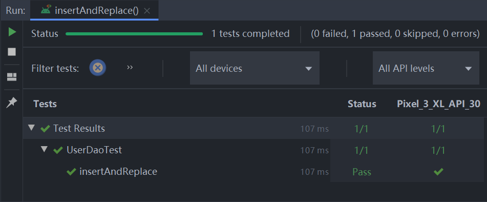

# Android上的单元测试与UI测试

对大多数人而言，工作的绝大部分时间都用来开会对需求，对完需求写业务，然后测试上线。在这种情况下，单元测试成了看起来不太重要，但又略显神秘的存在，你可能总想着试试但总也没有机会实施。然而作为一名严谨的工程师，都应该对这一必要但不紧急的知识有一定的理解，从而拥有更完整的技术栈。

单元测试的意义就像它字面上那样，对一个可以运行的最小单元进行测试，保证它的稳定。只要每个最小单元都是正确的，就可以保证上层逻辑的正确性。因此单元测试应该从那些最基础的部分写起，到覆盖核心逻辑为止。而建立在核心逻辑之上的是和用户互动的UI界面，这部分属于UI测试的范畴，但是由于UI变动通常比核心逻辑频繁得多，因此UI测试的意义也就远低于单元测试。

本文以我的 [玩儿Android](https://github.com/LtLei/wanandroid) 项目 **v1.0.2** 版本为例，介绍单元测试常用的 **MockWebServer**、**Mockito**，以及UI测试常用的 **Espresso** 等框架的使用。

在这个项目中我们使用Room作为本地数据的缓存，使用Retrofit进行网络请求，又通过Repository模型完成了MVX三层架构中的M层构建。M层基本涵盖了全部的核心业务逻辑，也就是说我们的单元测试只要覆盖了M层即可。Room和Retrofit是Repository的基础，所以第一步是对DAO和ApiService进行单元测试。

# API的单元测试

首先API是后端同学开发的，因此其正确性应该由他们来保证，这听起来好像和我们没什么关系，而且我们也的确不需要对每个API都书写测试代码。真正需要我们做的是：**确保网络模块能够正确解析数据。**

通常API开发都会遵守一定的规范，例如将返回数据定义为类似这样的结构：

```json
{
    "data": ...,
    "errorCode": 0, // 0表示成功，其它表示失败
    "errorMsg": ""
}
```

我们需要确保的就是能够按照约定正确地解析数据。也许有人会说，这么简单的事情写什么测试？这句话有一定的道理，但也有点浮躁。首先我们一定不是为了证明 1+1 确实等于 2 而写测试代码的，那样的确没什么意义。做API测试的目的在于：一是确保能够正确解析任何情况下的数据，二是掌握模拟网络请求方式这一测试技术本身，三是应该本着谨慎一点会更好的理念来写测试代码。

要模拟网络请求使用 mockwebserver 库，首先添加依赖：

```
testImplementation 'com.squareup.okhttp3:mockwebserver:4.8.1'
```

然后基于 MockWebServer 类构建一个 Retrofit 实例：

```kotlin
// 和正常使用Retrofit一样，只是把url换成了mockwebserver url随便写
Retrofit.Builder()
    .baseUrl(mockWebServer.url("/"))
    .addConverterFactory(serializationConverterFactory)
    .build()
```

因为MockWebServer不会真正发送请求，所以它也不知道应该返回什么数据。要模拟请求，就需要我们自己定义返回内容，这时使用的类是 MockResponse。现在让我们模拟一次网络错误的请求：

```
class NetworkTest {
    @Rule
    @JvmField
    val instantExecutorRule = InstantTaskExecutorRule()

    lateinit var service: TestService

    lateinit var mockWebServer: MockWebServer

    // 测试前初始化代码
    @ExperimentalSerializationApi
    @Before
    fun setUp() {
        mockWebServer = MockWebServer()

        val contentType = "application/json".toMediaType()
        val serializationConverterFactory = Json {
            ignoreUnknownKeys = true
        }.asConverterFactory(contentType)

        service = Retrofit.Builder()
            .baseUrl(mockWebServer.url("/"))
            .addConverterFactory(serializationConverterFactory)
            .build()
            .create(TestService::class.java)
    }

    // 测试完成后关闭
    @After
    fun clearUp() {
        mockWebServer.shutdown()
    }

    @Test
    fun networkError() = runBlocking {
        // 构造一个401的返回
        val mockResponse = MockResponse()
            .addHeader("Content-Type", "application/json; charset=utf-8")
            .setResponseCode(401)

        // 放到队列，调用时会取出
        mockWebServer.enqueue(mockResponse)

        // 请求数据
        val resource = safeCall {
            val response: ApiResponse<FakeUser> = service.login("fake_username", "fake_password")
            response.toResource { if (it.data == null) Resource.empty() else Resource.success(it.data) }
        }
        // 判断返回结果
        assertEquals(resource, Resource.error<FakeUser>(401, "Client Error"))
    }
}
```

可以看到，和平时开发最大的区别就在于需要自己创造返回值，并对结果进行断言，后续其它单元测试也会常常使用这个套路。按照这种方式，让我们补全正常返回数据和服务器返回错误时的测试代码：

```kotlin
@Test
fun getFakeUserSuccess() = runBlocking {
    val mockResponse = MockResponse().apply {
        setBody("""{"data": {"name": "LiHua","gender": "male"},"errorCode": 0,"errorMsg": "请求成功"}""".trimIndent())
    }
    mockWebServer.enqueue(mockResponse)

    val response: ApiResponse<FakeUser> = service.login("fake_username", "fake_password")
    assertTrue(response.isSuccess())
    assertEquals(response.data, FakeUser("LiHua", "male"))
}
```

以上我们将json直接写在测试代码里，可读性变得很差，可以通过文件的方式来处理，在 test 目录下创建 resources 目录，再创建一个 response 目录专门存储json，以上代码就可以改为：

```kotlin
val inputStream = javaClass.classLoader!!.getResourceAsStream("response/get_user.json")
val bufferedSource = inputStream.source().buffer()
val mockResponse = MockResponse()
mockWebServer.enqueue(mockResponse.setBody(bufferedSource.readString(Charsets.UTF_8)))

mockWebServer.enqueue(mockResponse)
// ...
```

# DAO的单元测试

测试的第一步是添加依赖：

```
androidTestImplementation 'androidx.test:core:1.2.0'
androidTestImplementation 'androidx.arch.core:core-testing:2.1.0'
androidTestImplementation 'androidx.room:room-testing:2.2.5'
```

Room的测试分为两部分：升级测试与DAO测试，目前该项目并没有升级，因此暂时只能写DAO测试，后续有升级时会在项目中跟进。

接下来看UserDao的实现：

```kotlin
@Dao
interface UserDao {
    @Insert(onConflict = OnConflictStrategy.REPLACE)
    suspend fun insert(user: User)

    @Query("SELECT * FROM user LIMIT 1")
    suspend fun getUser(): User?

    @Query("SELECT * FROM user LIMIT 1")
    fun getUserLiveData(): LiveData<User>

    @Query("DELETE FROM user")
    suspend fun clearAllUsers()
}
```

getUser和getUserLiveData虽然执行了同样的SQL语句，但却适用于不同的场景，一方面我们希望借助LiveData的特性当数据变化时自动更新页面，另一方面也希望随时可以获取到用户的信息，例如判断用户是否登录。

回到正题，我们应该写些什么测试呢？最严谨的做法是全方位测试，测试每个方法在正确、异常等各种场景下的表现。但是这样一来需要耗费极大的精力，二来有许多场景的测试是无意义的。例如我们已经十分明确1+1=2，就不需要为这种显而易见的事情写测试。还有对于“换汤不换药”的行为，例如`Insert`+`Select`+`Delete`操作，无论对UserDao还是对其它的Dao而言都是等效的，这样的测试只要一次跑通，也没有必要每增加一个Dao就书写一次相似的测试代码。因此在我看来，只需要**对自己怀疑的代码书写测试**。怀疑是一种主观行为，有的人谨小慎微，也有的人大大咧咧，因此我建议你自信一点但不要自负，因为出现问题最后买单的还是你自己（==!）。当然，如果时间充分，全方位测试自然是最好的。

## 第一个测试

接下来让我们开始写第一个测试，例如测试`OnConflictStrategy.REPLACE`的效果，需要先插入一条数据，取出来看一下，再插入另一条数据（主键的值相同），再取出来，如果每次取出后的结果和预期一致，就说明功能运行正常。在写测试之前，必然需要先连接好数据库，那么Room的`inMemoryDatabaseBuilder`就派上用场了。

```kotlin
open class DbTest {
    protected val db: WanAndroidDb
        get() = _db

    @get:Rule
    var instantTaskExecutorRule = InstantTaskExecutorRule()

    private lateinit var _db: WanAndroidDb

    @Before
    fun initDb() {
        val context = ApplicationProvider.getApplicationContext<Context>()
        _db = Room.inMemoryDatabaseBuilder(context, WanAndroidDb::class.java).build()
    }

    @After
    fun closeDb() {
        _db.close()
    }
}
```

使用`inMemoryDatabaseBuilder`获取测试使用的Db对象，这里 **@Before** 和 **@After** 分别表示在测试开始前和结束后将执行的代码。还有一处 **@get:Rule = InstantTaskExecutorRule()** 的作用是将异步任务转为同步执行，在[developer.android](https://developer.android.google.cn/reference/android/arch/core/executor/testing/InstantTaskExecutorRule)
上有对InstantTaskExecutorRule的详细说明：

> A JUnit Test Rule that swaps the background executor used by the Architecture Components with a different one which executes each task synchronously.
>
> You can use this rule for your host side tests that use Architecture Components.


有了Db，终于可以测试了，测试代码需要使用 **@Test** 标注，接下来按照我们的设想就可以很快地写出如下的代码：

```kotlin
class UserDaoTest : DbTest() {
    @Test
    fun insertAndReplace() = runBlocking {
        val userDao = db.userDao()
        // 创建第一个实例，uid是主键
        val user = createUser(uid = 100, nickname = "nick1")
        userDao.insert(user)
        // 从数据库获取，并确认和插入的数据一致
        val getFromDb = userDao.getUser()
        assertThat(getFromDb, notNullValue())
        assertThat(getFromDb!!.id, `is`(100))
        assertThat(getFromDb.nickname, `is`("nick1"))

        // 只有主键值保持一致时，才能替换
        val replaceUser = createUser(uid = 100, nickname = "nick2")
        userDao.insert(replaceUser)
        // 从数据库获取，并确认数据已经更新
        val getReplaceUserFromDb = userDao.getUser()
        assertThat(getReplaceUserFromDb, notNullValue())
        assertThat(getReplaceUserFromDb!!.id, `is`(100))
        assertThat(getReplaceUserFromDb.nickname, `is`("nick2"))
    }
}
```

接下来点击方法左侧的运行按钮，就可以看到测试结果了：

<div align="center"><br/>测试结果</div>

## 测试LiveData

UserDao中会返回一个LiveData，我们想确认当数据库内容发生变化时LiveData会自动更新，不过LiveData需要Observer才能激活，这一点可以通过`observeForever`解决。

```kotlin
// 自动取消订阅
fun <T> LiveData<T>.getOrAwaitValue(
    time: Long = 2,
    timeUnit: TimeUnit = TimeUnit.SECONDS,
    afterObserve: () -> Unit = {}
): T {
    var data: T? = null
    val latch = CountDownLatch(1)
    val observer = object : Observer<T> {
        override fun onChanged(o: T?) {
            data = o
            latch.countDown()
            this@getOrAwaitValue.removeObserver(this)
        }
    }
    this.observeForever(observer)

    afterObserve.invoke()

    // Don't wait indefinitely if the LiveData is not set.
    if (!latch.await(time, timeUnit)) {
        this.removeObserver(observer)
        throw TimeoutException("LiveData value was never set.")
    }

    @Suppress("UNCHECKED_CAST")
    return data as T
}

@Test
fun notifyLiveData() = runBlocking {
    val userDao = db.userDao()

    val user = createUser(uid = 100, nickname = "nick1")
    userDao.insert(user)

    val liveData = userDao.getUserLiveData()

    val user1 = liveData.getOrAwaitValue()
    assertEquals(user1, user)

    val replaceUser = createUser(uid = 100, nickname = "nick2")
    userDao.insert(replaceUser)

    val user2 = liveData.getOrAwaitValue()
    assertEquals(user2, replaceUser)
}
```

关于Room是如何做到通知LiveData的，可以通过自动生成的实现类，定位到源码 **RoomTrackingLiveData** 类中，关键的一行代码就是下面这句了：

```java
@Override
protected void onActive() {
    super.onActive();
    mContainer.onActive(this);
    getQueryExecutor().execute(mRefreshRunnable);
}
```

# Repository测试

完成了对Dao的测试，就保证了在基本单元上程序是正确的，但是这还不够。要对代码有足够的信心，至少要完成M层的测试，也就是接下来的Repository的测试。如果你对Repository不太熟悉，可以参考[《也谈Android应用架构》](./也谈Android应用架构.md)里的描述。下面我们摘取一个简单的Repository，看下为其写测试代码时应该注意什么。

```kotlin
interface ClassifyRepository {
    fun getClassifies(forceUpdate: Boolean): LiveData<Resource<List<ClassifyModel>>>
}

class DefaultClassifyRepository(
    private val classifyDao: ClassifyDao,
    private val classifyService: ClassifyService
) : BaseRepository(), ClassifyRepository {

    override fun getClassifies(forceUpdate: Boolean): LiveData<Resource<List<ClassifyModel>>> {
        return liveData {
            if (forceUpdate) {
                emit(fetchFromNetwork())
            } else {
                val dbResult = classifyDao.getClassifies()
                if (dbResult.isNotEmpty()) {
                    emit(Resource.success(dbResult))
                } else {
                    emit(fetchFromNetwork())
                }
            }
        }
    }

    private suspend fun fetchFromNetwork(): Resource<List<ClassifyModel>> {
        return safeCall {
            val classifies = classifyService.getClassifies()
            classifies.data?.let {
                classifyDao.insertClassifies(it)
            }
            classifies.toResource {
                if (it.data.isNullOrEmpty()) {
                    Resource.empty()
                } else {
                    Resource.success(it.data)
                }
            }
        }
    }
}
```

非常简单，就是从本地获取数据，获取不到再从网络获取，而从网络获取后会保存到本地，从而实现优先取缓存数据的操作。如果要为它写测试代码，要考虑哪些情况呢？首先对于`forceUpdate=true`应该确保直接从网络获取数据，其他情况下要确保的是如果缓存有数据则不会触发网络请求，缓存没数据则会触发网络请求，以及当网络请求也失败时，返回Error。也许你会说，这段代码看起来就会按照设想的那样执行，但是当你想要检查它是否正确时只能运行起来，等待网络请求返回数据，这样从编译运行再到等待网络的过程会耗费很多的精力和时间，更何况当网络出错时你可能根本看不到预期的页面。而单元测试则没有以上问题，这也是单元测试的优点之一。

与Dao不同的是，对于逻辑测试我们使用[mockito](https://github.com/mockito/mockito)。通过它，我们可以模拟一个对象，而不是使用真实的实例，这样不仅可以校验逻辑的正确性，还省去了真实对象的方法执行所需的时间，真是一举两得。因为逻辑测试是平台无关的，因此可以写在 **test** 目录下。第一步依然是添加依赖：

```gradle
testImplementation 'junit:junit:4.13'
testImplementation 'org.mockito:mockito-core:2.25.0'
testImplementation 'androidx.arch.core:core-testing:2.1.0'
```

得益于mockito的优秀设计，我们为测试写的代码就像自然语言一样流畅，因此以下代码可以轻易被理解，也就不需要我这里赘述：

```kotlin
class ClassifyRepositoryTest {
    @get:Rule
    var instantTaskExecutorRule = InstantTaskExecutorRule()

    // 模拟一个对象
    private val classifyDao = mock(ClassifyDao::class.java)
    private val classifyService = mock(ClassifyService::class.java)

    private val classifyRepository = DefaultClassifyRepository(classifyDao, classifyService)

    @Test
    fun getClassifiesForceUpdate() = runBlocking {
        val models = listOf(
            ClassifyModel(classifyId = 0, name = "", courseId = 0, parentChapterId = 0)
        )
        val response = ApiResponse(data = models)
        // 调用模拟对象的方法前，要定义好怎么执行这个方法
        `when`(classifyService.getClassifies()).thenReturn(response)

        val result = classifyRepository.getClassifies(true)

        val observer = mock<Observer<Resource<List<ClassifyModel>>>>()
        result.observeForever(observer)

        // 确认方法被调用了
        verify(classifyService).getClassifies()
        verify(classifyDao).insertClassifies(anyList())
        verifyNoMoreInteractions(classifyService)
        verifyNoMoreInteractions(classifyDao)
        verify(observer).onChanged(Resource.success(models))
    }
}
```

基于 when 和 verify 可以对任何逻辑进行测试，只要通过合理的设计，我们就可以对程序可能出现的任何情况进行测试而不需要依赖外部资源。

完成了Repository层测试，也就完成了M层的覆盖，对于核心业务现在你可以自信地说，我写的代码几乎没有Bug（为什么是几乎？总会有一些让你意想不到的事情吧~）！现在让我们把目光聚焦在最后一层，也就是UI层面，虽然UI测试因为变动频繁显得没有M层重要，但在时间充足的情况下还是很有必要写一下的，它会在后期节省你大量的时间。

# UI测试

## 1. 了解Espresso和IdlingResource

在编码时，我们总会写好一部分代码就运行起来看下效果，其实这本身就是UI测试，不过它是人为驱动的，且非常依赖外部环境，假如运行后发现服务器挂了，你的心情一定有些波动吧？还有些时候你就是想看下出错后的样子，就只好改下代码，再运行一次…，写好之后美滋滋地把代码推送到远端，结果发现改过的代码没有改回来，这回你的心情波动的应该明显许多了吧？如果你不想老这么波动，那就真的需要了解一下UI测试了。

我们希望的是，写好的代码不需要删，写好代码之后点击开始就自动执行，还想不管网络好不好都能完成测试，并且能同时测试到各种情况，所幸的是这一切 **Espresso** 都可以做到。

根据我们的设计，ViewModel像是“傀儡”一样只做了很少的事情，因此其单元测试的意义十分微薄，当然如果有必要测试，只需要按照Repository的测试方式进行即可，这里不再赘述。接下来我们通过一段简单的代码，先了解一下Espresso的基本结构：

```kotlin
// 添加依赖
androidTestImplementation 'androidx.test.espresso:espresso-core:3.3.0'

class IdlingResourceActivityTest {
    @Test
    fun testEspresso() {
        val scenario = ActivityScenario.launch(IdlingResourceActivity::class.java)

        onView(withId(R.id.et_name)).perform(typeText("wanandroid"), closeSoftKeyboard())
        onView(withId(R.id.et_pwd)).perform(typeText("123456"), closeSoftKeyboard())
        onView(withId(R.id.btn_login)).perform(click())
    }
}
```

如果执行这条Test，你会看到手机自动打开了页面，自动填充内容并点击登录按钮。但这等于什么都没有做，我们需要的是进行一定的操作后能够对结果进行确认。现在让我们加入一句确认语句：

```
onView(withId(R.id.tv_login_success)).check(matches(ViewMatchers.withText(R.string.text_login_success)))

```

我们的意图是点击按钮之后，tv_login_success会被赋值文字，但这条测试失败了。其原因在于点击按钮之后我们模拟了一个耗时操作，它需要一点时间才能返回结果，但检查的语句是即时执行的。在UI测试中这种耗时操作比比皆是，所幸Espresso有足够的能力应对，不过需要进行一点点准备工作。

首先添加依赖，注意是生产依赖而不是测试依赖：

```
implementation 'androidx.test.espresso:espresso-idling-resource:3.3.0'
```

Espresso提供了 **IdlingResource** 接口，并默认有一个 **CountingIdlingResource** 实现，Espresso通过 `IdlingResource#isIdleNow` 知道是否空闲以继续执行测试。因此在一个耗时操作开始前，需要我们告诉Espresso现在开始“忙碌”了，耗时操作结束后又需要我们告诉它我们“忙完”了。这个动作需要在生产项目中操作，因此算是Espresso的一点“额外”的准备。现在让我们对 IdlingResourceActivity 进行小小的改造：

```kotlin
// 使用单一的CountingIdlingResource对象即可
object EspressoIdlingResource {
    private const val RESOURCE = "GLOBAL"
    var countingIdlingResource = CountingIdlingResource(RESOURCE, true)
        private set

    fun increment() {
        countingIdlingResource.increment()
    }

    fun decrement() {
        if (!countingIdlingResource.isIdleNow) {
            countingIdlingResource.decrement()
        }
    }
}

class IdlingResourceActivity : BaseActivity() {
    override fun onCreate(savedInstanceState: Bundle?) {
        //...
        btn_login.setOnClickListener {
            lifecycleScope.launch {
                fetchFakeData {
                    tv_login_success.text = it
                }
            }
        }
    }

    private suspend fun fetchFakeData(callback: (text: String) -> Unit) {
        withContext(Dispatchers.IO) {
            // 耗时任务启动
            EspressoIdlingResource.increment()
            delay(3000)
            withContext(Dispatchers.Main) {
                // 耗时任务执行完毕
                EspressoIdlingResource.decrement()
                callback.invoke(getString(R.string.text_login_success))
            }
        }
    }

    @VisibleForTesting
    fun getIdlingResource(): IdlingResource {
        return EspressoIdlingResource.countingIdlingResource
    }
}
```

接下来让我们完善一下测试代码，加入IdlingResource：

```kotlin
class IdlingResourceActivityTest {
    private lateinit var idlingResource: IdlingResource

    @Test
    fun testEspresso() {
        val scenario = ActivityScenario.launch(IdlingResourceActivity::class.java)
        scenario.onActivity {
            idlingResource = it.getIdlingResource()
            IdlingRegistry.getInstance().register(idlingResource)
        }

        onView(withId(R.id.et_name)).perform(typeText("wanandroid"), closeSoftKeyboard())
        onView(withId(R.id.et_pwd)).perform(typeText("123456"), closeSoftKeyboard())
        onView(withId(R.id.btn_login)).perform(click())

        onView(withId(R.id.tv_login_success)).check(matches(ViewMatchers.withText(R.string.text_login_success)))
    }

    @After
    fun release() {
        IdlingRegistry.getInstance().unregister(idlingResource)
    }
}
```

这样Espresso就可以敏锐地感知耗时任务了，但是问题在于：一是我们要改造所有耗时任务以进行通知，二是这样的测试依赖真实环境，会因网络等原因出现意外，且无法测试所有边界。因此这种方式仅适用于明确希望按照实际代码执行的情况，并不适用于大规模使用。

## 2. 更好的测试方式

要覆盖问题的所有边界，就不能依赖真实的网络请求，而是使用mockito（没错，就是测试Repository时用的mocktio）。有了mockito，我们就可以假装成功和假装失败，并且没什么耗时。要使用mockito，耗时操作就不能直接写在Activity中，因此需要我们进行小小的改造，这里我们使用了ViewModel：

```kotlin
class IdlingResourceActivity : BaseActivity() {
    private val viewModelFactory: ViewModelProvider.Factory =
        IdlingResourceInjection.provideViewModelFactory()
    private val viewModel: IdlingResourceViewModel by viewModels { viewModelFactory }

    override fun onCreate(savedInstanceState: Bundle?) {
        super.onCreate(savedInstanceState)
        setContentView(R.layout.idling_resource_activity)
        btn_login.setOnClickListener {
            viewModel.fetchFakeData()
        }

        viewModel.fakeData.observe(this, {
            tv_login_success.text = getString(it)
        })
    }
}
```

最终只要mock一个ViewModel对象，就可以实现我们的目的了：

```kotlin
class IdlingResourceActivityTest {
    private val viewModel = mock(IdlingResourceViewModel::class.java)

    @Test
    fun fakeTest() {
        val fakeData = MutableLiveData<Int>()
        doReturn(fakeData).`when`(viewModel).fakeData
        `when`(viewModel.fetchFakeData()).then {
            fakeData.postValue(R.string.text_login_success)
        }
        IdlingResourceInjection.viewModel = viewModel

        val scenario = ActivityScenario.launch(IdlingResourceActivity::class.java)
        onView(withId(R.id.et_name)).perform(typeText("wanandroid"), closeSoftKeyboard())
        onView(withId(R.id.et_pwd)).perform(typeText("123456"), closeSoftKeyboard())
        onView(withId(R.id.btn_login)).perform(click())

        onView(withId(R.id.tv_login_success)).check(matches(ViewMatchers.withText(R.string.text_login_success)))
    }
```

# 总结

经过上述各种操作，我们对Android单元测试有了一个大体的印象。首先可以肯定单元测试十分有用，可以大大加强我们对代码的信心，但写测试是一个把用手操作的过程变成自动化的过程，不仅繁琐而且枯燥，还极其考验耐心和细心程度，因此在人力或时间不足的情况下应该优先书写核心业务的测试，确保投入和产出拥有最高“性价比”。

---

本文到此就结束了，如果您喜欢我的文章，可以关注我的微信公众号： **大大纸飞机** 

或者扫描下方二维码直接添加：

<div align="center"><br/>扫描二维码关注</div>

您也可以关注我的简书：https://www.jianshu.com/u/9ee83a8ee52d

编程之路，道阻且长。唯，路漫漫其修远兮，吾将上下而求索。