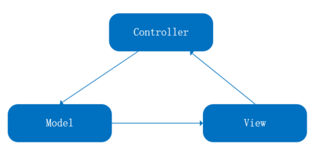
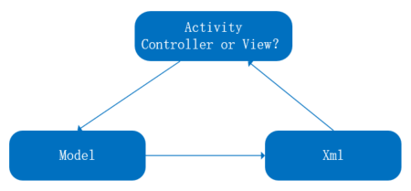
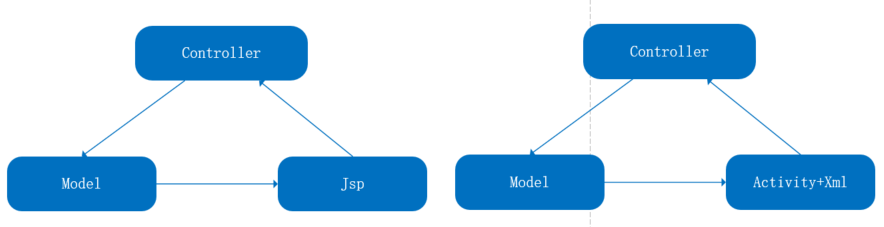
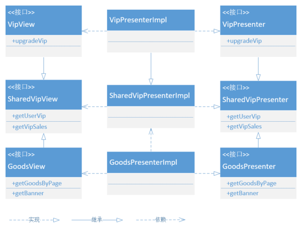
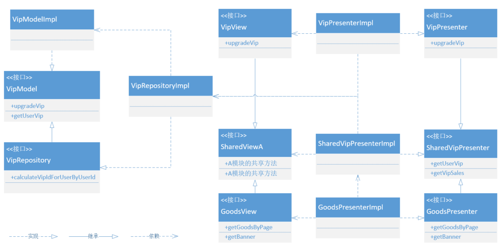
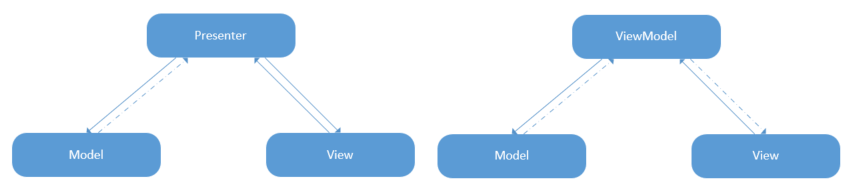

谈到架构，想到的一定是MVC、MVP、MVVM这几个词了，然后对比一下它们的优缺点，接下来就是站队的时间了。常常写MVC，偶然见到了MVP，“嗯，真香\~”。写久了MVP，又听说了MVVM，“嗯，真香\~”。“真香”定律真是被用得淋漓尽致，此外还要喜新厌旧一番，使用MVVM的鄙视使用MVP的，使用MVP的又鄙视使用MVC的。架构，就在这样的鄙视链下，“螺旋”发展。让我们跟随历史的进程，看一看架构是如何进化进化再进化的吧！

# MVC——时代的创造者

从我接触Android起，MVC所扮演的唯一角色就是告诉你不要这么做，这导致长久以来总认为讲MVC是没有意义的事情，知道这个概念还不如不知道呢。但实际上MVC何其优秀，在java web开发中大名鼎鼎的SSM框架中，第二个S就叫Spring MVC，可以说是黄金法则了。为什么同样的架构到了Android中就成了反派，整天被diss呢？这事我们要从MVC的名字说起。

MVC是由三个词组成的，M（Model）主要用来处理数据，例如从网络或者数据库获取业务相关的数据；V（View）是界面，用来响应用户的行为以及展示数据给用户；C（Controller）用来接收到View的请求传递给Model。整体流程就是V接收到了用户的操作，通过C将请求传递给M，由M处理后通过回调或者观察者等方式告知V，从而完成整个过程。在传统的web开发中（传统的，也就是过去的~），V对应的是jsp，它不仅包含了前端的一切，还可以写一点java代码。M和C则是抽象出来的概念，也就是随我们怎么写。在其他的平台上事件流向可能稍有出入，但总体结构是一致的。

<div align="center"><br/>MVC的事件流向</div>

这个流程早被我们记得滚瓜烂熟，但现在让我们持怀疑态度审视一下C的存在，V通过它最终向M获取数据，M又可以直接通知到V，那我直接让V向M请求数据，架构改名为MV架构算了（C听起来如此鸡肋，干掉它有什么不可以的呢？）。不过一个使用如此广泛的架构怎么会犯这种错误，C一定有它独特的意义，只不过还得深入思考一下。

有时候正着看理解不了的事情，反着看也许就有思路了。我们假设架构真的只有MV，页面V1向M1获取了数据，页面V2也要向M1获取数据。看起来很合理对吧？但是这合理建立在一个基本假设上，那就是V1、V2乃至Vn向M1获取的数据都是一致的。这个假设只能应对一些简单的场景，大部分情况是V需要的数据和M给出的并不一致，需要进行一定的逻辑操作，有的只是简单的变换下数据格式，有的可能要和来自其他M的数据一并处理得到一个全新的数据，而M本身是不具备这种能力的。当然V本身具备这个能力，但话又说回来了，我们谈架构的目的，不就是为了解决V繁重的问题么。这样C就有了立身之处，它可以协助V对M返回的数据进行改造，使得V可以专注在用户的交互和展示上。

若仅是通过加入Controller分离了View既要处理数据又要显示数据还要响应用户操作的行为，MVC也不至经久不衰，Controller的加入还带来了许多有建设性的好处。首先Model成为一个相对独立的单元，除了通知回调外它不需要关心外界的一切，不用管谁在使用它，怎么使用它，这一特点也使得Model可以复用。Controller本身不绑定View，因此Controller也可以复用，而没有Controller时这段处理逻辑放在V层，显然是无法复用的。单元测试成为可能，M和C都不依赖于V，都属于纯业务代码，对它们进行单元测试，书写难度小于UI测试，产生的效果又明显高于UI测试。

有了以上优点，缺点也呼之而出了。M要主动通知V，使得M、V之间“藕断丝连”，总有一些业务会在V层实现，从而削弱了C的作用。V什么都不想做，全部交给C处理，因此模块越大，V和C之间联系就越紧密，C会越来越像某个V的附属品，它们“狼狈为奸”，根本不给其他V任何机会。当然还有放之四海而皆准的一点，使用MVC会增加代码整体结构的复杂性。

整体而言，MVC是开创性的，它的优点明显比缺点更重要，因此能够备受关注。现在我们继续探索，当把这个优秀的架构引入Android时会发生什么问题。Android开发和web开发最大的区别在于Controller，在java web开发中，Controller是一个抽象概念，整个类都是由我们定义和书写的。但是在Android中，有一个可以称为“上帝”的类，是Controller的天然选择，这就是Activity（也可以是Fragment，这里仅用来说明问题）。这就是问题的关键了，jsp本身有能力处理View的一切，但是xml却实在弱小的可怜，它的大部分功能都是依赖Activity完成的，这样在MVC架构下Activity就要兼任Controller和View的职责，这使得本就分的不明不白的C和V又紧紧地贴合在一起，只剩下一个M是独立了，而它和V也有微弱的关联，MVC在这里的表现实在是差强人意。

<div align="center"><br/>Activity的二象性，从V的角度看它是V，从C的角度看它是C</div>

当一个理论在新问题面前失效，我们要么改进它，要么完全推倒它，建立一个全新的理论。但这实在是太小的一个问题了，唯一的阻碍就是Activity的存在而已，而且这个类主要作用是管理View的，所以我们把Activity+xml文件一起当做View处理，再抽象出一个完全由我们控制的Controller，就可以完全再现MVC。但我们终究是不满意的，Activity明明就可以当作Controller，现在我们让了一步，新增了一个真正的Controller，却没有捞到任何好处，在java中只要jsp+controller+model就可以实现MVC了，而我们要Activity+xml+controller+model才能完成同样的事，还要忍受同样的缺点。要么各退一步，我增加一个controller，你搞定一个缺点，要么就决一死战，退出Android舞台吧，虽然暂时没有更好的架构，但我就是想宁缺毋滥。

<div align="center"><br/>去除Activity的C特性后，Activity+xml才等于jsp</div>

现实当然不会如此血雨腥风，Android没有MVC问题只会更多，会更快失去控制，MVC如果不能开疆拓土也会更快淹没在历史长河中。所以Android和MVC就各退一步达成了和解，MVC在此要做的就是彻底斩断M和V的联系。Activity+xml和jsp的不同之处在于Activity是纯粹的java语言，它可以像其他类一样实现接口，使用设计模式。所以我们可以利用抽象统一管理Activity和xml，然后稍微用下策略，悄悄地把M通知V的事情转移到C中来，实现一次“偷梁换柱”。具体做法就是定义抽象的View，让Activity和xml来实现，再把View交到Controller手里，让Controller做中间人，处理任何M和V不想做的事。如此V的能力被彻底削减，它不再有能力处理一丁点业务，而C被委以重任，其地位水涨船高，M这下终于获得自由之身，V不能对它产生任何念头了。将M、V、C三层都进行抽象的这个改动，就是广为人知的**MVP架构**。

<div align="center"><br/>去除了Activity的C特性，但Model和View的联系被彻底斩断了</div>

现在我们进入了自己熟悉的领域，MVP在Android应用架构中起着重要的作用，现在依然是无数人心中的不二之选（MVVM的确很有特色，但要完全取代MVP还差一些火候）。既然是熟悉的领域，我们就要对它抽丝剥茧，看看它在方方面面的表现是优秀还是平庸。

# 后继有力，MVP力挽狂澜

将M、V、C三层全部抽象而来的MVP，明显有更强的控制欲。V被剥削成了“花架子”，当用户执行了某操作，只要这个操作涉及到一点数据，它就无法独自完成，需要向隔壁的P求援（P就是被委以重任的C），P处理完成后高冷地把结果一甩，V只能被动地接受；M和从前一样，它始终是独立的，不染尘埃；P真正地扬眉吐气一番，死死地拿捏着M和V，一切尽在掌握中。

我们先来挖掘一下它的优势，M和V隔离后，可以互不干涉，一个专注业务，一个专注页面，分工更明确了。V的抽象可以让单元测试覆盖更广的范围，在MVC中单元测试对V是束手无策的，但现在我们可以在抽象层对V进行测试。现在让我们把目光转向P，它是在C的基础上加强的，自然也继承了C的缺点，模块越大就和V联系越紧密，而且因为它全权操纵V，这个缺点只会比C更恶劣。

说来说去，MVP就是MVC的一次“因地制宜”，它的理论基础就这些，实际使用时因为场景多变和Android独特的平台特性还会遇到各种各样的问题，接下来我们就通过代码看下可能发生的情况和应对之法。

## 1. MVP的基本结构

MVP里强调的是M、V、P三层都是抽象的概念，因此如果严格按照抽象定义，一个完整的MVP应该至少包含三个接口与三个实现类，而按照谷歌的推荐，这三个接口会通过一个Contract的概念放在一起，以更直观地了解到MVP的全部面目（不管是谁的推荐，使代码变得直观就是一个很好的 idea），所以一个最完善的MVP大致和下面的示例一致，以简单使用用户名和密码进行登录为例。

```
public interface LoginContract{
    public interface LoginModel{
        User login(String userName, String userPwd);
    }

    public interface LoginPresenter{
        void login(String userName, String userPwd);
    }

    public interface LoginView{
        void loginSuccess();

        void loginFailed(String cause);

        void invalidUserName();

        void invalidUserPwd();
    }
}
```

以上就是抽象层的全部代码，使用Contract可以让我们在一个文件中了解到MVP的全部行为，这不是架构本身的意图，但它对我们是有利的。然后分别定义LoginModelImpl、LoginPresenterImpl，以及实现了LoginView的Activity或Fragment，一个和登录行为相关的MVP就实现好了。

显而易见，未使用任何架构时我们只要写一个Activity就能搞定，使用MVP后类的数量飙升至六个，如果Contract也算在内的话就有七个类了，这样的话我们使用MVP的代价是不是过于沉重？即使它有数不清的优点，但就这一点就足够劝退一大批人。可是我们没有注意的是，抽象是一种思想，而不是一种格式。Activity由系统控制，所以我们不得不借助抽象来实现V的行为，但是M和P完全是我们自己造就的，抽象与否我们有绝对的掌控权。拿P来说，定义接口有两个好处：一是可以支持多实现，二是可以更轻易看到它的所有方法（类肯定比接口长很多），不定义接口也没什么坏处，毕竟很少会需要多个实现类的。因此在极简情况下，只定义V的抽象，四个类就可以实现MVP了，而在最坏情况下才是六个或七个类。所以最好的方式是，根据需求，合理选择是否定义M和P的接口。

为了说明后续的问题，贴一下现有的Presenter实现类。

```
public class LoginPresenterImpl implements LoginContract.LoginPresenter{
    private LoginContract.LoginView mLoginView;
    private LoginContract.LoginModel mLoginModel;

    public LoginPresenterImpl(){
        mLoginModel = new LoginModelImpl();
    }

    public void attach(@NonNull LoginContract.LoginView loginView){
        mLoginView = loginView;
    }

    public void detach(){
        mLoginView = null;
    }

    @Override
    public void login(String userName, String userPwd){
        if(TextUtils.isEmpty(userName)){
            if(mLoginView != null){
                mLoginView.invalidUserName();
            }
            return;
        }

        if(TextUtils.isEmpty(userPwd)){
            if(mLoginView != null){
                mLoginView.invalidUserPwd();
            }
            return;
        }

        User user = mLoginModel.login(userName, userPwd);

        if(user == null){
            if(mLoginView != null){
                mLoginView.loginFailed("some error");
            } 
            return;
        }

        if(mLoginView != null){
            mLoginView.loginSuccess();
        } 
    }
}
```

## 2. P的体积暴涨和可重用性问题

以上示例虽然写了好几个类，但整体而言结构清晰，看起来很简洁舒爽，但是实际项目中大多页面的功能都是极其复杂的，从模块化的角度去看也是多个模块耦合在一起，如此一来P的整洁就很难保持了，很可能随着业务的堆积体积暴涨，在一个P中实现了多个模块的功能也使得P的可重用性大大降低。让我们凭空捏造一个复杂场景，在某个页面除了本身的功能之外，我们希望根据用户会员身份决定是否推荐一些促销信息，会以弹窗的方式展示给用户，同时在Toolbar上想要轮播当前的热搜词，诱导用户进入搜索以购买商品，然后还希望在页面上加一个类似广告的小浮窗，对不同的用户给予不同的折扣活动推荐。P的结构可能会像这样：

```
public interface GoodsPresenter{
    // 页面本身的核心内容
    void getGoodsByPage(int page);
    void getBanner();
    // ...

    // 用户会员相关
    void getUserVip(String userId);
    void getVipSales(String vipId);
    // ...

    // 搜索的诱导
    void getHotSearchKeywords();
    // ...

    // 给予不同用户不同的折扣活动推荐
    void getGoodsSaleForUser(String userId);
    // ...

    // 其他更多模块更多的功能
}
```

随着业务变繁重，P的暴涨是必然的，但也是可以接受的，因此P的接口变长并没有问题，问题在于P的实现类。可以肯定的是，在很多页面都会有会员相关的卡点，搜索的热搜词也不一定只在当前页面展示，APP里也可能到处在推广某个活动…，这时候P的重用性问题就暴露出来了，一模一样的逻辑要在无数个Presenter里写无数遍，我们会很快掉入可怕的重复“地狱”。

解决问题的办法似乎只有一个，那就是按照模块拆分成多个P，当前的GoodsPresenter只处理当前页面的内容，VipPresenter处理会员的内容，SearchPresenter处理搜索的内容…，同样的M和V也做此拆分，MVP框架就转成 MM..VV..PP.. 框架，对每个MVP单元来说都是独立的、可模块化的。

但是MVP单元化了，并不代表复杂性真正降低了，在原有的结构下每个Activity只需要实现一个V，持有一个P就可以完成工作，只是这个P格外大，而现在每个Activity要实现多个V，持有多个P，还要了解在什么场景下使用什么P来工作，这样一来只是把问题从P转移到了Activity而已。

P的拆分势在必行，不然无法重用，Activity也应该仅实现一个V，持有一个P才能保持单纯，这看起来是矛盾的，难道真的鱼与熊掌不可兼得了吗？别忘了我们MVP的全部概念都是抽象的，对应于Java就是一个个接口，而接口是可以多继承的，利用这一点就可以让矛盾化为无形。我们可以再建一个P，它同时继承GoodsPresenter、VipPresenter、SearchPresenter…，对V也进行同样的处理，然后在实现层组合多个P和V一起实现功能。改进后的P如下所示：

```
public interface GoodsPresenter{
    // 页面本身的核心内容
    void getGoodsByPage(int page);
    void getBanner();
    // ...
}

public interface VipPresenter{
    // 用户会员相关
    void getUserVip(String userId);
    void getVipSales(String vipId);
    // ...
}

public interface SearchPresenter{
    // 搜索的诱导
    void getHotSearchKeywords();
    // ...
}

public interface GoodsProxyPresenter extends GoodsPresenter, VipPresenter, SearchPresenter{
}

public class GoodsProxyPresenterImpl implements GoodsProxyPresenter{
    private GoodsPresenter mGoodsPresenter;
    private VipPresenter mVipPresenter;
    private SearchPresenter mSearchPresenter;

    public GoodsProxyPresenterImpl(){
        mGoodsPresenter = new GoodsPresenterImpl();     
        mVipPresenter = new VipPresenterImpl(); 
        mSearchPresenter = new SearchPresenterImpl(); 
    }
    
    @Override
    public void attach(GoodsProxyView view){
        mGoodsPresenter.attach(view);
        mVipPresenter.attach(view);
        mSearchPresenter.attach(view);
    }

    @Override
    public void getGoodsByPage(int page){
        mGoodsPresenter.getGoodsByPage(page);
    }

    @Override
    public void getUserVip(String userId){
        mVipPresenter.getUserVip(userId);
    }

    // ...
}
```

我们解决了以上的问题，又增加了一个类，当然这也不算增加类，因为本身这些Presenter是必然存在的，把它们组合起来使用也是必然的。但我们还是引入了一个问题，或者说是触犯了一条规则：**最少知道原则**，简单说就是只知道需要知道的事情。按照这样的设计，模块与模块之间的P、V是可以互相调用的，它们不得不暴露在模块之外，把自己的全部细节展示出来。在当前的模块下我们只需要知道用户的会员状态，也就是VipPresenter的一个功能，但却一股脑的拥有了VipPresenter的全部。而且V的继承也会使Activity里增加很多冗余的实现，例如VipView中有一个upgradeVip的功能，我们的Activity不需要这个能力，但不得不增加一个空实现。

所以在这种复杂的场景下，MVP还要进一步改造，才能更合理、更有效。接下来我们继续研究如何利用**最少知道原则**来优化MVP的能力。

## 3. 最少知道原则

现在我们既希望能够跨模块调用，又不想暴露全部细节，即满足最少知道原则，就只能另辟蹊径找到更好的办法。我们先从V的组合说起，一个V继承了多个V会变得极其庞大，而且大部分都是冗余的，那我们不让它冗余不就好了吗？从这一点出发可以有两种方案，一是不继承，把需要的方法重新写一遍，二是只继承需要的部分，这就需要被继承的V本身也是多继承的。方案一没什么可说的，它和其他任何模块都不关联，这是优点也是缺点，好在够独立，坏在不能复用，而且重复定义一样的接口不利于后期管理，当然这都不是什么大事。方案二会好一些，它的做法是将V分成可共享与不可共享两部分，通过继承来连接，例如VipView中有两个方法会被其他模块引用，其他方法不会被引用，就可以定义成这样：

```
public interface SharedVipView{
    void getUserVip(String vipId);
    void getVipSales(VipSales sales);
}

public interface VipView extends SharedVipView{
    void upgradeVip(boolean isSuccessful);
}
```

这样做的好处是只需要暴露SharedVipView即可，可重用性的问题也解决了，但是书写起来会更复杂一些，对代码审查要求也更严格，因为太容易写成方案一那种形式了。

回过头来再看看P，我们也可以按照V的方式处理，但针对接口和实现类有些不同，接口只要继承即可，但是实现类因为不支持多继承，只能通过依赖其他模块的P来实现功能，如此一来就要求每个模块的P也分成两层，整体结构如下所示：

<div align="center"><br/>P和V的依赖关系</div>

看起来通过这样的方式解决了问题，但是每个MVP单元其实变成了MVVPP，复杂度大大增加了，这给实际工作造成很大麻烦，因此我们还需要进一步寻找更合适的方案。

## 4. MVVPP到MVP-VP

我们已经解决了好几个棘手的问题，但现在的这个问题比之前的都要棘手很多倍，一方面我们不希望增加每个MVP单元的复杂度，另一方面也希望能够保持最少知道原则，同时减少重复性。尝试多种方案而不可得，给我们带来了沉痛的打击，但是也不全是坏消息，因为当极致的黑暗到来时，黎明也就不远了。

我们在P和V之间盘旋太久了，以致于都忘记了MVP其实是三部分组成的，M被遗忘是我们的过失，但也给我们提供了一个完全不同的思路。M不起眼的原因就是独立性，那么我们在多模块使用时，是不是也可以提供一个独立的V和P，既不增加MVP单元的复杂度，又能提高复用性呢？

为了管理上的便利，我们还是通过继承来定义P和V的接口层，当然也可以完全另写一个接口，这不会造成多大的影响。我们定义的接口如下：

```
public interface SharedVipView{
    void getUserVip(String vipId);
    void getVipSales(VipSales sales);
}

public interface VipView extends SharedVipView{
    void upgradeVip(boolean isSuccessful);
}

public interface SharedVipPresenter{
    void getUserVip(String userId);
    void getVipSales(String vipId);
}

public interface VipPresenter extends SharedVipPresenter{
    void upgradeVip();
}
```

主要的差别在于P的实现，我们要让两个P之间毫无关联，即使功能是完全一致的，也要各自有自己的实现。它们可以定义如下：

```
public class SharedVipPresenterImpl implements SharedVipPresenter{
    @Override
    public void getUserVip(String userId){
        VipInfo vipInfo = mVipModel.getUserVip(userId);
        if(vipInfo != null){
            mSharedVipView.getUserVip(vipInfo.getVipId());
        }
    }

    // ...
}

public class VipPresenterImpl implements VipPresenter{
    @Override
    public void getUserVip(String userId){
        VipInfo vipInfo = mVipModel.getUserVip(userId);
        if(vipInfo != null){
            mVipView.getUserVip(vipInfo.getVipId());
        }
    }

    // ...

    @Override
    public void upgradeVip(){
        // ...
    }
}
```

暂时忽略两个实现中几乎一致的代码，我们也感受到了明显的区别，通过共用一个M，跨模块与非跨模块形成了两个独立的MVP单元，也就是从MVVPP转变成了MVP-VP结构，VP的耦合与复杂度问题都不见了。另外还有一个重要的改变是问题被压缩在了两个P的实现里，整体的结构却是简洁而优雅的，仅这一点便足够我们长舒一口气了。接下来只要搞定这两段类似的代码就大功告成了。

## 5. P职责的再划分

让我们把这两段代码单独拿出来看，它们是不是已经没有可优化的空间了呢？

```
@Override
public void getUserVip(String userId){
    VipInfo vipInfo = mVipModel.getUserVip(userId);
    if(vipInfo != null){
        mSharedVipView.getUserVip(vipInfo.getVipId());
    }
}

@Override
public void getUserVip(String userId){
    VipInfo vipInfo = mVipModel.getUserVip(userId);
    if(vipInfo != null){
        mVipView.getUserVip(vipInfo.getVipId());
    }
}
```

这两段代码除了依赖的V不同，其余部分完全一致，我们是不是会率先想到抽取一下，把V当成变量传递进来，就像这样：

```
// 含义尚不明确，不知道如何取名字
public class VipPresenterXxx<V extends SharedVipView>{
    private V mView;

    public VipPresenterXxx(V view){
        mView = view;
    }

    public void getUserVip(String userId){
        VipInfo vipInfo = mVipModel.getUserVip(userId);
        if(vipInfo != null){
            mView.getUserVip(vipInfo.getVipId());
        }
    }
}
```

看似没有问题，但实际上出了大问题，我们知道VipPresenter包含了更多的方法，而VipPresenterXxx只实现公共方法的话，它就必然对VipPresenter造成了侵入，你需要知道何时调用VipPresenterXxx来实现，何时需要自己实现。而如果VipPresenterXxx实现了VipPresenter的全部方法，它就必须时刻知道V是SharedVipView还是VipView的实例，把两个不同的V糅合在一起明显不是一个聪明的决策。

现实逼迫着我们进行抽取，又不能混合着两个V使用，所以我们只能抽取，但是留下V。我们把例子举的稍微复杂一点，这样可以看得更清楚：

```
@Override
public void getUserVipId(String userId){
    VipInfo vipInfo = mVipModel.getUserVip(userId);
    // 要根据用户ID和当前的VIP信息，经过复杂的计算得到一个当前需要的vipId
    String vipId = mVipModel.calculateVipIdForUser(userId, vipInfo);
    if(vipId != null){
        mVipView.getUserVipId(vipId);
        // mSharedVipView.getUserVipId(vipId);
    }
}
```

最开始我们就说过C的作用不仅是传递数据到V，它还要中间负责对数据的加工，P是C的升级版，自然也有一样的职责。如果我们只抽取部分，而留下V，可以发现它们被完美的拆分成了数据加工和页面渲染两部分：

```
// 数据加工部分
VipInfo vipInfo = mVipModel.getUserVip(userId);
// 要根据用户ID和当前的VIP信息，经过复杂的计算得到一个当前需要的vipId
String vipId = mVipModel.calculateVipIdForUser(userId, vipInfo);

 // 页面渲染部分
mVipView.getUserVipId(vipId);
// mSharedVipView.getUserVipId(vipId);
```

我们从一个P里拆出了两个完全不相干的概念，这说明P是多职责的，我们可以依据**单一职责原则**优化它！页面渲染很好理解，它是V的部分，但是对数据加工算什么呢？严格来说它不是纯粹的业务，它是根据需要改造过的业务，但无论如何改变不了它操作的是数据的事实。所以我们可以总结，P由两部分组成，一是作为M和V的桥梁，二是处理业务，身兼多职是它得以膨胀和傲视他人的根源。而我们接下来要做的就是斩断它的“左膀右臂”之一，只让它做桥梁就好了。

我们要给M重新下定义，把原有的M，也就是纯粹的业务，称为**NSM(narrow sense model
)**，把包含了业务加工的M，称为**BSM(broad sense model)**，NSM是BSM不需要加工时的特例。现在我们的M更像一个工厂，它不仅生产业务，还加工业务，或许叫M Factory更合适，但是Factory容易被误解为工厂模式，所以我们换个名字，就叫M Repository吧（是的，我们也叫Repository，但是和你看到的谷歌的Repository还不太一样，我们的Repository更强大）。

## 6. Repository——M的东山再起

我们给M升级，自然会减轻P的负担，使得M、V、P三部分可以“三足鼎立”，再不是P一个说了算。升级后的M依然可以保持独立性，因此也不会破坏任一个MVP单元。一个Repository由纯粹的业务和对业务加工两部分组成，因为NSM是BSM的特例，因此外界对这两部分是零感知的。还是以Vip为例，我们的Repository定义如下：

```
public interface VipModel{
    VipInfo getUserVip(String userId);
    VipSales getVipSales(String vipId);
    String calculateVipIdForUser(String userId, VipInfo vipInfo);
    boolean upgradeVip();
}

// VipRepository 拥有 VipModel 的全部能力，还拥有加工的能力
public interface VipRepository extends VipModel{
    String calculateVipIdForUserByUserId(String userId);
}
```

其中，NSM部分的能力依然由原始的M完成，而BSM的能力则由Repository来完成，所以Repository的实例会依赖M，实现如下：

```
public class VipRepositoryImpl implements VipRepository{
    private VipModel mVipModel;

    public VipRepositoryImpl(){
        mVipModel = new VipModelImpl();
    }

    @Override
    public VipInfo getUserVip(String userId){
        return mVipModel.getUserVip(userId);
    }

    // ...

    @Override
    public String calculateVipIdForUserByUserId(String userId){
        VipInfo vipInfo = mVipModel.getUserVip(userId);
        // 要根据用户ID和当前的VIP信息，经过复杂的计算得到一个当前需要的vipId
        String vipId = mVipModel.calculateVipIdForUser(userId, vipInfo);
        return vipId;
    }
}
```

VipRepository完全有能力同时为VipPresenter和SharedVipPresenter提供服务，它们只需要分别调用Repository的方法，分发给各自的View即可。听起来是不是还是有些小瑕疵，这两个P做的事情还是极其相似的？但是我们已经尽力了，如果真的十全十美，想来也是一种遗憾吧。

最后看下我们现在的模型吧，它一定比之前好了太多太多：

<div align="center"><br/>MVP-R</div>

## 7. MVP的生命周期

生命周期是Android平台的特性，MVP虽然是架构思想，也要适应这种特性，这里我们暂不展开叙述如何解决生命周期的问题，在下一篇文章分析Jetpack时会对此进行详尽的阐述，现在只要知道问题的具体情况就好了。

MVP在生命周期中遇到问题的主要是P，我们都知道Activity有一段从onCreate到onDestory的生命周期，一般情况下，只要在onCreate时生成P，在onDestory时销毁P，就可以保证P不会引发内存泄漏的问题。但是Activity会在很多情况下，例如屏幕旋转时重走一次onCreate到onDestory的过程，此时我们的P也会跟着销毁并重建。

P销毁并重建，就意味着业务逻辑要重新执行一遍，如果是从网络加载就需要再次请求一次网络，不仅浪费用户流量，还有可能因请求失败导致页面显示错误的信息。当然我们有很多方式避免这一情况的发生，也可以简单地对此视而不见，毕竟这种情况在所有操作中所占据的比例不会太高。后续我们会介绍每种处理方式，并比较它们的优缺点，但现在让我们加快脚步，因为架构中还有另一道迷人的景色等待我们欣赏呢。

# 新时代的弄潮儿——MVVM

MVP已经足够应对任何场景了，但是它终究只解决了MVC的一个缺点，P和V依然无法无天地炫耀他们的关系。而且当我们把业务加工也归并到M后，P的唯一职责就是保持M和V的通讯，而这个通讯要是仅仅P通知V还好，实际却是V要主动调用P，P再主动回调V，双方都深受其苦。V要喊P干活貌似是必须的，但是如果V可以做一个“监工”，时刻盯着P干活，等结束后自己拿着结果走人，岂不是双方都省事？不然P在那边“埋头苦干”，V在一边“晒太阳”，如此压榨劳动力也许某天P就造反了。

好在有个设计模式叫观察者模式，简直就是为“监工”量身定做，而且监工也不需要时刻盯着，这边完成工作后自己就会发出信号，就像水烧开了自己会响一样，V收到P发的信号就过来收作业，真是皆大欢喜呀。在Android中，MVVM架构做的就是这样的事情。

MVVM，并不是四个单词的组合，前面的MV和MVC、MVP中的概念都是一致的，最后一个VM是ViewModel的意思，和C、P属于同一层级，VM可以理解为V+M，它对应的就是我们刚刚提取出的Repository的概念，用来对纯粹业务进行加工的。那么P哪去了呢？奥秘就在于VM虽然和Repository同概念，但是它是可以被观察的，V可以通过观察VM自动更新自己，所以P就可以退出历史舞台了。V观察VM，所以VM并不知晓V的存在，这是一个单向的依赖关系。MVVM的事件流向是这样的：

<div align="center"><br/>MVP-MVVM对比图，虚线箭头表示以结果、回调、订阅等方式回传信息</div>

可以看到，MVVM和MVP最大的区别就是PV是互相引用的，而VM和V是单向引用的，整体结构更为简洁，没有一点冗余，VM不再依赖V，它的复用就更简单了。

V是如何观察VM的，这里我们就不再展开了，简单来说通过回调就可以实现。但是在Android上V的实现由Activity+xml组合完成，因此通过回调只能通知到Activity层，再由Activity来更新xml，而想要更进一步直接更新xml，就要借助**databinding**这一招大杀器了，它的出现使得MVVM在Android平台上以星火燎原之势迅速发展起来。

让我们还是以简单的登录为例，感受一下MVVM给我们带来的新惊喜。首先书写VM，为了简洁说明问题，全部操作都是模拟的：

```
public class LoginViewModel extends BaseObservable {
    public final ObservableField<String> mLoginResultState = new ObservableField<>();
    public final ObservableField<Boolean> mIsLoading = new ObservableField<>();

    public void login(final String username, final String password) {
        new Thread(new Runnable() {
            @Override
            public void run() {
                mIsLoading.set(true);

                if (!isUserNameValid(username)) {
                    mIsLoading.set(false);
                    mLoginResultState.set("username is not valid.");
                    return;
                }

                if (!isPasswordValid(password)) {
                    mIsLoading.set(false);

                    mLoginResultState.set("password is not valid.");
                    return;
                }

                // 模拟耗时操作
                try {
                    Thread.sleep(1000);
                } catch (InterruptedException ignored) {
                }

                mLoginResultState.set("login succeed!");
                mIsLoading.set(false);
            }
        }).start();

    }
    // ...
}
```

在VM中只要给ObservableField赋值，通过databinding工具就会自动通知订阅者（Activity或xml）。我们希望xml可以自己感知是否正在加载中和加载结果，所以xml大致是这样的：

```
<?xml version="1.0" encoding="utf-8"?>
<layout xmlns:android="http://schemas.android.com/apk/res/android"
    xmlns:app="http://schemas.android.com/apk/res-auto"
    xmlns:tools="http://schemas.android.com/tools">

    <data>

        <import type="android.view.View" />

        <variable
            name="viewmodel"
            type="com.common.mvvmsample.ui.login.LoginViewModel" />
    </data>

    <androidx.constraintlayout.widget.ConstraintLayout
        ...>

        <EditText
            android:id="@+id/username"
            ... />

        <EditText
            android:id="@+id/password"
           ... />

        <Button
            android:id="@+id/login"
            ... />

        <ProgressBar
            android:id="@+id/loading"
            android:visibility="@{viewmodel.mIsLoading ? View.VISIBLE : View.GONE}"
            ... />

        <TextView
            android:id="@+id/result"
            android:text="@{viewmodel.mLoginResultState}"
            ... />
    </androidx.constraintlayout.widget.ConstraintLayout>
</layout>
```

虽然和我们平时写的不大一样，但也只是加了一层而已，整体还是很好理解的，接下来是Activity部分：

```
public class LoginActivity extends AppCompatActivity {

    private LoginViewModel loginViewModel;

    @Override
    public void onCreate(Bundle savedInstanceState) {
        super.onCreate(savedInstanceState);
        ActivityLoginBinding activityLoginBinding = DataBindingUtil.setContentView(this, R.layout.activity_login);
        loginViewModel = new LoginViewModel();
        activityLoginBinding.setViewmodel(loginViewModel);

        // ...

        loginButton.setOnClickListener(new View.OnClickListener() {
            @Override
            public void onClick(View v) {
                loginViewModel.login(usernameEditText.getText().toString(),
                        passwordEditText.getText().toString());
            }
        });
    }
}
```

好了，示例到此结束，我们只是展示了databinding最基础的用法，databinding的实现原理其实就是回调，在build下有自动生成的代码，感兴趣可以自行查看。我们演示的主要目的其实不是说明databinding的原理，而是展现它不好的一面。

结合上述示例，可以发现databinding一个显著的问题，那就是它使得xml无法复用，因为每个view都和model绑定在一起了。还有一个问题比较隐晦，由于V和VM自动同时更新的原因（V和VM是双向绑定的，VM可以更新V，V也可以更新VM，感兴趣的话可以多用用databinding，自己去发现哈），这时候如果出现了bug，到底先从VM看还是先从V看就成了“玄学”的问题了。

诚然，MVVM并不是一定得结合databinding使用，但是若只是单纯的将P替换成VM，相当于去掉了原有的PV互相引用的问题，却又加入了观察者回调，等于是换汤不换药，所产生的提升是极其有限的。也许等某一天有了更好的工具可以取代databinding，MVVM就会遥遥领先，成为Android中的“架构之王”。

# 总结一

经过了对MVC、MVP、MVVM的分析，我们发现三层结构是架构的基石，将业务与界面分离，并提供一个中转站似乎是目前最好的途径。MVC开创了时代，MVP解决了M和V的微弱联系，MVVM则是把P和V的联系也减弱了，它们都是站在MVC的肩膀上发展起来的，并且在Android这个平台上发光发热。让我们对这一段历程做一个简要的总结吧。

## MVC的优缺点

1. 优点

使用三层结构，分离了业务与UI，使得业务保持独立性，可以进行单元测试，大大提高了可复用性，大大降低了耦合性；

2. 缺点

M和V依然保持一定的联系；
C和V联系紧密，无法单独复用；

## MVP的优缺点

1. 优点

彻底分离了M和V，且M、V、P三层均为抽象，将单元测试的范围大大扩展；
通过对P的优化，可以极好地支持模块化，满足最少知道原则、单一职责原则；

2. 缺点

将MV分离后，加重了P和V的联系，造成了和则生分则死的局面；
P和V之间需要大量的接口，书写困难，复杂性提高；

## MVVM的优缺点

1. 优点

在MVP的基础上，减弱了VM和V之间的联系，从而解开PV“生死相依”的局面；
VM不再需要V，复用性较P而言大大提高；

2. 缺点

VM和V双向绑定，数据从一处传到了另一处，给debug增加了难度；
由于Activity+xml的模式，databinding工具使xml无法复用；
代码不如MVP直观，人往往对可见的信息更敏感，如此会增加出错的概率；

MVVM还有进一步发展的空间，如果能够解决它的缺点，它将可能是史上最强架构，在未来很长的时间里发光发热，真是叫人期待呢。

# 总结二

架构是一种思想，一种对代码的设计，永远不应该是一种束缚，一种条条框框的东西。例如并不是一定要定义MVP的三层接口，也不一定非要使用MVP，比方说某个页面只有一个功能，就是检查一下当前APP是不是最新版本，而且这是一个次级功能，很可能长时间不会有改动，使用MVP和直接自上而下写代码能有多少区别呢？这个页面有没有问题一眼就可以看出来，这种情况下还硬是要套模式，就是自讨苦吃了。当然同样的问题在核心流程上还是有一定必要使用优秀设计的，比方说登录的功能，它一旦出问题会产生不可估量的损失，老老实实地做分层架构并进行全方位的测试，才是更稳妥的方案。

总之在使用架构上，一定要灵活，结合每个页面每个功能点量身定做，不要搞出一套“官僚主义”来，处处走形式。当类变得很大，就拆分，很小就不需要拆分，不需要复用就直接定义实现类，等需要复用了再抽象…，只有使用合适的方式做合适的事情，才是真正的优秀的架构。

---

本文到此就结束了，如果您喜欢我的文章，可以关注我的微信公众号： **大大纸飞机** 

或者扫描下方二维码直接添加：

<div align="center"><br/>扫描二维码关注</div>

您也可以关注我的简书：https://www.jianshu.com/u/9ee83a8ee52d

编程之路，道阻且长。唯，路漫漫其修远兮，吾将上下而求索。