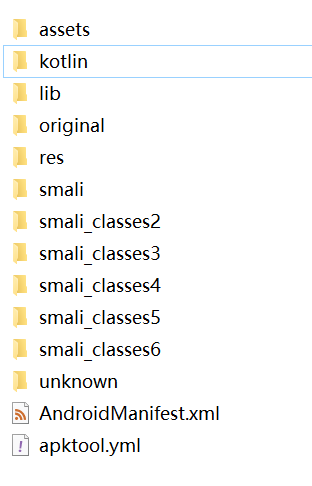
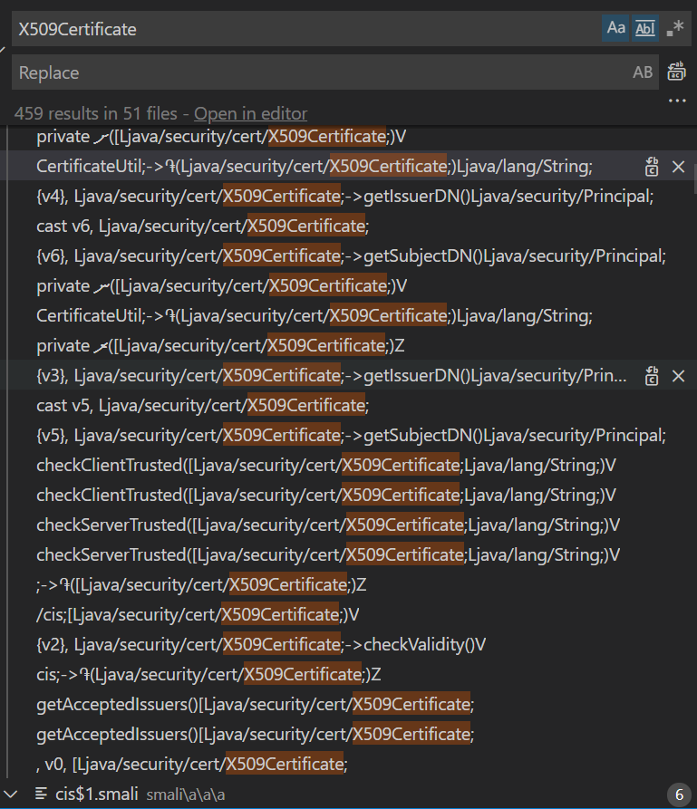
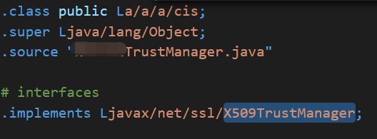
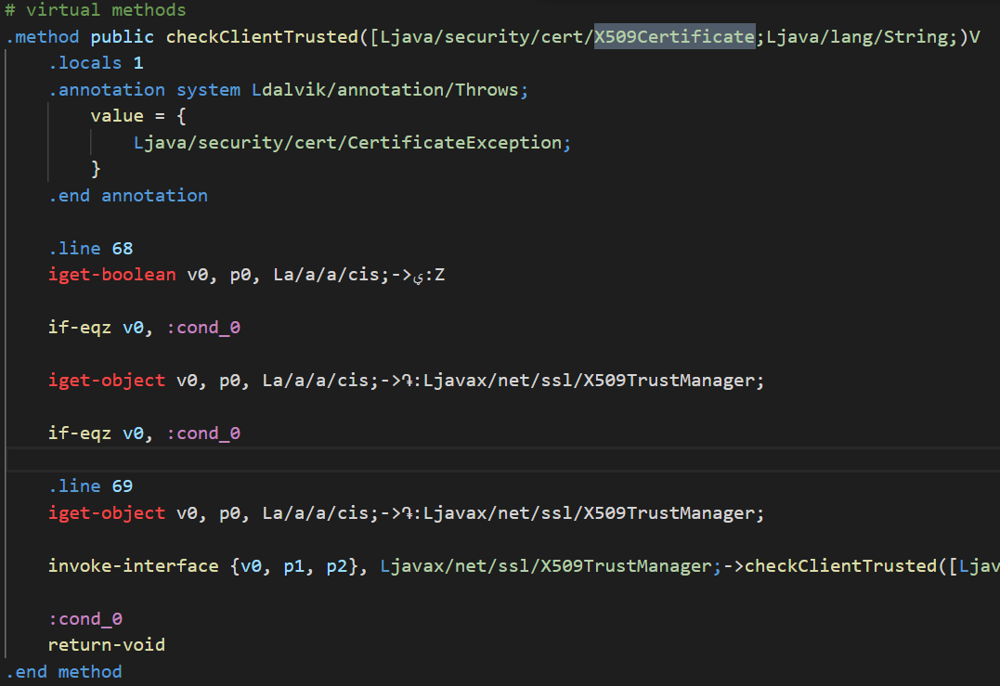
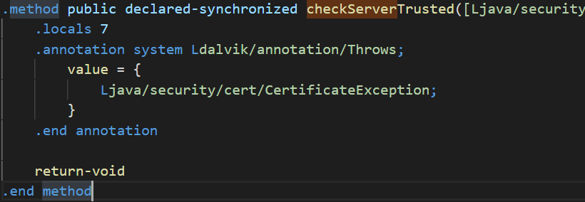
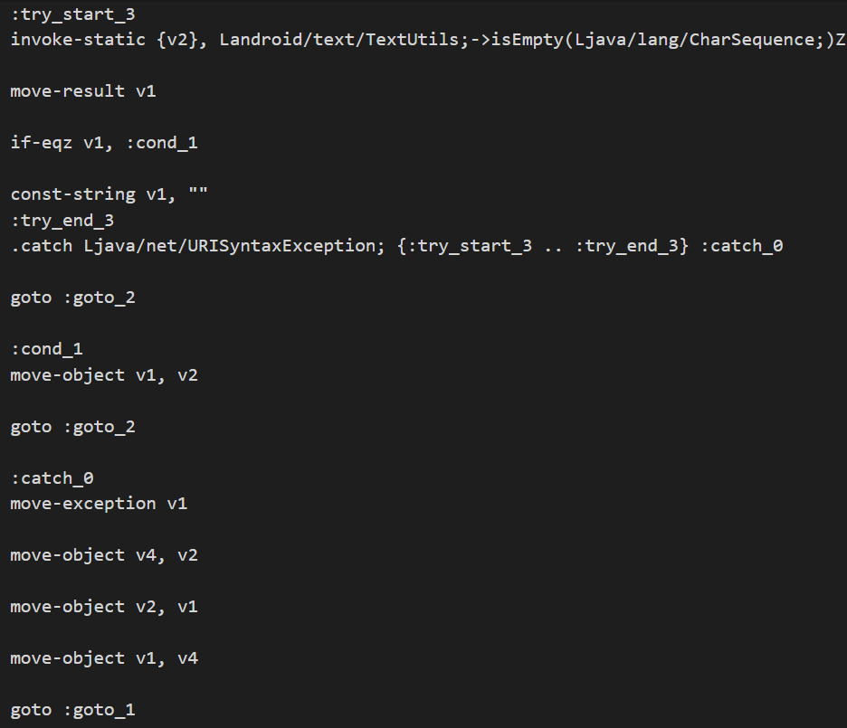
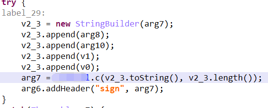
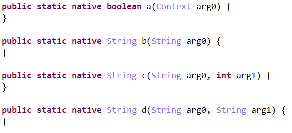
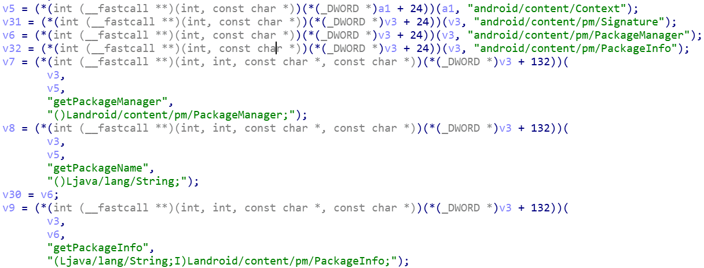
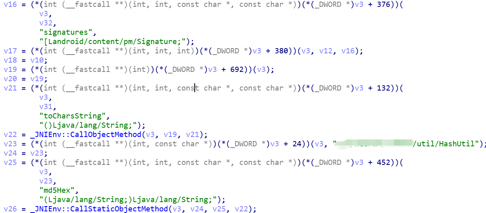

近日市场投放部门的同事找我说，在应用商店输入关键字查看我们APP的排名，这个能不能通过技术自动化实现？本以为是件很简单的事情，结果做的时候遇到了重重阻碍，于是就有了这次逆向之旅。

逆向，听起来就很黑客的词，好像比开发高大上好多倍啊。真正接触到才明白，逆向其实是一个很需要耐心，会查阅资料，又比较依赖运气的一件事。我的这次逆向之旅，虽然没有触及到很深刻的主题，但是如果你是一个新手又对逆向感兴趣，至少可以帮助你尽快进入状态，少走一些弯路。

本次用到的工具主要有：apk查壳神器、apktool.jar、signapk.jar、jeb2、IDA、Xposed，和一台夜神模拟器。**相关资源文末有下载链接**。

这个事情的核心其实就是抓下接口，伪造一个相同的请求，然后就可以用脚本刷接口了。抓包工具一般就是Fiddler或者Charles，然后在手机安装一个证书，就可以抓取HTTPS请求（如果事情这么简单，就不会有接下来的事了）。安装好证书后开始抓包，发现还是失败，并且APP检测到了抓包行为，提示当前网络存在安全隐患（WTF？）。看起来这个APP在本地应该有证书，就是那个X509什么什么的。没办法，正式进入本文的主题：逆向。

APP防逆向目前的手段主要还是混淆+加固。混淆的话没办法还原，只能靠自己去理解，而加固倒是有现成的手段，先去找一个**apk查壳神器**看看目标APK使用了什么加固手段，再去找找对应的脱壳方法，幸运的是我这次破解的商店没有用到任何加固（也挺不幸运，脱壳的技术暂时了解不到了）。

## Step1 解读Smali

**apktool.jar** 应该广为人知，使用它可以得到apk包内的smali文件和资源文件。使用如下命令即可：

```
java -jar apktool.jar xxx.apk
```

执行完之后可以得到一个下图结构的文件夹：

<div align="center"><br/></div>

我们这次分析的目标就是smali_xxx文件夹，有多个文件夹是因为当前APP大多使用了MultiDex（PS：这里我不是没试过用dex2jar转成可读性更强的Java Class，但是dex2jar只能解析一个dex，其他dex的文件都丢失了，后边使用jeb2搞定了这个事，但是我们待会再说）。smali文件浩如烟海，如果没有一定的目的性是肯定办不了事的，但我们的目标很明确就是X509Certificate，所以全局搜索它：

<div align="center"><br/></div>

看起来有400多个结果分布在50多个文件中，但是这次搜索并不是一无所获，其中 CertificateUtil 以及 checkClientTrusted、checkServerTrusted 引起了我的注意。前者不知道干嘛的，但是后者都是X509TrustManager定义的接口，我们定位到这个文件开头，可以看到确实实现了X509TrustManager：

<div align="center"><br/></div>

不知道是否运气太好，一次就破案了，只要我们删除 checkServerTrusted 里的校验，就可以让客户端信任所有的服务端证书，也就可以实现抓包操作了。

## 一次失败的尝试：修改Smali，回编APK

虽然不了解smali语法，但是还是能大致看懂一些的，随便截个方法体会一下：

<div align="center"><br/></div>

大体上没那么难懂吧？每一步在干什么写的很清楚，让我们往里面加代码可能比较难，但是删除一些还是比较简单的，我们就想让checkServerTrusted直接返回null，直接改成下面这样：

<div align="center"><br/></div>

smali修改完成后，得重新打包成apk，不然怎么安装呢？打包的方法如下：

```
java -jar apktool.jar b {刚刚反编译出来的路径} 
```

这个时候得到的apk是没有签名的，以前可以在回编命令加入 -c/--copy-original 保持原有的签名，只要没有修改Manifest文件即可。但是现在这个办法不可用了，在官方issues找到了解释：[apktool issue](https://github.com/iBotPeaches/Apktool/issues/2129)。所以我们可以通过 signapk.jar 来进行重签名。

```
// 下载signapk.jar 会同时得到 testkey.x509.pem testkey.pk8
java -jar signapk.jar testkey.x509.pem testkey.pk8 xxx.apk out.apk
```

但是APP肯定会对签名进行校验的，我们这个方式虽然能正常安装，但依然无法达到抓包的目的，具体原因请继续往下看。这说明通过修改smali文件回编apk的方式比较难搞，也可能做不了，所以我们有了方式2：Xposed。

## Step2 Xposed Hook Java

回编译行不通，我们就要找找其他办法，Xposed可以在不修改apk代码的情况下，改变apk的行为，虽然它只能hook java层代码，但就目前而言足够了。首先我们要有一台root过的手机，然后安装Xposed，文末我会分享此次使用的夜神模拟器和对应的Xposed安装器，如果你有Pixel或者Nexus手机那就更好了。

安装的过程很简单，只要提示以下的状态就是安装成功了：

<div align="center"><br/></div>

接下来就可以编写代码，新建一个APP工程，加入以下内容：

```
// app build.gradle
compileOnly 'de.robv.android.xposed:api:82'

// AndroidManifest.xml
<!-- 表明这是一个xposed插件 -->
<!-- 表明这是一个xposed插件 -->
<meta-data
    android:name="xposedmodule"
    android:value="true" /> <!-- 指定xposed的最小版本 -->
<meta-data
    android:name="xposedminversion"
    android:value="30+" /> <!-- 插件的描述 -->
<meta-data
    android:name="xposeddescription"
    android:value="xposed插件开发测试" />
```

这样配置一下，Xposed就可以识别我们的工程是一个插件，在那个安装器里选择模块，就可以激活我们的插件。

接下来就可以写我们的hook方法了，在工程中随便建一个类，实现 `IXposedHookLoadPackage` 接口，在 assets 目录下新建 xposed_init 文件，然后把这个类的class路径加入其中。IXposedHookLoadPackage 接口只有一个方法 handleLoadPackage，这里就是我们功能实现的地方。就我们的需求而言，这个非常简单：

```
public class HookXXXStore implements IXposedHookLoadPackage {
    @Override
    public void handleLoadPackage(XC_LoadPackage.LoadPackageParam lpparam) throws Throwable {
        XposedBridge.log("HookLogic >> current package:" + lpparam.packageName);
        if (lpparam.packageName.equals("com.xxx.market")) {
            XposedHelpers.findAndHookMethod("a.a.a.cis", lpparam.classLoader, "checkServerTrusted", X509Certificate[].class, String.class, new XC_MethodReplacement() {
                @Override
                protected Object replaceHookedMethod(MethodHookParam param) throws Throwable {
                    XposedBridge.log("直接替换checkServerTrusted方法，返回null");
                    return null;
                }
            });
        }
    }
}
```

简单明了不需要解释吧？传进去class、方法名、参数，再加一个回调，注意是 XC_MethodReplacement，直接替换原方法的实现，class名、方法名刚刚截图里都有。把这个脚本跑起来，重启一下就可以生效了。然后把抓包工具跑起来，原APP跑起来，就可以看到抓包的数据了。

## Step3 破解sign验签

抓包看数据可不是我们的目的，我们不仅想看到，还希望能自己写脚本调用接口。但是接口一般都会有个验签步骤，就是把Header中的参数拼接起来，再通过一定的加密算法生成一个字符串，客户端和服务端采用相同的手段，比对一下生成的字符串是否一致。所以我们必须知道这个sign的规则才能“伪装”自己就是APP，来刷接口数据。

从smali寻找蛛丝马迹的过程就不说了，搜索sign然后找可疑目标就好。不过这次找到之后smali文件读起来就比较费劲了，刚刚是因为我们知道那个方法的作用，不需要了解实现就能改，现在我们必须知道它取了哪些Header，又怎么排序怎么加密的，smali读起来像看天书，你们感受一下：

<div align="center"><br/></div>

满眼都是goto goto，这不是考验耐心了，是直接击垮耐心。所以我选择使用jeb2直接看对应的java代码。jeb2使用更简单，直接把源apk丢进去就可以了。这里就是关键代码：

<div align="center"><br/></div>

要搞清楚里面的arg8、arg10、v1、v0比较容易，重点是关键参数arg7是另一个类处理的，而具体实现是在native完成的：

<div align="center"><br/></div>

就好像眼看着就得到答案了，答案又埋在了更深的地方。关键是Xposed面对native是无力的，c语言本来就已经搁置很久，而且so库还会做混淆，为破解增加了无限压力。最后我采用了一种共生的方式完成了这个任务，那就是在安装了这个软件的手机上，调用它的so库来实现功能，好处是不需要了解它具体的实现，缺点是离不开Android平台了。

找到so是一回事，确定一个方案却是另一回事。如果不先看一下so，没准还以为自己可以读懂呢？这时候IDA就派上用场了，它可以打开so，还可以转成c语言代码，甚至可以动态调试（如果不是IDA和我的模拟器连接比较困难，总是卡在某个错误中，也许能动态调试出结果呢）。

## Step4 IDA分析so库

分析so库不仅为了找寻答案，也是来解释一下为什么我说换了签名之后就不能抓包了（其实也不是不能抓包，主要是拿不到需要的数据）。我们使用IDA打开这个so，主要关注签名用到的 **.c** 方法，还有传入了Context的 **.a** 方法。我们先看 **.a** 方法：

<div align="center"><br/></div>

这里先是拿到了包名信息，这个“伪装”起来很容易，接下来还根据Signature做了签名的校验：

<div align="center"><br/></div>

虽然不大明白，但大致就是对Signature简单处理一下，再md5加密，和一个特定的字符串对比，通过之后才能走下面的初始化流程，得到加密需要用到的key等字段。

接下来 **.c** 方法就很简单了，有了加密的key，调用加密算法进行加密即可。

## Step5 共生的方式调用so库

我们的探索就先到此，解释一下怎么通过共生的方式达到我们的目的。Context有个createPackageContext方法，可以创建另外一个包的上下文，它有两个标记位，CONTEXT_INCLUDE_CODE和CONTEXT_IGNORE_SECURITY，表示可以执行对方的代码以及忽略安全警告。我们只要把这个context给到so，就可以实现我们的功能了：

```
Context context = mContext.createPackageContext("com.xxx.market", Context.CONTEXT_INCLUDE_CODE | Context.CONTEXT_IGNORE_SECURITY);
XxxTools.a(context);
```

接下来就可以正常地进行抓包、解析数据，实现我们需要的功能了。

## 总结和展望

之所以中断探索的过程，不是说到了so就不能破解了，通过强大的**frida**工具可以同时 hook java 和 native 的代码，而且native的校验也都是比较容易绕过去的。难点在于使用frida要懂一些python脚本，还要掌握一点JS的知识，理解native的代码还需要有一些c语言基础，虽然深度要求不高，但是广度上需要掌握很多东西，这些都需要长时间的接触，而不是突然遇到就能突然掌握的。frida的配置也比较繁琐，整体而言对我们这个简单的需求有点**杀鸡焉用牛刀**的感觉。

因此本文仅仅是一个引子，告诉你有哪些工具，每个工具的作用，如果你对逆向有兴趣，可以从使用这些工具入手，慢慢深入。将这些工具集中在一起介绍一下，如果能减少你入门探索的时间，让你感受到逆向的门槛好像也没那么高，而由此带来一点点信心上的提升，那这篇文章的价值就实现了。

**相关的工具下载地址已经放在下方公众号，您可以回复 逆向 获取哦。**

---

本文到此就结束了，如果您喜欢我的文章，可以关注我的微信公众号： **大大纸飞机** 

或者扫描下方二维码直接添加：

<div align="center"><br/>扫描二维码关注</div>

您也可以关注我的简书：https://www.jianshu.com/u/9ee83a8ee52d

编程之路，道阻且长。唯，路漫漫其修远兮，吾将上下而求索。