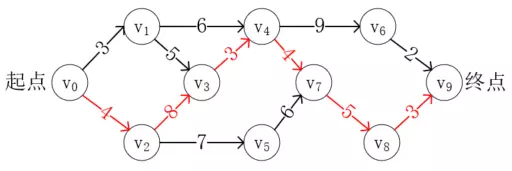

# 关键路径

梳理活动的顺序仅仅是拓扑排序可以完成的功能之一，更有价值的是估量完成整个事件的最短时间。比如生产一辆汽车，虽然安排员工、准备原始材料是先行条件，但是组装各种零部件是可以同时进行的，例如制造轮子和发动机、外壳等是可以同时进行的，这样可以大大减少生产时间。这种场景我们称为AOE网。

> 在一个表示工程的带权有向图中，用顶点表示事件，用有向边表示活动，用边上的权值表示活动的持续时间，这种有向图的边表示活动的网，称之为AOE网（Activity On Edge Network）。

我们的目标就是在这样的AOE网中，确定它的最短完成时间，而具备最短时间的路径就是关键路径。

> 把路径上各个活动所持续的时间之和称为路径长度，从起点到终点具有最大长度的路径叫关键路径，在关键路径上的活动叫关键活动。

那么我们怎么确定一个活动是不是关键活动呢？以做饭为例，我们可以同时烧水、炒菜和熬粥，其中烧水只需要3分钟，炒菜需要10分钟，熬粥需要20分钟。那么很显然至少需要20分钟才能完成全部工作，也就是说在这20分钟时间里，熬粥必须从一开始就进行，而烧水则可以从开始进行，也可以等17分钟后再进行，炒菜也可以从开始进行，或者最晚等10分钟后进行。这里没有空闲时间的活动就是关键活动。

例如下图就是一个AOE网，其中权值表示活动需要的时间：

<div align="center"><br/>AOE网</div>

以从v<sub>0</sub>->v<sub>3</sub>为例，假设权值表示的时间单位为分钟，可选的路径有v<sub>0</sub>->v<sub>1</sub>->v<sub>3</sub>，需要8分钟，或者v<sub>0</sub>->v<sub>2</sub>->v<sub>3</sub>，需要12分钟。要尽快到达v<sub>3</sub>，则v<sub>2</sub>必须一开始立刻启动，而v<sub>1</sub>可以在最开始，或者等待4分钟之后再启动，所以v<sub>0</sub>->v<sub>2</sub>->v<sub>3</sub>是关键路径。按照此方式，可以得到此AOE网的关键路径如下：

<div align="center"><br/>关键路径</div>

那么接下来，我们只需要确认每个顶点的最早开始时间和最晚开始时间，判断它们的时间差，如果没有时间差就是关键路径。

# 代码实现

首先，我们需要对AOE网进行拓扑排序，在排序的同时还可以得到每个顶点事件的最早发生时间，代码如下所示：

```java
public <T> boolean topoSort(ATGraph<T> atGraph,int[] earlestTimeVertex,Stack<ATVertex<T>> stack2) {
    int count = 0;
    Queue<ATVertex<T>> queue = new LinkedList<>();
    for (int i = 0; i < atGraph.getLen(); i++) {
        if (atGraph.getVertex(i).getIn() == 0) {
            queue.offer(atGraph.getVertex(i));
        }
    }
    while (!queue.isEmpty()) {
        ATVertex<T> vertex = queue.poll();
        System.out.print(vertex.getData() + "->");
        //将排序的数据push到stack2中
        stack2.push(vertex);
        count++;
        //获取第一条边
        ATEdge<T> next = vertex.getNext();
        while (next != null) {
            //获取
            ATVertex<T> nextVertex = next.getVertex();
            nextVertex.setIn(nextVertex.getIn() - 1);
            if (nextVertex.getIn() == 0) {
                queue.offer(nextVertex);
            }

            // 计算每个顶点可以执行的最早时间
            // 获取弧尾顶点下标
            int topIndex = atGraph.getVertexIndex(vertex);
            // 获取弧头顶点下标
            int index = atGraph.getVertexIndex(nextVertex);
            // 更新当前顶点可以发生的最早时间
            if (earlestTimeVertex[topIndex] + next.getWeight() > earlestTimeVertex[index]) {
                earlestTimeVertex[index] = earlestTimeVertex[topIndex] + next.getWeight();
            }
            next = next.getNext();
        }
    }

    return count >= atGraph.getLen();
}
```

现在我们得到了最早发生时间，并且将全部顶点按照访问的先后顺序压进了一个栈中，这是为了方便进行计算最晚发生时间。从前向后计算最晚发生时间是复杂的，但是反过来却很简单，对于最后一个顶点，它的最晚发生时间和最早发生时间一定一致，而它前面的顶点，就必须在此时间点之前完成。参考代码如下：

```java
for (int i = 0; i < atGraph.getLen(); i++) {
    // 先将最晚发生时间都设置为最长时间
    latestTimeVertex[i] = earlestTimeVertex[atGraph.getLen()-1];
}

// 从后向前，更新每个顶点的最晚发生时间
while (!stack2.isEmpty()){
    ATVertex<T> vertex = stack2.pop();
    ATEdge<T> next = vertex.getNext();
    while (next!=null){
        ATVertex<T> nextVertex = next.getVertex();
        int nextIndex = atGraph.getVertexIndex(nextVertex);
        int index = atGraph.getVertexIndex(vertex);
        if (latestTimeVertex[nextIndex]-next.getWeight()<latestTimeVertex[index]){
            latestTimeVertex[index] = latestTimeVertex[nextIndex]-next.getWeight();
        }

        next = next.getNext();
    }
}
```

最后，只要按照顺序比对这两个时间是否相等，就可以得到完整的关键路径了，完整代码如下：

```java
public <T> void criticalPath(ATGraph<T> atGraph){
    Stack<ATVertex<T>> stack2 = new Stack<>();
    int[] earlestTimeVertex = new int[atGraph.getLen()];
    int[] latestTimeVertex = new int[atGraph.getLen()];

    topoSort(atGraph,earlestTimeVertex,stack2);
    for (int i = 0; i < atGraph.getLen(); i++) {
        // 先将最晚发生时间都设置为最长时间
        latestTimeVertex[i] = earlestTimeVertex[atGraph.getLen()-1];
    }

    // 从后向前，更新每个顶点的最晚发生时间
    while (!stack2.isEmpty()){
        ATVertex<T> vertex = stack2.pop();
        ATEdge<T> next = vertex.getNext();
        while (next!=null){
            ATVertex<T> nextVertex = next.getVertex();
            int nextIndex = atGraph.getVertexIndex(nextVertex);
            int index = atGraph.getVertexIndex(vertex);
            if (latestTimeVertex[nextIndex]-next.getWeight()<latestTimeVertex[index]){
                latestTimeVertex[index] = latestTimeVertex[nextIndex]-next.getWeight();
            }

            next = next.getNext();
        }
    }

    int ete,lte;
    for (int i = 0; i < atGraph.getLen(); i++) {
        ATVertex<T> vertex = atGraph.getVertex(i);
        ATEdge<T> next = vertex.getNext();
        while (next!=null){
            ATVertex<T> nextVertex = next.getVertex();
            int nextIndex = atGraph.getVertexIndex(nextVertex);
            lte = latestTimeVertex[nextIndex]-next.getWeight();
            ete = earlestTimeVertex[i];
            if (ete==lte){
                System.out.println("路径："+atGraph.getVertex(i).getData()+"->"+atGraph.getVertex(nextIndex).getData()+", 长度："+ next.getWeight());
            }
            next = next.getNext();
        }
    }
}
```

以上涉及代码请参考[TopoSort.java](./sample/TopoSort.java)。

---

本文到此就结束了，如果您喜欢我的文章，可以关注我的微信公众号： **大大纸飞机** 

或者扫描下方二维码直接添加：

<div align="center"><br/>扫描二维码关注</div>

您也可以关注我的简书：https://www.jianshu.com/u/9ee83a8ee52d

编程之路，道阻且长。唯，路漫漫其修远兮，吾将上下而求索。