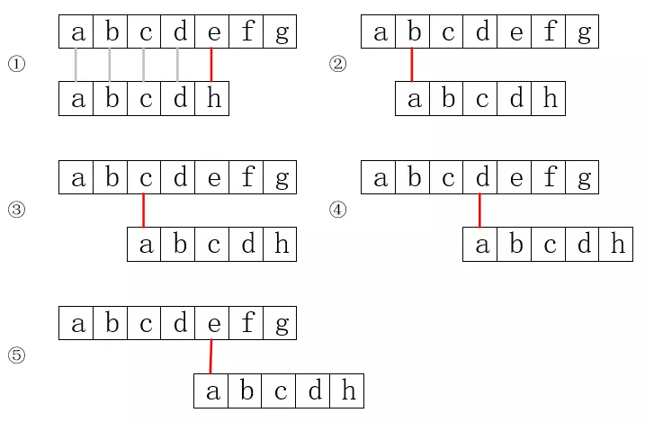
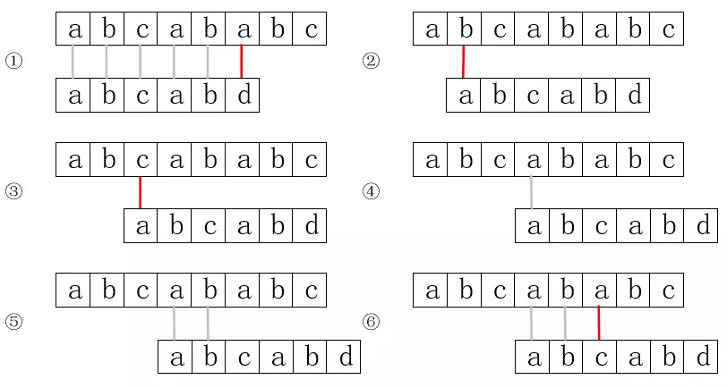
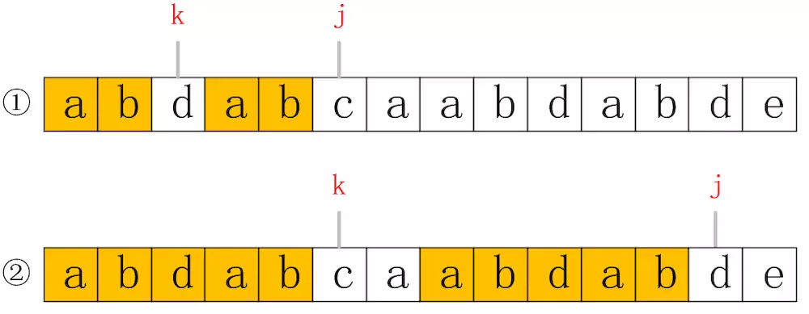
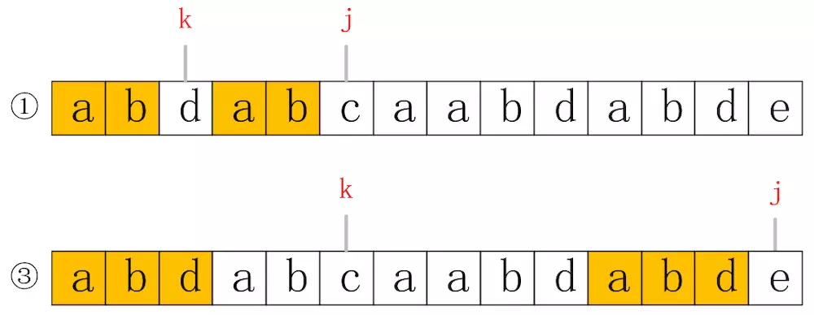

# 字符串匹配

我们应该都使用过`String.indexOf("xxx")`方法来查找某个字符或字符串在String中的位置，这就是一个字符串的匹配问题。字符串匹配在很多场景中都有应用，下面介绍的几种算法，就是在不同场景下的解决方法。

# 字符串的存储

数据存储只有顺序或链式两种方式，首先字符串并不适合使用链式存储，因为字符串是由字符组成的，如果每个结点仅存储一个字符，会浪费大量的空间，而如果每个结点存储多个字符，那这个数量的选择就十分关键，不同的情况下可能需要不同的数量，这样一来变数太大，不够灵活。

而使用顺序存储的话，就不会有以上问题，但数组也有一定的缺陷，数组是定长的，有可能字符串比数组小，也可能数组放不下字符串，比如最初短信只能发70个汉字，超过的部分就会被丢弃，后来则是自动拆分成两条短信。所以存储字符串使用的数组一般会通过动态分配来处理。

# “暴力”匹配算法

我们要做的，就是从一个字符串中，寻找到目标子串出现的位置，比如在“helloworld”中找到“low”出现的位置。“暴力”匹配算法就是我们最容易想到的方案，那就是用目标子串和该字符串的每一位一一对比，第一个字符一致再比第二个，直到找到为止。这里我们以char数组来模拟String，找到第一个匹配目标即可。示例代码如下：

```java
private  int indexOf(char[] origin, char[] target){
    int originLen = origin.length;
    int targetLen = target.length;

    if(originLen==0 || targetLen == 0 || originLen<targetLen){
        return -1;
    }

    if(origin == target) return 0;

    int i=0,j=0;
    while (i<originLen && j<targetLen) {
        if(origin[i] == target[j]){
            // 如果相同就一一比较
            i++;
            j++;
        }else{
            // 不相同，i指向上次匹配第一个字符的下一位，j清零
            i = i-j+1;
            j=0;
        }
    }

    if(j>targetLen-1) return i-targetLen;
    else return -1;
}
```

我们算下“暴力”匹配算法的时间复杂度，假设n是原字符串长度，m是目标字符串长度，最好的情况是上来就匹配，也就是只走if语句，需要运行m次，所以复杂度为O(1)。最坏的情况是，每次都先走if语句，到最后一位判断时发现不匹配，然后else-if交替进行，时间复杂度为O((n-m+1)*m)，这就好比是从字符串`aaaaaaaaaab`中查找`ab`，每次比对都发现第一个字符相同，但第二个字符不同。

在字符串比较短时，这个算法是可行的，但是当字符串非常长时，它的效率就十分低了。

# KMP匹配算法

“暴力”匹配算法的主要问题在于执行else时 i 的回溯。我们以在字符串`abcdefg...`中寻找`abcdh`为例，来说明以上算法的问题。

<div align="center"><br/>暴力匹配</div>

上图中，用灰线表示匹配成功，红线表示匹配失败。可以发现，因为`abcdh`没有重复字符，而`abcd`又在步骤①时都比较过了，它们分别对应相等，所以第一个字符a不可能与后边的`bcd`三个字符相等了，也就是说步骤②③④都是多余的。

当然，字符不重复是特殊情况，下面我们看看字符有重复时的情况，以在字符串`abcababc...`中查找`abcabd`为例。

<div align="center"><br/>重复字符</div>

首先，步骤②和③是可以省略的，而目标串第一位的a和第四位一样，第二位的b和第五位一样，而第四位和第五位的a和b字符又已经和原串比较过了，它们是相等的，也就是说前两位的ab和原串第四位和第五位是分别相等的，因此步骤④和⑤也是可以省略的。

分析以上两种情况，可以发现，无论是否有重复字符，i 的值都不需要回溯，也就是从头到尾遍历一次原串，就能完成匹配。KMP算法就是把以上思路转为实现。

KMP算法的核心是计算出一个next数组，这个数组表示在暴力匹配算法中 j 的变化，也就是目标串首字符与原串比较的位置，比如在字符不重复例子中，从步骤①直接到步骤⑤，j 的变化就是从0到3，而在字符重复的例子中，就是从0到5。这个next的计算遵循以下规则：

> 统计当前字符下标 j 之前前缀和后缀最长连续重复字符数，把它的值当做next数组对应的数据值，没有字符则值为-1。前缀指从前往后，不包含原串的所有子串，后缀是从后往前不包含原串的所有子串。

首先解释一下前缀后缀，比如在字符串`abcd`中，a、ab、abc都是前缀，而d、cd、bcd都是后缀。同样，我们分没有重复和有重复来解释这里next数组的计算方式。还是以`abcdh`为例，j 表示每个字符的下标。

- 当j=0时，j之前没有字符，next[j]=-1;
- 当j=1时，j之前只有字符a，没有重复，所以next[j]=0;
- 当j=2时，j之前有字符a和b，但是它们不相等，所以next[j]=0;
- 当j=3时，j之前有a、b、c三个字符，也不重重，所以next[j]=0;
- ...

因为没有重复字符，所以next数组的最终值为-10000。

接下来我们看有重复字符的情况，以`abcabd`为例：

- 当j=0时，j之前没有字符，next[j]=-1;
- 当j=1时，j之前只有字符a，没有重复，所以next[j]=0;
- 当j=2时，j之前有字符a和b，但是它们不相等，所以next[j]=0;
- 当j=3时，j之前有a、b、c三个字符，也不重重，所以next[j]=0;
- 当j=4时，j之前有abca四个字符，此时最前的字符a和最后的字符a相等，所以next[j]=1;
- 当j=5时，j之前有abcab五个字符，此时最前的字符ab和最后的字符ab相等，所以next[j]=2;

所以next数组的最终值为-100012。

通过以上示例发现，next就是统计当前位置之前连续重复的字符数量，所以代码也就顺理成章了，如下所示：

```java
private int[] getNext(char[] target){
    int len = target.length;
    if(len==0){
        return new int[]{-1};
    }
    
    int[] next = new int[target.length];

    // j表示当前位置，k表示子串需比较的第一位。
    int j=0,k=-1;
    next[0] = -1;
    while (j<len-1) {
        if(k==-1 || target[j]==target[k]){
            j++;
            k++;
            next[j]=k;
        }else{
            k=next[k];
        }
    }

    return next;
}
```

这里代码对上述比较进行了一次小的优化。我们看分析`abcabd`时，当j=4时，我们已经判断过前缀a和后缀a相等，那么当j=5时，只需要再判断前缀ab和后缀ab中的b是否相等就可以，因为a已经确认是相等了。假如b是相等的，可以推算出next[5]=next[4]+1，也就是代码中if语句的做法，这部分比较好理解。那假如是不同的呢，我们通过一个图来说明，如下所示：

<div align="center"><br/>next值确定</div>

next的值，也就是表示从0到j-1的所有字符中，前缀和后缀连续相同的最大值，我们把这个值记为k，那么k的值如果对应到数组中的位置就恰好指向符合规则的前缀的下一位，如上图所示。在②中，我们知道k=5，j=12，现在我们要计算j=13时next的值，也就是当 j 指向e时的值，我们发现②中k和j指向的值不再相等，意味着需要从新开始比较，但是我们却不一定需要把 k 置为0，先看下图，e对应的最长子串应该是abd：

<div align="center"><br/>e的最长子串</div>

可以发现，①和③是有共性的，也就是它们的符合规则的子串前两位是重合的，都是ab，而且①中k的位置，又正好是③中子串的最后一位，这意味着，我们只需要把原有的k，换成k=next[k]，就可以有效减少对比次数。当然，有可能k向前移动一次依然不符合，就可以再次向前移动，直到从新开始。

有了next数组，我们就可以实现KMP算法了，代码如下：

```java
private int indexOfKMP(char[] origin, char[] target){
    int originLen = origin.length;
    int targetLen = target.length;

    if(originLen==0 || targetLen == 0 || originLen<targetLen){
        return -1;
    }

    if(origin == target) return 0;

    int i=0,j=0;
    int[] next = getNext(target);

    while (i<originLen && j<targetLen) {
        if(j==0 || origin[i] == target[j]){
            // 如果相同就一一比较,j=0表示不需要比较
            i++;
            j++;
        }else{
            // j返回到合适的位置，i不再需要回溯
            j = next[j];
        }
    }

    if(j>targetLen-1) return i-targetLen;
    else return -1;
}
```

这段代码和暴力匹配差别不大，主要是在if语句中增加了j==0的判断，在else中减掉了 i 的回溯，从而大大提高效率。

KMP算法的最坏时间复杂度为O(n+m)，其中n表示原串长度，m表示目标串的长度，它的最大优势在于把时间复杂度降低到了线性级别。但是在使用中，它的优势并不十分明显，因为极少有需要在重复性很高的字符串中寻找重复性很高的子串，而且它还需要一个额外的数组来保存next。KMP算法的优势还在于不需要回退，所以它比较适合在长度不确定的输入流中查找。Java的String类内部indexOf方法使用的就是暴力匹配，可见KMP在一般场景下并不那么适用。

# 总结

除了以上算法之外，字符串匹配算法还有Boyer-Moore算法和Rabin-Karp算法等，这里就不再进行研究了。感兴趣的可以查阅《算法》一书。总之，在一般场景下我们可以使用暴力匹配算法，而在超长的输入流中则可以使用KMP算法，具体使用哪种还需要根据实际情况进行评估。

以上涉及代码请参考[KMPSample.java](./sample/KMPSample.java)。

---

本文到此就结束了，如果您喜欢我的文章，可以关注我的微信公众号： **大大纸飞机** 

或者扫描下方二维码直接添加：

<div align="center"><br/>扫描二维码关注</div>

您也可以关注我的简书：https://www.jianshu.com/u/9ee83a8ee52d

编程之路，道阻且长。唯，路漫漫其修远兮，吾将上下而求索。