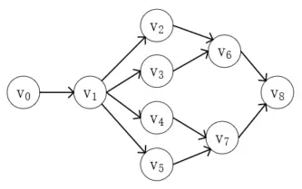

# 拓扑排序

最小生成树和最短路径可以解决无序的问题，此处的无序指的是对顶点的访问顺序没有要求，但是很多场景对顺序有严格的要求，比如说建造一栋大楼必须先找好施工人员，购买各种材料和准备好各种器械之后才能开始盖楼。或者是拍电影必须先找好演员和各种负责人之后才能开拍。类似这样的场景我们称为AOV网。

> 在一个表示工程的有向图中，用顶点表示活动，用弧表示活动之间的优先关系，这样的有向图为顶点表示活动的网，我们称为AOV网（Activity On Vertex Network）。

AOV网中不能存在回路，因为后续的活动依赖之前的活动，而不能互相依赖。而拓扑排序，就是对这样的AOV网进行排序，它的定义如下：

> 设G=(V, E)是一个具有 n 个顶点的有向图，V中的顶点序列v<sub>0</sub>, v<sub>1</sub>, ..., v<sub>n-1</sub>，满足若从顶点 v<sub>i</sub> 到 v<sub>j</sub> 有一条路径，则在顶点序列中顶点 v<sub>i</sub> 必在 v<sub>j</sub> 之前，这样的顶点序列就是拓扑序列。将AOV网排序成这样的序列就是拓扑排序。

例如下图就是一个AOV网，其中v<sub>2</sub>、v<sub>3</sub>、v<sub>4</sub>、v<sub>5</sub>都依赖于v<sub>1</sub>，表明只要v<sub>1</sub>执行完毕后，它们都可以开始了。

<div align="center"><br/>AOV网</div>

对于这样的AOV网，只要v<sub>0</sub>在v<sub>1</sub>之前，v<sub>1</sub>在v<sub>2</sub>、v<sub>3</sub>、v<sub>4</sub>、v<sub>5</sub>之前，而v<sub>2</sub>、v<sub>3</sub>在v<sub>6</sub>之前，v<sub>4</sub>、v<sub>5</sub>在v<sub>7</sub>之前，v<sub>6</sub>和v<sub>7</sub>在v<sub>8</sub>之前，就是一个有效的拓扑序列。比如可以是v<sub>0</sub>->v<sub>1</sub>->v<sub>2</sub>->v<sub>3</sub>->v<sub>4</sub>->v<sub>5</sub>->v<sub>6</sub>->v<sub>7</sub>->v<sub>8</sub>，也可以是v<sub>0</sub>->v<sub>1</sub>->v<sub>2</sub>->v<sub>3</sub>->v<sub>6</sub>->v<sub>4</sub>->v<sub>5</sub>->v<sub>7</sub>->v<sub>8</sub>。

拓扑排序的思路就是：从AOV网中选择一个入度为0的顶点，删除它与其它顶点间的弧，然后重复这个过程，直到得到全部顶点，或者是判断出它不是一个AOV网。

因为涉及到大量的删除操作，我们选择邻接表来存储数据，同时为了方便计算入度，增加一个属性来记录每个顶点的入度。拓扑排序的参考代码如下：

```java
public <T> boolean topoSort(ATGraph<T> atGraph) {
    int count = 0;
    Queue<ATVertex<T>> queue = new LinkedList<>();
    for (int i = 0; i < atGraph.getLen(); i++) {
        if (atGraph.getVertex(i).getIn() == 0) {
            queue.offer(atGraph.getVertex(i));
        }
    }
    while (!queue.isEmpty()) {
        ATVertex<T> vertex = queue.poll();
        System.out.print(vertex.getData() + "->");
        count++;
        ATEdge<T> next = vertex.getNext();
        while (next != null) {
            ATVertex<T> nextVertex = next.getVertex();
            nextVertex.setIn(nextVertex.getIn() - 1);
            if (nextVertex.getIn() == 0) {
                queue.offer(nextVertex);
            }
            next = next.getNext();
        }
    }

    return count >= atGraph.getLen();
}
```

以上涉及代码请参考[TopoSort.java](./sample/TopoSort.java)。

---

本文到此就结束了，如果您喜欢我的文章，可以关注我的微信公众号： **大大纸飞机** 

或者扫描下方二维码直接添加：

<div align="center"><br/>扫描二维码关注</div>

您也可以关注我的简书：https://www.jianshu.com/u/9ee83a8ee52d

编程之路，道阻且长。唯，路漫漫其修远兮，吾将上下而求索。