# 排序算法

通过前面的知识，我们已经知道，有序的数据在查找时有极大的性能提升。很多查找都基于有序数据，但并不是所有的结构都能像二叉排序树一样，在插入数据时就已经排好序，很多时候往往是无序的数据，需要我们使用时再进行排序，这就意味着我们需要寻找高效率的排序算法。接下来，我们对当下使用较为普遍的几个算法逐一进行分析。这里推荐一个可以查看算法运行动态过程的[网站](https://www.cs.usfca.edu/~galles/visualization/Algorithms.html)，加深对算法原理的理解。

# 基础知识

## 排序定义

> 假设含有n个记录的序列为{r<sub>1</sub>. r<sub>2</sub>, ..., r<sub>n</sub>}，其相应的关键字分别为{k<sub>1</sub>, k<sub>2</sub>, ..., k<sub>n</sub>}，需确定1, 2, ..., n的一种排列p<sub>1</sub>, p<sub>2</sub>, ..., p<sub>n</sub>，使其相应的关键字满足k<sub>p1</sub>≤k<sub>p2</sub>≤...≤k<sub>pn</sub>(非递减或非递增) 关系，即使得序列成为一个按关键字有序的序列{r<sub>p1</sub>, r<sub>p2</sub>, ..., r<sub>pn</sub>} ， 这样的操作就称为排序。

## 稳定性

> 假设k<sub>i</sub>=k<sub>j</sub>( 1≤i≤n, 1≤j≤ n, i≠j ) ，且在排序前的序列中 r<sub>i</sub> 领先于 r<sub>j</sub> (即i<j) 。如果排序后 r<sub>i</sub> 仍领先于 r<sub>j</sub>，则称所用的排序方法是稳定的；反之，若可能使得排序后的序列中 r<sub>j</sub> 领先 r<sub>i</sub>，则称所用的排序方法是不稳定的。

简单来说，就是对于原数据中相等的数据，排序前后如果相对位置没有改变，就是稳定的。

## 内排序与外排序

> 内排序是在排序整个过程中，待排序的所有记录全部被放置在内存中。外排序是由于排序的记录个数太多，不能同时放置在内存，整个排序过程需要在内外存之间多次交换数据才能进行。本文先介绍内排序算法，外排序以后再来分析。

# 冒泡排序

> 冒泡排序（Bubble Sort）是一种交换排序，它的基本思想是：两两比较相邻记录的关键字，如果反序则交换，直到没有反序的记录为止。

冒泡排序可能是我们最熟悉的排序算法了，它的核心在于两两交换，代码代码：

```java
private void bubbleSort(int[] arr){
    int len = arr.length;

    for (int i = 0; i < len-1; i++) {
        for (int j=0; j < len-1-i; j++) {
            if(arr[j]>arr[j+1]){
                swap(arr, j, j+1);
            }
        }
    }
}
```

它的最坏时间复杂度是1+2+...+(n-1) = n(n-1)/2，也就是O(n<sup>2</sup>)，这个复杂度相对还是比较高的，所以只适合小量数据排序。因为冒泡排序每次遍历后，最后的数据一定是有序的，所以当初始数据部分有序时，还可以对它进行优化。比如数组为{1,0,5,6,7,8,9,10}，当第一次遍历后，数组就是有序的，这时后续的循环遍历都是没有用的，优化后的算法如下：

```java
private void bubbleSort1(int[] arr){
    int len = arr.length;
    boolean flag = false;
    for (int i = 0; i < len-1; i++) {
        flag = false;
        for (int j=0; j < len-1-i; j++) {
            if(arr[j]>arr[j+1]){
                swap(arr, j, j+1);
                flag = true;
            }
        }
    }
}
```

使用一个flag标记是否有数据交换，冒泡排序如果没有数据交换，则意味着后边的数据一定是有序的，这样一来可以有效地提高冒泡排序的性能。但总体而言，冒泡排序还是不适合大数据量、数据比较乱的情况。

# 简单选择排序

选择排序的思想是每一趟从待排序的记录中选出最小的元素，顺序放在已排好序的序列最后，直到全部记录排序完毕。简单选择排序就基于此思想，除此之外还有树型选择排序和堆排序也是基于此思想。

> 简单选择排序法就是通过n-i次关键字间的比较，从n-i+1个记录中选出关键字最小的记录，并和第 i (0≤i≤n)个记录交换。

它的实现如下：

```java
private void selectSort(int[] arr){
    int len = arr.length;
    int min;
    for (int i = 0; i < len; i++) {
        min = i;
        for (int j = i+1; j < len; j++) {
            if(arr[min]>arr[j]){
                min = j;
            }
        }
        if(i!=min){
            swap(arr,i,min);
        }
    }
}
```

总体来看，简单排序算法的最坏时间复杂度也是O(n<sup>2</sup>)，但是它交换数据的次数明显比冒泡排序要少很多，所以性能也比冒泡排序略优。

# 直接插入排序

直接插入排序和我们排序扑克牌的道理一致，就是把新的一张牌插入到已经排好序的牌中，它的基本操作是将一个记录插入到已经排好序的有序表中，从而得到一个新的、记录数增1的有序表。它的代码实现如下：

```java
private void insertSort(int[] arr){
    int len = arr.length;
    int temp;
    for (int i = 0; i < len; i++) {
        for (int j = 0; j < i; j++) {
            if(arr[i]<arr[j]){
                temp = arr[i];
                // j及以后的记录向后移动一位，然后把当前值存放在j的位置
                System.arraycopy(arr,j,arr,j+1,i-j);
                arr[j] = temp;
            }
        }
    }
}
```

它的最坏时间复杂度依然是O(n<sup>2</sup>)。

我们介绍了三种最简单，最容易理解的算法，但是它们的效率也确实较低。在数据量小的时候影响不大，然而现实是我们更多地要对大量数据进行排序。接下来介绍的几种算法属于改进算法，它们的效率都较为高一些。

# 希尔排序

简单的排序算法，都需要在数据量少，或者部分有序的情况下，才能发挥较好的性能。但是再大规模的数据都可以拆分成多个小规模的数据，希尔排序的思想就是把大规模的数据拆分成多个小规模数据，然后每部分分别进行直接插入排序，最后再对全部数据进行整体排序。如何拆分就是希尔排序的重点，比如数据是{0, 9, 2, 4, 6, 1}，要将它拆成两部分，如果按照前后拆分，那么进行直接插入排序后结果是{0, 2, 9, 1, 4, 6}，这样排序后对后续整体排序没有帮助。那么希尔排序是如何做的呢？我们先通过一个简单的数组来演示希尔排序的过程，首先有数组如下：

<div align="center">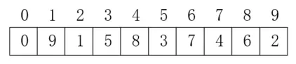<br/>希尔排序</div>

假设第一次取数据的一半作为间隔值，之后每次减半，我们把这个值记为inc，那么第一次inc=5，我们在对应位置前加一条红色虚线表示，如下所示：

<div align="center">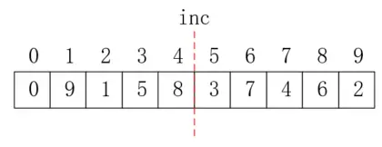<br/>inc定义</div>

接下来我们就要进行直接插入排序了，前面说过希尔排序不是按照前后区分，而是按照间隔区分的，所以，在进行完这一轮的排序后，我们要保证以下数据是有序的，如下图所示，不同颜色表示不同的子数组，只要保证每个子数组有序即可：

<div align="center">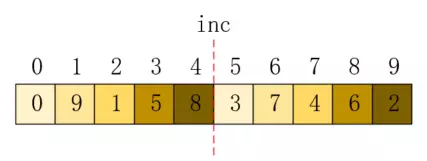<br/>子数组拆分</div>

可以看到，每个子数组的元素下标间隔都是inc，这就是inc值的意义。根据这一原则，我们就可以进行直接插入排序了，只需要依次将每个子数组排好序即可。首先比较0和5位置的值，发现已经有序，无需交换，如下：

<div align="center">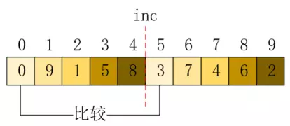<br/>比较0和5</div>

然后比较位置1和6，发现数值顺序错误，对它进行交换，如下所示：

<div align="center">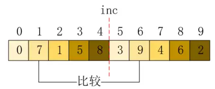<br/>比较1和6</div>

接下来再依次比较2和7，3和8，4和9的值，将其排序，最终结果如下所示：

<div align="center">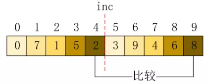<br/>第一轮比较结果</div>

现在，拆分的子数组都已经是有序了。接下来，我们需要合并，我们把inc的值折半，再进行上述操作，那么inc的位置和拆分的子数组如下所示：

<div align="center">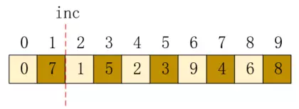<br/>子数组拆分</div>

可以看到，每个子数组的元素下标间隔都和inc值一样，这时子数组只有两个了。我们来对这两个子数据依次进行直接插入排序，首先对包含位置0的数组进行排序，直接插入排序就是把当前值插入到已有的有序子数组中，所以0位置依然是0，然后把位置2的元素插入，因为1＞0，所以它的位置不变，如下所示：

<div align="center">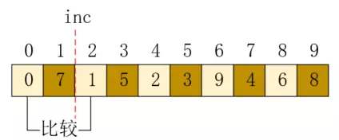<br/>调整位置0和2</div>

位置4和6的元素又是最大值，所以也不需要交换，结果如下所示：

<div align="center">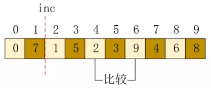<br/>调整位置4和6</div>

接下来位置8，插入后需要和6交换，如下所示：

<div align="center">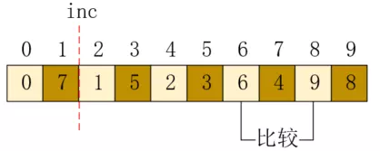<br/>调整位置8</div>

这样，第一个数组就调整完毕了，接下来调整第二个数组，位置1和3需要交换，如下所示：

<div align="center">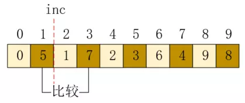<br/>调整位置1和3</div>

接下来调整位置5，因为值3是最小值，应该放在位置1，所以需要把1和3位置的值向后移动，然后再插入，结果如下：

<div align="center">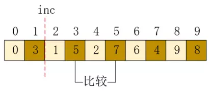<br/>调整位置5</div>

最后位置7和9也按照同样的方式进行，最终结果如下：

<div align="center">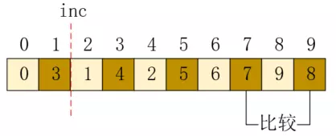<br/>调整位置7和9</div>

现在，我们再进行合并时就是一个完整的数组了，可以看到，这个数组已经是基本有序的了，较小的值基本位于左侧，较大的值基本位于右侧，这比直接进行直接插入排序要好的多。希尔排序的代码如下：

```java
private void shellSort(int[] arr){
    int len = arr.length;
    int inc = len;
    // 设置间隔值
    for (inc=len/2; inc>0; inc/=2) {
        // i 从inc走到len，j正好可以把所有子数组遍历一次
        // j会先比较每个子数组的第一个值，再第二个值，这样横向进行遍历
        for (int i = inc; i < len; i++) {
            for (int j = i; j>=inc && arr[j]<arr[j-inc]; j-=inc) {
                swap(arr,j,j-inc);
            }
        }
    }
}
```

希尔排序总体而言效率比直接插入排序要好，因为它最开始当inc值较大时，数据的移动距离很长，而当inc值小时，因为数据已经大致有序，可以使直接插入排序更有效率，这两点是希尔排序高效必备的条件。inc值的选取对希尔排序十分关键，像以上这种折半方式，在某些情况下还是较慢，但是我们没有办法找到完美的计算方案使希尔排序最高效，以inc=inc*3+1构建的间隔也是常用的一种，示例代码如下：

```java
private void shellSort1(int[] arr) {
    //首先根据数组的长度确定增量的最大值
    int inc=1;
    // inc * 3 + 1得到增量序列的最大值
    while(inc <= arr.length / 3)
        inc = inc * 3 + 1;
    //进行增量查找和排序
    while(inc>=1){           
        for(int i=inc;i<arr.length;i++){
            for(int j=i;j >= inc && arr[j] < arr[j-inc];j -= inc){
                swap(arr,j,j-inc);
            }
        }
        inc = inc/3;
    } 
}
```

目前，最高效的希尔排序的时间复杂度可以达到O(n<sup>3/2</sup>)，相关知识大家可以查阅书籍了解，这里我们就不再追究了。

# 堆排序

堆排序是对简单选择排序的优化，在简单选择排序中，每排序一个数据，都要在剩余全部数据中寻找最小值，但是在这个寻找的过程中，没有对剩余的数据记录，所以之后的寻找会进行多次重复操作。堆排序则是会把这些数据记录在堆中，之后的寻找只需要在堆中进行。

> 堆是具有下列性质的完全二叉树：每个结点的值都大于或等于其左右孩子结点的值，称为大顶堆；或者每个结点的值都小于或等于其左右孩子结点的值，称为小顶堆。

根据以上定义，可以确定，根结点一定是最大（或最小）值。大顶堆和小顶堆示意如下：

<div align="center">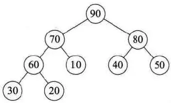<br/>大顶堆</div>

<div align="center">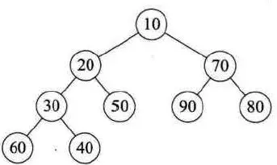<br/>小顶堆</div>

如果按照层序遍历的顺序给堆的每个结点编号：0, 1, ..., (n-1)，那么它一定符合以下条件：

a[i]≤a[2i+1] 且 a[i]≤a[2i+2]，其中0 ≤ i ≤ (n-1)/2，或 a[i]≥a[2i+1] 且 a[i]≥a[2i+2]，其中0 ≤ i ≤ (n-1)/2。

掌握了堆的概念之后，就可以进行堆排序了，以从小到大排序为例，它的过程是先将待排序的数组构建成一个大顶堆，此时，根结点就是最大值，将它放置在数组的结尾，然后将剩余数据重新构建成一个堆，如此循环进行，直到全部有序。

那，我们如何构建一个大顶堆，又如何进行调整呢？接下来，我们用一个数组示例，来演示堆排序的过程，假如数组如下：{50, 20, 90, 30, 80, 40, 70, 60, 10}，我们第一步要做的就是把它看做是一个完全二叉树层序遍历的结果集，所以它对应的完全二叉树如下：

<div align="center">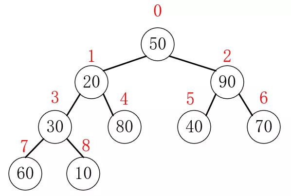<br/>完全二叉树</div>

我们要做的，就是把这棵完全二叉树调整为一个大顶堆结构，按照树的一般处理思路，我们只需要把每个子树都调整为大顶堆，就可以把整棵树调整为大顶堆，所以，我们只需要自下而上，依次把分别以3、2、1、0为根结点的子树调整为大顶堆即可，结点3就是最后一个子树，之后的结点都是叶子结点。

下面先看调整的代码，如下所示：

```java
/**
 * 堆的调整
 * root：子树的根结点位置
 * len：当前排序数组的长度
 */
private void heapAdjust(int[] arr, int root, int len){
    if(len<=0)return;
    int temp;
    // 根结点的值先保存
    temp = arr[root];
    // i是这个结点的左孩子，或者是它孩子的左孩子
    for (int i=2*root+1; i<len; i=2*i+1) {
        if(i<len-1 && arr[i]<arr[i+1]){
            // 寻找到两个孩子的较大者
            i++;
        }
        // 根结点的值比两个孩子都大，就不需要再调整了
        if(temp>=arr[i]){
            break;
        }
        // 把根结点的值记为这个较大的孩子的值
        arr[root] = arr[i];
        // 再向下一级子树遍历
        root=i;
    }
    // 最后把temp的值存放在空置的位置
    arr[root] = temp;
}
```

按照以上思路，这段代码看起来就比较简单了，那就是寻找到这棵树的最大值，并且每次都选择它的两个孩子中较大的那个进行交换，最终最大值处于根结点。有了调整的代码，我们就可以把原数组构建成一个大顶堆了，只需要对结点3、2、1、0依次调用调整方法即可。如下所示：

```java
for (int i = (len-2)/2; i>=0; i--) {
    heapAdjust(arr,i,len);
}
```

这里要说明一下 i 的起点的设置，按照我们的定义，一个长度为 n 的数组，其下标范围是 0 到(n-1)，如果 n 是奇数，那么最后一个有孩子的结点一定有两个孩子，如上面这棵树的结点3就有两个孩子，如果 n 是偶数，那么最后一个有孩子的结点只有一个左孩子。对于有两个孩子的，我们用n-1-1，就得到了它左孩子的下标，对于只有一个孩子的，因为 n 是偶数，所以n-1是奇数，n-1-1还是偶数，可以知道(n-1)/2和(n-2)/2是相等的。综上所述，我们使用(n-2)/2，就可以得到最后一个有孩子结点的下标。

现在，就可以实现完整的堆排序算法了，只需要每次都把最大值移动到数组最后，然后剩余部分再进行一次调整即可，代码如下所示：

```java
private static void heapSort(int[] arr){
    int len = arr.length;

    // 从最后一个有孩子的结点开始，逐一进行堆的调整
    for (int i = (len-2)/2; i>=0; i--) {
        heapAdjust(arr,i,len);
    }


    // 对于一个堆，最大值一定在根结点，也就是在数组位置0，把它换到数组最后，然后对剩余的数据再进行一次堆的调整
    for (int i = len-1; i>0; i--) {
        // 把最大值放在数组的最后
        swap(arr,0,i);

        // 剩余的值进行堆的调整
        heapAdjust(arr,0,i);
    }
}
```

堆排序的最坏时间复杂度为O(nlogn)，其中 n 是外层循环，logn是调整内部的for循环，这个for循环和递归类似。因为它对原始数据并不敏感，所以最好、平均和最坏时间复杂度都是O(nlogn)，和O(n<sup>2</sup>)相比效率高了很多。堆排序因为操作是在原地进行，所以空间复杂度为O(1)。

# 归并排序

归并排序也利用了完全二叉树，从而把时间复杂度降低到O(nlogn)，它的思想是一种分而治之的思想，我们这里以2路归并排序为例，来说明它的核心原理。

> 假设初始序列含有 n 个记录，则可以看成是 n 个有序的子序列，每个子序列的长度为1，然后两两归并，得到n/2个长度为 2 或 1 的有序子序列；再两两归并，...，如此重复，直至得到一个长度为 n 的有序序列为止，这种排序方法称为2路归并排序。

归并排序的原理并不复杂，通过一张图就可以完全理解它的意图，如下所示，它的过程就是先分后治的分而治之思想的体现：

<div align="center">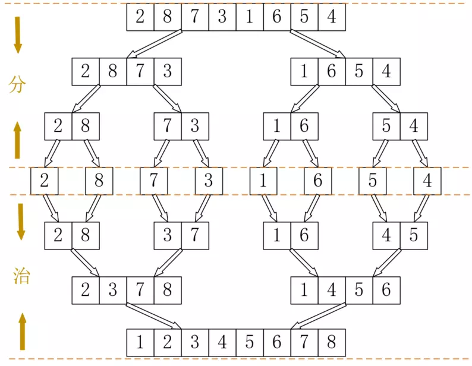<br/>归并排序</div>

分，就是把数组拆分成一条一条数据，2路归并就是采用二分法，直到每部分只含一条数据为止。治，就是把数据排序后再合并，从而使得每部分有序，再合并，直到全部有序为止。分的过程可以使用递归，这很好实现，代码如下所示：

```java
private void mergeSort(int[] arr, int left, int right){
    if(left<right){
        int mid = (left+right)/2;
        mergeSort(arr,left,mid);
        mergeSort(arr,mid+1,right);
        // 归并操作
        ...
    }
}
```

接下来就是治的过程，这个过程就是把两个有序数组合并成一个有序数组，以把{2, 8}和{3, 7}合并成{2, 3, 7, 8}为例，首先比较2和3，选择2，如下所示：

<div align="center">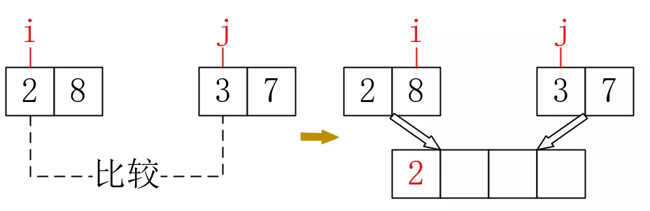<br/>选择2</div>

接下来应该比较3和8，选择3，如下所示：

<div align="center">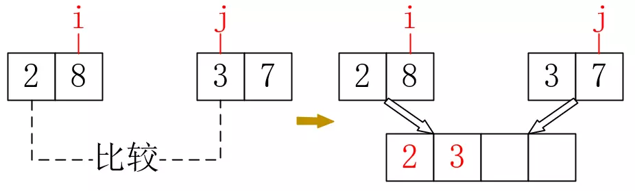<br/>选择3</div>

接下来比较7和8，选择7之后，只剩下8了，可以肯定8及之后（如果有）的所有数据都是比较大且有序的，无需再次比较。根据这个思路，参考代码如下所示：

```java
private void merge(int[] arr, int[] temp, int left, int mid, int right){
    int i = left;
    int j = mid+1;
    int k = 0;
    while(i<=mid && j<=right){
        if(arr[i]<arr[j]){
            temp[k++] = arr[i++];
        }else{
            temp[k++] = arr[j++];
        }
    }

    while(i<=mid){
        temp[k++] = arr[i++];
    }
    while(j<=right){
        temp[k++] = arr[j++];
    }

    k=0;
    while (left<=right) {
        arr[left++] = temp[k++];
    }
}
```

其中temp是事先创建好的数组，因为数组的特殊性，比较操作无法在原数组进行，所以需要在temp数组进行比较后，再将有序结果复制到原数组。最终，归并排序代码如下：

```java
private void mergeSort(int[] arr){
    int[] temp = new int[arr.length];
    mergeSort(arr,temp,0,arr.length-1);
}

private void mergeSort(int[] arr, int[] temp, int left, int right){
    if(left<right){
        int mid = (left+right)/2;
        mergeSort(arr,temp,left,mid);
        mergeSort(arr,temp,mid+1,right);
        merge(arr,temp,left,mid,right);
    }
}
```

归并排序的时间复杂度是O(nlogn)，而以上使用递归的做法，它的空间复杂度是O(n+logn)，其中 n 是temp数组，logn是递归占用的栈空间。可以看到，递归占用了不菲的空间，那么我们能不能用非递归的方式实现归并排序呢？答案是肯定的，许多递归都可以转为线性操作。归并排序是从单个数据开始的，而数组本身就可以看做是一个一个数据，非递归实现的思路如下：

<div align="center">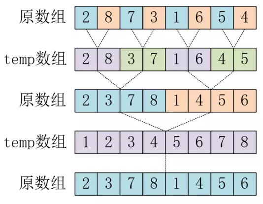<br/>非递归归并排序</div>

其中不同颜色代表不同的子数组，第一次从原数组进行一次归并后，temp数组中存放的其实就是第二次归并的原始数据，这时只要再从temp数组归并到原数组，就得到了第三次归并的原始数据，重复下去，直到归并完毕。可以看到，只需要一个数组的空间就可以完成全部过程，所以空间复杂度降低到了O(n)。因为篇幅的原因，代码在文末github链接中，大家可以参考。

# 快速排序

> 快速排序：通过一趟排序将待排记录分割成独立的两部分，其中一部分记录的关键字均比另一部分记录的关键字小，则可分别对这两部分记录继续进行排序，以达到整个序列有序的目的。

从这段定义可以发现，这又是递归可以发挥能力的算法，快速排序的关键在于用来分割的关键字的选择。我们先从选择每个子数组最左侧数据为例来实现快速排序，代码如下：

```java
private void quickSort(int[] arr){
    qSort(arr,0,arr.length-1);
}

private void qSort(int[] arr, int low, int high) {
    int pivot;
    if(low<high){
        pivot = partition(arr,low,high);
        qSort(arr,low,pivot-1);
        qSort(arr,pivot+1,high);
    }
}

private int partition(int[] arr, int low, int high) {
    int pivotKey = arr[low];
    while (low<high) {
        while (low<high&&arr[high]>=pivotKey) {
            high--;
        }
        swap(arr,low,high);
        while (low<high&&arr[low]<=pivotKey) {
            low++;
        }
        swap(arr,low,high);
    }
    return low;
}
```
关键的代码就在partition这个方法中，先选择一个关键字，然后用它左右两侧数据与之对比并调整位置，最后返回这个关键字的地址，再以此分为左右两部分重复此操作。下面，我们用一个简单的数组来模拟以上操作，如下所示，红色标注的数据就是选择的关键字：

<div align="center">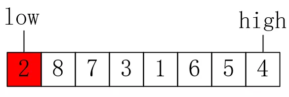<br/>快速排序</div>

先比较high的值与关键字，如果不需要调整，就向前移动，如下所示：

<div align="center">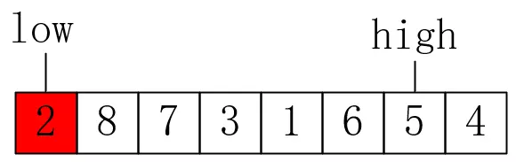<br/>high前移</div>

接下来5和6都比关键字大，直到high的值为1时，交换low与high的值，注意我们的关键字还是2，如下所示：

<div align="center">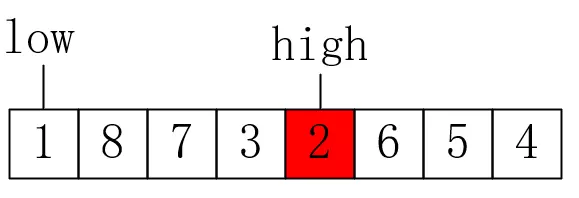<br/>交换low和high</div>

接下来比较low的值与关键字，1比2小，所以low指针后移，如下所示：

<div align="center">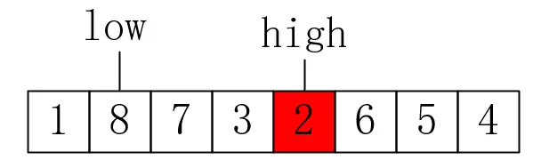<br/>low后移</div>

接下来8比2大，所以交换low和high的值，如下所示：

<div align="center">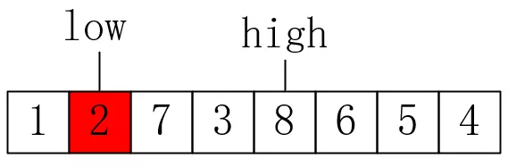<br/>交换low和high</div>

接下来直到high指向 7 都不再进行交换，第一轮排序就结束了，可以看到，low的值依然是之前的关键字。这也是为何先比较high指针再比较low指针的原因，也是为何最终返回low的原因。接下来只要按照这个规则，就可以把数组排序好。

快速排序最好的时间复杂度为O(nlogn)，也就是每次关键字取值都能恰好把数组平分两部分时的情况，最坏时间复杂度是O(n<sup>2</sup>)，也就是十分不幸地，每次拆分都分成了一边空一边是剩余全部的两部分。而空间复杂度也跟随着变化，从O(logn)到O(n)。

可以看到，快速排序严重受关键字选择的影响，像以上示例关键字2仅把数组分成了一边长度为1、一边长度为6的两部分，显然不够高效。于是就有了三数取中法，做法是取三个关键字先进行排序，然后用中间的值作为选择的关键字，这样的好处是这个关键字至少不是最大值或最小值，而且很有可能取到比较接近中间的值，这在大多数情况下都能提高一定的效率。三数取中法只需要在partition中增加以下代码即可：

```java
private static int partition(int[] arr, int low, int high) {
    // 三数取中法,把中间值存放在low中
    int mid = low + (high-low)/2;
    if (arr[low]>arr[high]) {
        swap(arr, low, high);
    }
    if (arr[mid]>arr[high]) {
        swap(arr,mid,high);
    }
    if (arr[low]>arr[mid]) {
        swap(arr,low,mid);
    }

    int pivotKey = arr[low];
    ...
}
```

当然，三数取中法并不完美，它有可能很高效也可能很低效，这点就需要根据实际情况来合理选择了，甚至有人提出采用九数取中法来进一步提高效率，感兴趣的话可以查阅相关资料进一步研究。接下来我们对快速排序的其他部分进行优化，在排序过程中，选取的关键字从最初到最终的位置经过了多次移动，这是没有必要的，可以让它直接到达终点，修改代码如下所示：

```java
private int partition(int[] arr, int low, int high) {
    int pivotKey = arr[low];

    // 暂存关键字
    int temp = pivotKey;

    while (low<high) {
        while (low<high&&arr[high]>=pivotKey) {
            high--;
        }
        arr[low] = arr[high];
        //swap(arr,low,high);
        while (low<high&&arr[low]<=pivotKey) {
            low++;
        }
        arr[high] = arr[low];
        // swap(arr,low,high);
    }
    // 恢复关键字
    arr[low] = temp;
    return low;
}
```

以上优化用复制数据代替了交换数据，从而使性能有一定的提升，可以这样做的原因是因为每次进行交换的值都包含关键字。除此之外，它的递归部分也可以进行优化，优化后的代码如下所示：

```java
private void qSort(int[] arr, int low, int high) {
    int pivot;
    // 递归
    // if(low<high){
    //     pivot = partition(arr,low,high);
    //     qSort(arr,low,pivot-1);
    //     qSort(arr,pivot+1,high);
    // }
    // 迭代代替递归
    while(low<high){
        pivot = partition(arr,low,high);
        qSort(arr,low,pivot-1);
        low = pivot+1;
    }
}
```

这个优化就是用循环代替了递归，只是写法上有些不同，是否真的有优化效果还有待考证。关于递归和循环，也不一定是所有递归都应该使用循环代替，这里有一篇文章我觉得分析的不错，大家可以参考一下，链接如下：[快速排序的优化和关于递归的问题，说说我的想法](https://www.jianshu.com/p/6777a3297e36)。

# 分配排序

最后，我们还要讲一个应用场景较少的排序算法，它的时间复杂度可以达到线性阶，也就是O(n)。根据不同的分配方式，又主要有计数排序、桶排序和基数排序三个算法。

## 1. 计数排序

计数排序的原理很简单，顾名思义就是对每个数据计数，然后分配到下标为0-max的数组中，然后对计数进行排列即可。如下所示，桶中存储的是每个数据出现的次数：

<div align="center">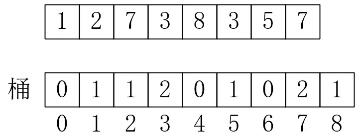<br/>计数</div>

有了计数，就可以得到排好序的数组了，0有0个，1有1个，所以第一个有序值是1，2有一个，所以第二个值是2，依次类推，最后有序数组为{1, 2, 3, 3, 5, 7, 7, 8}。实现代码如下：

```java
private void countingSort(int[] arr){
    int len = arr.length;
    // 获取最大值
    int max = arr[0];
    for (int i = 1; i < len; i++) {
        if(max<arr[i]){
            max = arr[i];
        }
    }
    // 创建max+1个桶，从0-max
    int[] bucket = new int[max+1];
    for (int i = 0; i < len; i++) {
        // 每获取一个数，就把它放在编号和其一致的桶中
        bucket[arr[i]]++;
    }
    int j = 0;
    for (int i = 0, bLen = bucket.length; i < bLen; i++) {
        // 遍历桶，按顺序恢复每条数据
        for (int k = bucket[i]; k > 0; k--) {
            arr[j++] = i;
        }
    }
}
```

因为一般重复数据比较少，所以每个桶内的值不会很大，它的最好时间复杂度是O(n)。但是它有很严格的使用条件，那就是值是离散的，有穷的，而且数据要紧密，比如有数组{0, 2, 5, ..., 10000}，其中10000与其他数据差距很大，那么就会造成严重的空间浪费，也给遍历增加了难度。但是如果数据能满足这些要求，它的排序速度非常快。

## 2. 桶排序

桶排序和计数排序类似，只是不再精确地一个下标对应一个数组，而是取多个区间，比如[0, 10), [10, 20), ...，然后每个部分再使用如直接插入排序等方法进行排序。这一点和哈希表类似，需要数组和链表结合使用，如下所示：

<div align="center">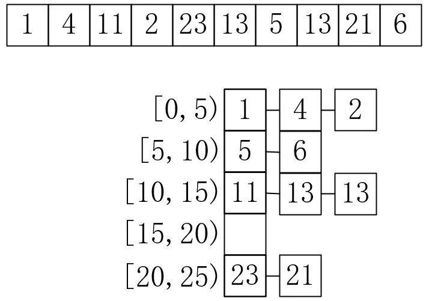<br/>桶排序</div>

数组的每一位存储的都是链表，对这个链表进行排序比对全部数据排序要好的多，这里就不再给出代码实现了。

## 3. 基数排序

基数排序，就是从每个数的低位开始排序，先排序个位数，再排序十位数、百位数，直至整个数组有序。它的原理如下所示，首先按照个位排序：

<div align="center">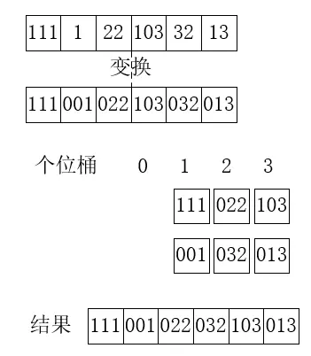<br/>个位桶排序</div>

根据个位排序的结果，再进行十位数排序，如下所示：

<div align="center">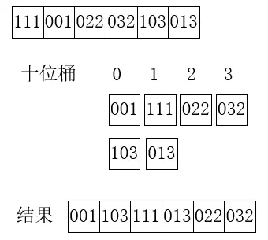<br/>十位桶排序</div>

最后再按照百位数排序，如下所示：

<div align="center">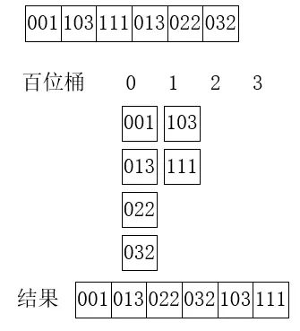<br/>百位桶排序</div>

## 4. 总结

分配排序针对整数这种结构，在数据较为均匀，紧密性较好的前提下进行了优化，可以使得排序时间复杂度接近O(n)。不过因为它的使用场景较少，且占用空间比较多，因此不常被使用。

# 总结

除了分配排序这种十分苛刻的排序算法，其他排序的时间复杂度都在O(nlogn)到O(n<sup>2</sup>)之间。快速排序是当前使用最多的一种排序算法，但是我们也不能盲目的选择它，而是要针对实际情况选择不同的算法。通常，当数据量十分小（一般是7-10个）时，会使用直接插入排序来代替其它排序，因为当数据很少时，算法的时间复杂度并不能作为评判算法效率的唯一标准，时间复杂度本身比较粗略，在 n 很小时有可能O(n<sup>2</sup>)比O(n)还要快，比如n=5，O(n<sup>2</sup>)算法实际运行次数是n<sup>2</sup>=25次，而O(n)算法实际运行次数是10n=50次，这时候常数项也会对算法有所影响。

最后，我们对多种排序的综合性能进行对比，如下表所示：

| 排序方法 | 最好情况 | 平均情况 | 最坏情况 | 辅助空间 | 稳定性 |
| ------------ | ------------ | ------------ | ------------ | ------------ | --------- |
| 冒泡排序 | O(n) | O(n<sup>2</sup>) | O(n<sup>2</sup>)| O(1) | 稳定 |
| 简单选择排序 | O(n<sup>2</sup>) | O(n<sup>2</sup>) | O(n<sup>2</sup>)| O(1) | 稳定 |
| 直接插入排序 | O(n) | O(n<sup>2</sup>) | O(n<sup>2</sup>)| O(1) | 稳定 |
| 希尔排序 | O(n<sup>1.3</sup>) | O(nlogn)-O(n<sup>2</sup>) | O(n<sup>2</sup>)| O(1) | 不稳定 |
| 堆排序 | O(nlogn) | O(nlogn) | O(nlogn)| O(1) | 不稳定 |
| 归并排序 | O(nlogn) | O(nlogn) | O(nlogn) | O(n) | 稳定 |
| 快速排序 | O(nlogn) | O(nlogn) | O(n<sup>2</sup>)| O(logn)-O(n) | 不稳定 |
| 分配排序 | O(n) | O(n) | O(n) | O(n) | 稳定 |

最后，再对这里的稳定性简单说明一下，对于两两比较的算法一定是稳定的，而存在跳跃比较的算法则是不稳定的，因为两两比较的是相邻值，那么相等的数据不会发生交换，而跳跃比较就无法保证了，所以如果对稳定性要求很高，可能归并排序就是最好的选择。

以上就是常见排序算法的全部解析了，经历了这么多年，还诞生了更多更有趣的排序算法，以后有机会再来一睹为快吧。

以上涉及代码请参考[SortSample.java](./sample/SortSample.java)。

---

本文到此就结束了，如果您喜欢我的文章，可以关注我的微信公众号： **大大纸飞机** 

或者扫描下方二维码直接添加：

<div align="center"><br/>扫描二维码关注</div>

您也可以关注我的简书：https://www.jianshu.com/u/9ee83a8ee52d

编程之路，道阻且长。唯，路漫漫其修远兮，吾将上下而求索。