# 最小生成树

我们已经掌握了图的概念和基本操作，接下来了解一下图可以解决的问题。图主要用来解决多对多问题，比如有多个起点和终点，或者有多种选择的问题。例如我们要从下图中找到能连通每个顶点的最短路径，或者寻找从顶点v<sub>0</sub>到顶点v<sub>3</sub>的最短路径：

<div align="center">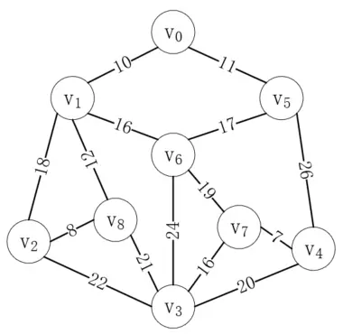<br/>网</div>

现在我们要研究的就是寻找能连通每个顶点的最短路径，我们称这种构造连通网的最小代价生成树为最小生成树。这个问题有两个经典的算法，分别是普里姆算法和克鲁斯卡尔算法。

# 普里姆（Prim）算法

普里姆算法的思想是每次都从未选择的顶点中选择代价最小的顶点，并更新剩余顶点的最小代价值。我们以上图为例，演示普里姆算法的过程。

首先选择一个顶点，比如v<sub>0</sub>，与v<sub>0</sub>相连的顶点记它的最小代价值为实际值，其余顶点记为∞，如下所示：

<div align="center">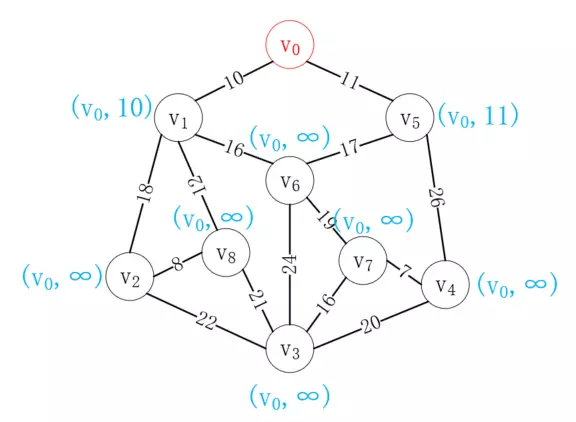<br/>选择顶点v0</div>

接下来选择距离v<sub>0</sub>最近的顶点v<sub>1</sub>加入已选列表，并更新剩余结点到已选列表的距离值，如下所示：

<div align="center">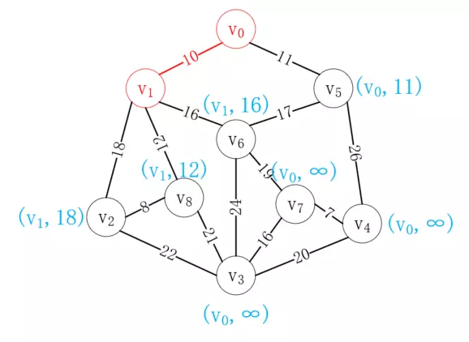<br/>选择顶点v1</div>

接下来再次选择距离已选列表最近的顶点，很显然v<sub>5</sub>最近，选择后结果如下：

<div align="center">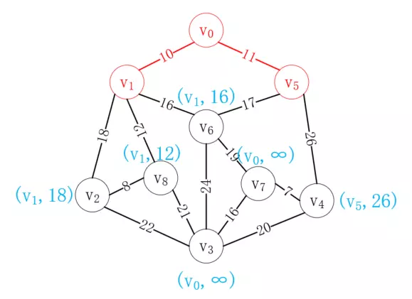<br/>选择v5</div>

按照同样的方式，我们选择v<sub>8</sub>加入已选列表，如下所示：

<div align="center">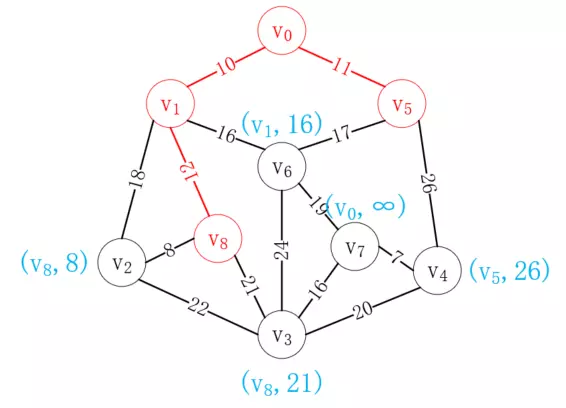<br/>选择v8</div>

重复这一操作，最后我们可以得到如下路径，就是我们要构造的最小生成树：

<div align="center">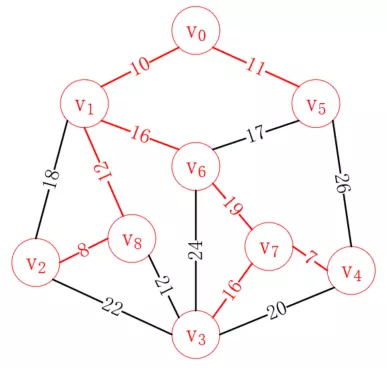<br/>最终结果</div>

# 克鲁斯卡尔（Kruskal）算法

普里姆算法是从顶点出发，我们也可以从边出发，克鲁斯卡尔算法就是每次选择合适的最小的边加入已选列表，直至所有顶点都连通。我们依然以上图为例，演示它的过程。

因为要对边进行操作，所以首先应该对所有的边按照代价大小排序，还记得图的边集数组存储方式吗？我们把边排序后就放在一个边集数组中，如下所示：

<div align="center">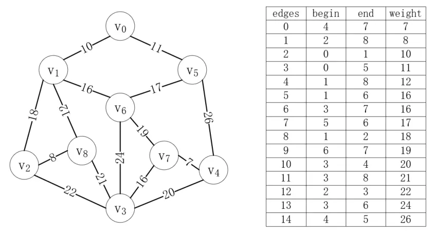<br/>边集数组</div>

首先，我们把每个顶点都看作一棵独立的树，这些顶点组成了一个森林，而我们的目的就是把这个森林组合成一棵树，如下所示：

<div align="center">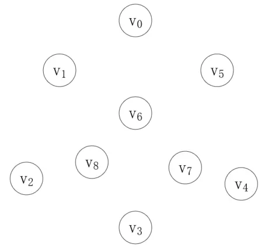<br/>顶点组成的森林</div>

第一步，我们从边集数组中取最短的边，将森林中的对应顶点连接起来，第一个边就是(v<sub>4</sub>, v<sub>7</sub>)，weight为7，如下所示：

<div align="center">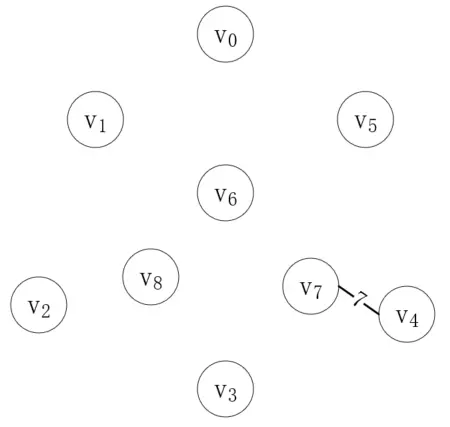<br/>连接v4和v7</div>

顶点v<sub>4</sub>和v<sub>7</sub>现在就属于同一棵树了，接下来我们再找最短的边，它的两个就不能在同一棵树上，第二条边是(v<sub>2</sub>, v<sub>8</sub>)，如下所示：

<div align="center"><br/>连接v2和v8</div>

按照同样的步骤，我们继续连接剩下的边，直到连接完(v<sub>3</sub>, v<sub>7</sub>)如下：

<div align="center">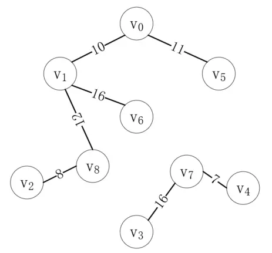<br/>连接v3和v7</div>

接下来最短的边是(v<sub>5</sub>, v<sub>6</sub>)，但是顶点v<sub>5</sub>和v<sub>6</sub>在同一棵树上，如果把它们连起来，就会形成一个环，这明显是不对的，所以这个边是无效的。接下来的(v<sub>1</sub>, v<sub>2</sub>)同理，所以我们应该连接(v<sub>6</sub>, v<sub>7</sub>)，如下所示：

<div align="center">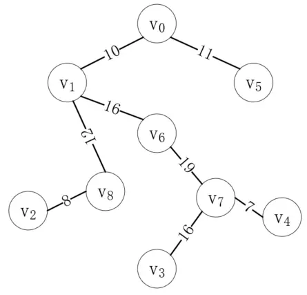<br/>连接v6和v7</div>

至此，所有的顶点都连通了，可以看到，结果和普里姆算法是一致的。

# 代码实现

## 普里姆算法

依然以邻接矩阵为例，演示普里姆算法的实现过程，代码如下所示：

```java
public <T> void prim(AMGraph<T> graph) {
    int len = graph.getVertexNum();
    int min = 0;
    // 相关顶点的坐标
    int[] adjvex = new int[len];
    // 最小代价
    int[] lowcost = new int[len];
    // 将位置0的顶点加入生成树，设置lowcost为0
    lowcost[0] = 0;
    adjvex[0] = 0;

    for (int i = 1; i < len; i++) {
        // 和v0相连的顶点的权值存入数组
        lowcost[i] = graph.getWeight(0, i);
        // 全部坐标都初始化为v0下标
        adjvex[i] = 0;
    }

    for (int i = 1; i < len; i++) {
        // INFINITE是一个不可能的值，这里设置为Int的最大值
        min = INFINITE;
        int j = 1, k = 0;
        while (j < len) {
            // 循环剩下的全部顶点，寻找lowcoast
            if (lowcost[j] != 0 && lowcost[j] < min) {
                min = lowcost[j];
                k = j;
            }
            j++;
        }

        System.out.println("当前顶点中最小权值的边是：(" + adjvex[k] + ", " + k + ")" + "最小值为：" + min);

        // 把此顶点的权值设为0
        lowcost[k] = 0;
        for (j = 1; j < len; j++) {
            // 把当前的k顶点加入已选列表，并更新剩余顶点的权值
            if (lowcost[j] != 0 && graph.getWeight(k, j) < lowcost[j]) {
                lowcost[j] = graph.getWeight(k, j);
                adjvex[j] = k;
            }
        }
    }
}
```

可以看到，因为双重for循环的原因，普里姆算法的时间复杂度为**O(n<sup>2</sup>)**。

## 克鲁斯卡尔算法

```java
public void kruskal(Edge[] edges) {
    int len = edges.length;
    // 定义一个数组，保存每个顶点的父结点，也就是它所在的树结构中的父结点
    int[] parent = new int[len];
    for (int i = 0; i < len; i++) {
        parent[i] = 0;
    }

    int begin,end;
    for (int i = 0; i < len; i++) {
        // begin顶点所在树的根结点
        begin = find(parent,edges[i].getBegin());
        // end顶点所在树的根结点
        end = find(parent,edges[i].getEnd());
        // 不在同一棵树上
        if (end != begin){
            parent[end] = begin;
            System.out.println("加入边：(" + edges[i].getBegin()+", "+edges[i].getEnd() +") , weight = "+edges[i].getWeight());
        }
    }
}

private int find(int[] parent, int find){
    // 找到这棵树的根结点
    while (parent[find]>0){
        find = parent[find];
    }
    return find;
}
```

这里省略了把邻接矩阵转为边集数组和对边集数组进行排序的代码。可以看到，克鲁斯卡尔算法的时间复杂度和边的个数有关，记边的个数为e，则其时间复杂度为**O(eloge)**。

# 总结

普里姆算法和克鲁斯卡尔算法都有其适用范围，虽然克鲁斯卡尔算法的时间复杂度较低，但是它的实际值和边的个数有很大关系，当边数很少时，它的效率十分高。而在边数很多的稠密图中，使用普里姆算法会更好一些。

以上涉及代码请参考[MinimumSpanningTree.java](./sample/MinimumSpanningTree.java)。

---

本文到此就结束了，如果您喜欢我的文章，可以关注我的微信公众号： **大大纸飞机** 

或者扫描下方二维码直接添加：

<div align="center"><br/>扫描二维码关注</div>

您也可以关注我的简书：https://www.jianshu.com/u/9ee83a8ee52d

编程之路，道阻且长。唯，路漫漫其修远兮，吾将上下而求索。