# 最短路径

公交和地铁是最普遍的交通工具了，但是通常情况下去往某处有多种出行方案，有的少换乘，有的时间短，有的步行少，等等。这就涉及到如何寻找一条最合适的路径的问题，比如从下图的v<sub>0</sub>处出发，怎样才能最快到达v<sub>8</sub>处？

<div align="center">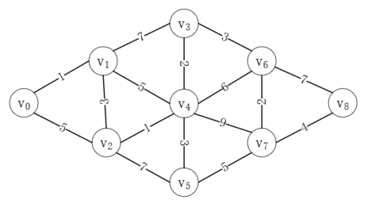<br/>最短路径</div>

寻找最短路径，通常也有两种经典算法，接下来我们一一介绍。

# 迪杰斯特拉（Dijkstra）算法

迪杰斯特拉算法的思路是从起点开始，寻找它到每个中间点的最短距离，一步步向终点逼近。我们就以上图为例，演示迪杰斯特拉算法的过程。

首先从v<sub>0</sub>出发，可以到达的最近的点是v<sub>1</sub>，距离是1，所以通过的第一条边是(v<sub>0</sub>, v<sub>1</sub>)，如下所示：

<div align="center">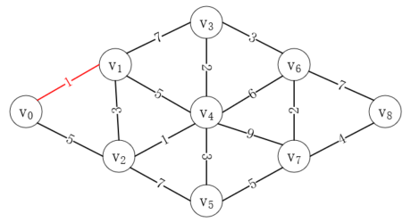<br/>v0-v1</div>

接下来因为v<sub>1</sub>可以去往v<sub>2</sub>、v<sub>3</sub>和v<sub>4</sub>，所以从v<sub>0</sub>->v<sub>1</sub>->v<sub>2</sub>距离为4，从v<sub>0</sub>->v<sub>1</sub>->v<sub>3</sub>距离为8，从v<sub>0</sub>->v<sub>1</sub>->v<sub>4</sub>距离为6，这三条路径中最短为v<sub>0</sub>->v<sub>1</sub>->v<sub>2</sub>，它甚至比直接从v<sub>0</sub>->v<sub>2</sub>还要短，所以接下来的路径应该为v<sub>0</sub>->v<sub>1</sub>->v<sub>2</sub>，如下所示：

<div align="center">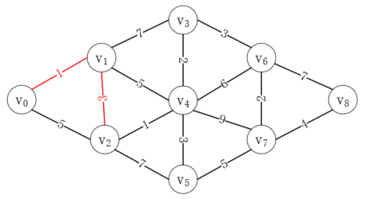<br/>v0-v2</div>

接下来我们又可以获取更多的路径信息，从v<sub>0</sub>->v<sub>2</sub>->v<sub>4</sub>距离是5，从v<sub>0</sub>->v<sub>2</sub>->v<sub>5</sub>距离是11，而前者比从从v<sub>0</sub>->v<sub>1</sub>->v<sub>4</sub>还要短，所以接下来的路径应该为v<sub>0</sub>->v<sub>2</sub>->v<sub>4</sub>，其中v<sub>0</sub>->v<sub>2</sub>实际上是v<sub>0</sub>->v<sub>1</sub>->v<sub>2</sub>，如下所示：

<div align="center">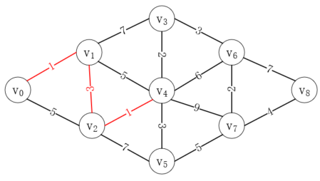<br/>v0-v4</div>

接下来，我们按照同样的逻辑，从v<sub>4</sub>出发最近的顶点为v<sub>3</sub>，路径长度为7，而从v<sub>0</sub>->v<sub>1</sub>->v<sub>3</sub>的直接距离为8，所以完整路径为v<sub>0</sub>->v<sub>1</sub>->v<sub>2</sub>->v<sub>4</sub>->v<sub>3</sub>，如下所示：

<div align="center">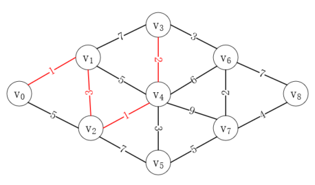<br/>v0-v3</div>

按照同样方式，我们可以得到以下路径，就是我们要找的最短路径，如下所示：

<div align="center"><br/>完整路径</div>

可以看到，迪杰斯特拉算法就是通过不断寻找到中间顶点的最短距离和对比顶点间的直接距离，一点点逼近终点的，这比较适合于提前规划好路线，而不能走一步看一步。

# 弗洛伊德（Floyd）算法

弗洛伊德算法比较精妙，但是也相对较难理解，我们依然以上图为例，演示它的运算过程。

首先，构建它的邻接矩阵表，称为D<sup>-1</sup>，除此之外，再构建一个矩阵P<sup>-1<sup>，赋值如下：

<div align="center">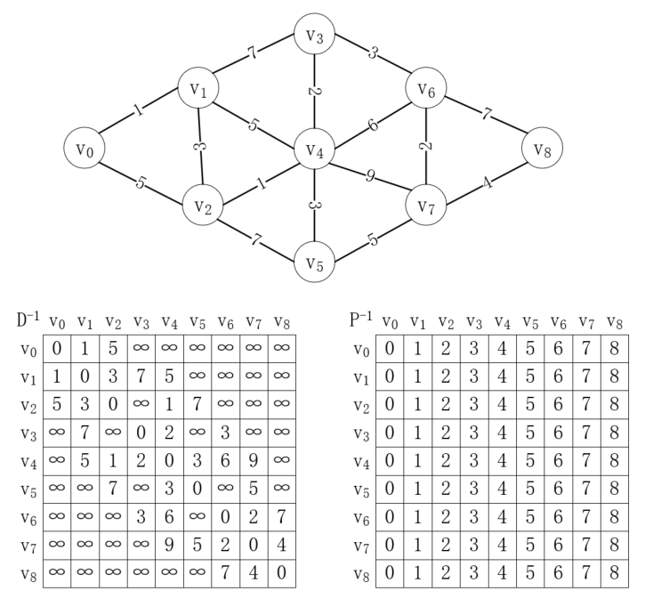<br/>初始矩阵</div>

其中上标-1表示初始化状态，P<sup>-1</sup>中的每个值表示从顶点 v<sub>i</sub> 到顶点 v<sub>j</sub> 需要经过的中间点，默认值表示直接连接，没有中间点。

初始化完成后，就可以进行弗洛伊德算法了。首先，让所有顶点之间的路径都经过v<sub>0</sub>，比如从v<sub>1</sub>->v<sub>2</sub>，变为v<sub>1</sub>->v<sub>0</sub>->v<sub>2</sub>，此时发现v<sub>1</sub>->v<sub>2</sub>距离为3，而变为v<sub>1</sub>->v<sub>0</sub>->v<sub>2</sub>后距离成为了6，所以不需要更新数据。由于v<sub>3</sub>-v<sub>8</sub>都不邻接于v<sub>0</sub>，也就无法让 v<sub>0</sub> 成为中间点，所以也不需要更新，因此这次操作后，数据没有任何改变，但是矩阵的状态改变了，从D<sup>-1</sup>变为D<sup>0</sup>，P同理，如下所示：

<div align="center">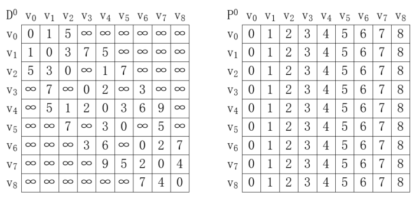<br/>第0次运算</div>

现在，我们以每个顶点之间的路径都经过v<sub>1</sub>，可以看到v<sub>0</sub>->v<sub>2</sub>的距离为5，而v<sub>0</sub>->v<sub>1</sub>->v<sub>2</sub>的距离为4，比直接距离更短，同理v<sub>0</sub>->v<sub>3</sub>原本不能直接到达，经过v<sub>1</sub>后的路径v<sub>0</sub>->v<sub>1</sub>->v<sub>3</sub>距离变为8，v<sub>0</sub>->v<sub>1</sub>->v<sub>4</sub>距离变为6。以v<sub>2</sub>为起点，到达v<sub>3</sub>的路径v<sub>2</sub>->v<sub>1</sub>->v<sub>3</sub>距离变为10。以v<sub>3</sub>为起点，到达v<sub>0</sub>和v<sub>2</sub>的距离，以及以v<sub>4</sub>为起点，到达v<sub>0</sub>的距离都发生了改变。此时因为将v<sub>1</sub>作为中间点，使得部分路径缩短，于是更新两个表的值如下：

<div align="center">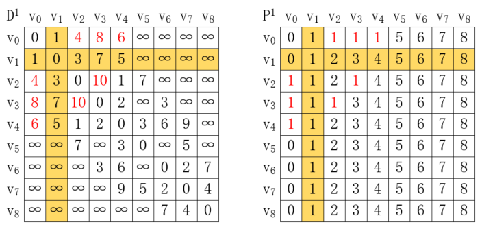<br/>第1次运算</div>

其中P的某些值更新为1，表示从v<sub>i</sub>到v<sub>j</sub>需要经过顶点v<sub>1</sub>。

在此基础上，我们以每个顶点之间的路径都经过v<sub>2</sub>，再次进行同样的计算，我们找到的第一个需要更新的数据是v<sub>0</sub>->v<sub>4</sub>，它的距离是6，而v<sub>0</sub>->v<sub>2</sub>->v<sub>4</sub>的距离为5，所以D[0][4]值更新为5，P[0][4]的值则应该更新为P[0][2]的值，这是因为从v<sub>0</sub>->v<sub>2</sub>还有可能经过其它中间点，例如这里就是经过v<sub>1</sub>，这样我们就把v<sub>0</sub>->v<sub>4</sub>的路径从原本的v<sub>0</sub>->...->v<sub>4</sub>，变为了从v<sub>0</sub>->...->v<sub>2</sub>->v<sub>4</sub>，只要不断迭代，就可以找到完整的路径。更新结果如下所示：

<div align="center">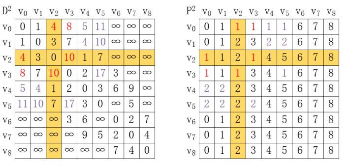<br/>第2次运算</div>

按照同样的规则，我们对其余数据进行同样的操作，最终可以得到下图的结果：

<div align="center">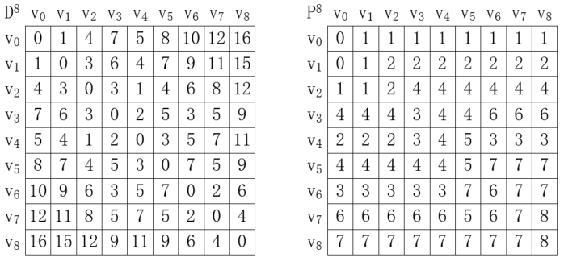<br/>第8次运算</div>

最后得到的D<sup>8</sup>表的每个数据表示从顶点 v<sub>i</sub> 到顶点 v<sub>j</sub> 的最短距离，而P<sup>8</sup>表的每个数据表示从顶点 v<sub>i</sub> 到顶点 v<sub>j</sub> 需要经过的第一个中间顶点。例如从 v<sub>0</sub>->v<sub>8</sub>，首先要经过顶点 v<sub>1</sub>，完整路径为v<sub>0</sub>->v<sub>1</sub>加上v<sub>1</sub>->v<sub>8</sub>，而v<sub>1</sub>->v<sub>8</sub>需要经过v<sub>2</sub>，于是完整路径为v<sub>0</sub>->v<sub>1</sub>->v<sub>2</sub>加上v<sub>2</sub>->v<sub>8</sub>，迭代下去，可以得到最终的最短路径为v<sub>0</sub>->v<sub>1</sub>->v<sub>2</sub>->v<sub>4</sub>->v<sub>3</sub>->v<sub>6</sub>->v<sub>7</sub>->v<sub>8</sub>，如下所示：

<div align="center">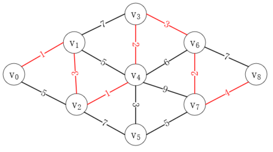<br/>完整路径</div>

可以看到，结果和使用迪杰斯特拉算法的结果是一致的。

# 代码实现

## 迪杰斯特拉算法

```java
public void dijkstra(AMGraph<String> amGraph, int fromIndex) {
    int len = amGraph.getVertexNum();
    // 存储从fromIndex到其他各顶点的最短路径下标
    int[] p = new int[len];
    // 存储从fromIndex到其他各顶点的最短路径的权值和
    int[] d = new int[len];
    // 标记求得了顶点fromIndex到其他各定点的最短路径
    boolean[] finded = new boolean[len];
    // 初始化数据
    for (int toIndex = 0; toIndex < len; toIndex++) {
        finded[toIndex] = false;
        d[toIndex] = amGraph.getWeight(fromIndex, toIndex);
        p[toIndex] = 0;
    }

    // fromIndex到自己的路径长度为0，并且不需要再求它的最短路径了
    d[fromIndex] = 0;
    finded[fromIndex] = true;

    int min = 0;
    int k = -1;
    // 求fromIndex到toIndex的最短路径
    for (int toIndex = 1; toIndex < len; toIndex++) {
        min = Integer.MAX_VALUE;
        // 寻找距离fromIndex最近的顶点
        for (int i = 0; i < len; i++) {
            if (!finded[i] && d[i] < min) {
                // i 离 fromIndex最近
                k = i;
                min = d[i];
            }
        }

        // 找到了最近的点
        finded[k] = true;

        // 更新剩余顶点的距离值
        for (int i = 0; i < len; i++) {
            // 如果经过 k 之后的距离比直接到 i 的距离近，就更新距离
            if (!finded[i] && amGraph.getWeight(k, i) != Integer.MAX_VALUE && (min + amGraph.getWeight(k, i) < d[i])) {
                d[i] = min + amGraph.getWeight(k, i);
                p[i] = k;
            }
        }

        System.out.println();
        for (int i = 0; i < len; i++) {
            System.out.print(p[i] + "\t");
        }
    }
}
```

迪杰斯特拉算法的时间复杂度为O(n<sup>2</sup>)，但是它每次只能计算出从某一个顶点开始到其它顶点的最短路径。

## 弗洛伊德算法

```java
public void floyd(AMGraph<String> amGraph) {
    int len = amGraph.getVertexNum();
    int[][] d = new int[len][len];
    int[][] p = new int[len][len];

    // 初始化d和p数组
    for (int i = 0; i < len; i++) {
        for (int j = 0; j < len; j++) {
            d[i][j] = amGraph.getWeight(i, j);
            p[i][j] = j;
        }
    }

    for (int k = 0; k < len; k++) {
        for (int i = 0; i < len; i++) {
            for (int j = 0; j < len; j++) {
                if (d[i][k] != Integer.MAX_VALUE && d[k][j] != Integer.MAX_VALUE && d[i][j] > d[i][k] + d[k][j]) {
                    d[i][j] = d[i][k] + d[k][j];
                    p[i][j] = p[i][k];
                }
            }
        }
    }

    printD(len, d);
    printP(len, p);
}
```

弗洛伊德算法十分优雅和简洁，并且可以得到任意顶点间的最短路径，不过因为三层循环的原因，它的时间复杂度为O(n<sup>3</sup>)。

以上涉及代码请参考[ShortestPath.java](./sample/ShortestPath.java)。

---

本文到此就结束了，如果您喜欢我的文章，可以关注我的微信公众号： **大大纸飞机** 

或者扫描下方二维码直接添加：

<div align="center"><br/>扫描二维码关注</div>

您也可以关注我的简书：https://www.jianshu.com/u/9ee83a8ee52d

编程之路，道阻且长。唯，路漫漫其修远兮，吾将上下而求索。