# B树与B+树

计算机的发展速度很快，CPU、内存、显卡等已不再是计算机性能的瓶颈，SSD硬盘的出现也使得硬盘读写速度有了质的飞跃，但和内存相比依然有极大的差距，这就意味着我们在内存环境下设计的算法，在涉及到硬盘读写时效率会极大地降低。比如红黑树、AVL树等，因为其每个结点只能存储一个数据，且每个结点最多有两个子结点，这意味着当数据很多时，树的高度会非常大，也就意味着要频繁地进行IO操作。即使是普通的树，每个结点可以有多个孩子，那它要么度非常大，要么高度特别大，也可能两者都特别大，也无法摆脱频繁IO操作带来的性能瓶颈。今天要研究的B树和B+树就是这种频繁IO操作场景的解决办法。

# B树

## 定义

我们首先要知道多路查找树的概念，它的定义如下：

> 多路查找树（multi-way search tree），其每一个结点的孩子数可以多于两个，且每一个结点处可以存储多个元素。

和普通的树相比，多路查找树一个节点不再是只能存储一个元素，这打破了我们对树的理解，但是正是这个特性，使得它能够出色地解决IO问题。我们要研究的B树就是一棵多路查找树，它的定义如下：

> B树是一种平衡的多路查找树，结点最大的孩子数目称为B树的阶（Order）。

一个m阶的B树具有如下属性：

- 如果根结点不是叶结点，则其至少有两棵子树。
- 每一个非根的分支结点都有k-1个元素和k个孩子，其中[m/2]≤ k ≤ m。每一个叶子结点 n 都有k-1个元素，其中[m/2]≤ k ≤ m。
- 所有叶子结点都位于同一层次。
- 所有分支结点包含下列信息数据( n, A0, K1, A1, K2, A2,  …, Kn, An )，其中: Ki( i=1, 2, …, n ) 为关键字，且Ki < Ki+1( i=1, 2, …, n-1 ); Ai ( i=0, 2, …, n) 为指向子树根结点的指针，且指针Ai-1所指子树中所有结点的关键字均小于Ki( i=1, 2, …, n ) ，An 所指子树中所有结点的关键字均大于Kn，n ( [m/2]-1 ≤ n ≤ m-1 ) 为关键字的个数(或 n+1 为子树的个数)。

这段定义一定让人感到费解吧，那我们就从B树的一个特例：2-3树作为切入点，来看看一个B树是如何构建和操作的。

> 2-3树是这样的一棵多路查找树：其中的每一个结点都具有两个孩子（称为2结点）或三个孩子（称为3结点）。

它拥有如下属性：

- 一个2结点包含一个元素和两个孩子（或没有孩子），和二叉排序树一致，左子树包含的元素小于该元素，右子树包含的元素大于该元素。但是这个2结点要么有两个孩子，要么没有孩子，不能只有一个孩子。
- 一个3结点包含两个元素和三个孩子（或没有孩子），左子树、较小元素、中间子树、较大元素和右子树也按照从小到大排序。一个3结点要么有三个孩子，要么没有孩子。
- 2-3树的所有叶子结点都在同一层次上。

按照这个描述，一棵正确的2-3树大概长这个样子：

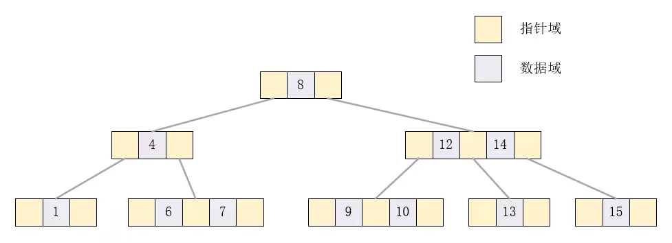 2-3树

## 插入

下面我们通过构造一棵2-3树来演示它的增删过程，假定初始数据为：{1, 7, 4, 9, 15, 13, 6, 5, 8, 10, 3, 12, 14, 2, 11}。现在树为空，要把1插入进去只需要构建一个2结点即可，如下所示：

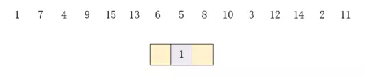 插入1

接下来插入元素7，只要把当前结点升级为3结点即可，如下所示：

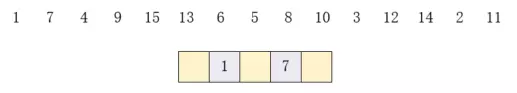 插入7

接下来插入4，可以发现根结点已经是3结点了，因为必须是平衡的，所以只能把根结点拆开，变为3个2结点，如下所示：

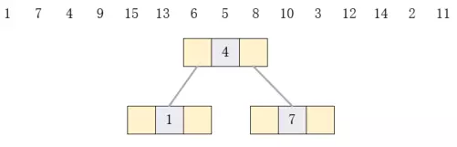 插入4

插入9时，因为9比4大，所以插入到右侧，而7所在结点可以升级为3结点，所以插入结果如下所示：

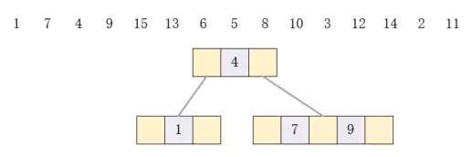 插入9

接下来要插入15，因为9所在结点已经是3结点，但是它的父结点4是2结点，所以可以把4所在结点升级，因为3结点必须有三个孩子，所以7和9所在结点需要拆分，如下所示：

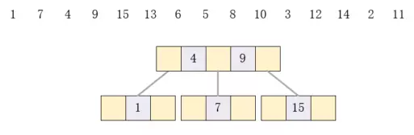 插入15

接下来插入13和6时，对应节点都可以升级，所以插入结果如下：

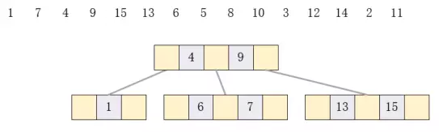 插入13和6

接下来插入元素5时，发现6所在结点已经是3结点，而父结点，也就是根结点也是3结点了，这时只能再次拆分。首先，5、6、7中间的数是6，我们把它提出来，它应该位于4和9中间，如下所示：

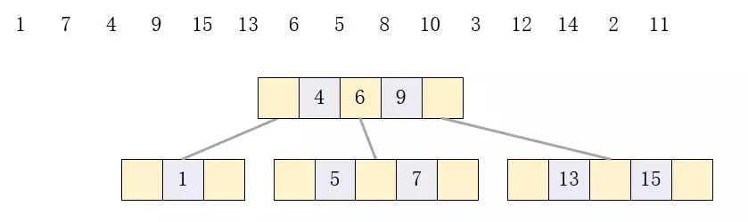 插入5步骤1

因为3结点只能有两个元素，所以根结点也必须拆分，结果如下：

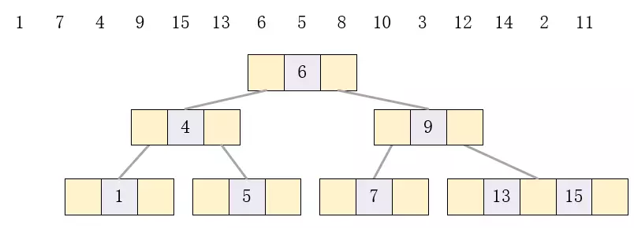 插入5步骤2

可以发现，根结点拆分后使得树的高度增加了。接下来插入8，10，3也是重复步骤，结果如下：

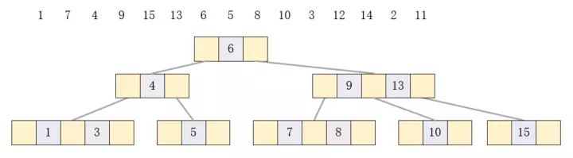 插入

至此，再插入元素12、14、2时也变得十分简单了，结果如下：

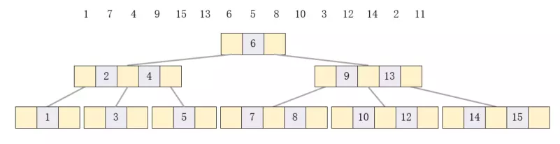 插入

最后插入11，可以发现它在10和12之间，而父结点也是3结点，所以10和12要拆分，9和13也要拆分，11应该和6一起升级为3结点，结果如下：

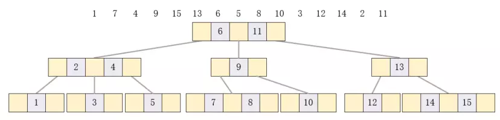 插入11

## 删除

现在，我们已经建立了一棵2-3树，我们按照插入顺序，再演示删除的过程。首先删除元素1，因为1是2结点，删除后会影响平衡，但是我们发现它的父结点是一个3结点，所以可以把父结点拆开，2和3合并成一个3结点，结果如下：

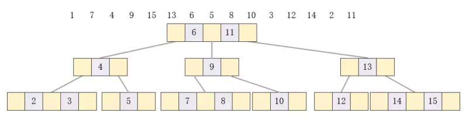 删除1

现在，要删除7，因为7是叶节点也是3结点，直接删除就可以，结果如下：

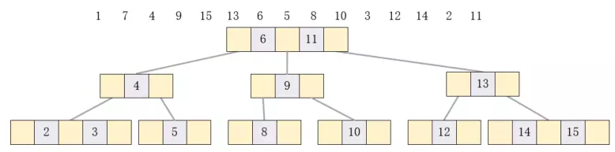 删除7

删除结点4，因为它的左孩子是3结点，只要把它拆开就可以了，结果如下：

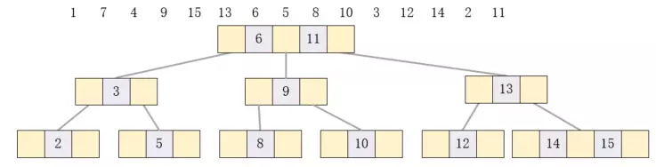 删除4

删除9时比较复杂，因为它的左右孩子都是2结点，首先把它的两个孩子合并为3结点并代替它，结果如下：

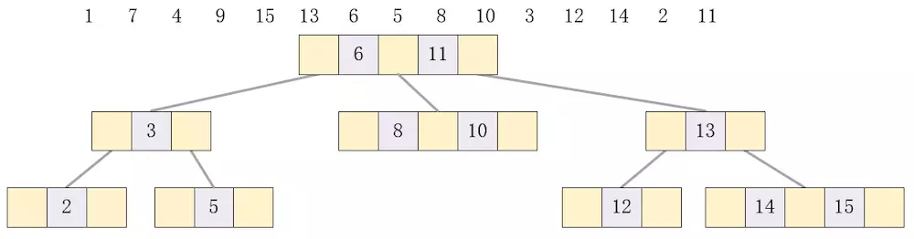 删除9步骤1

此时树是不平衡的，此时发现左侧3和6可以合并为3结点，结果如下：

 删除9步骤2

接下来删除15，直接删除即可，结果如下：

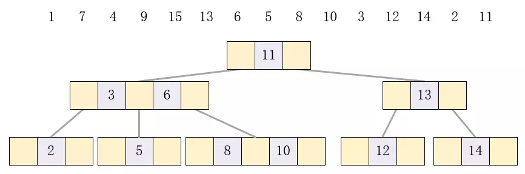 删除15

删除13也比较复杂，首先需要把它的两个孩子合并，然后以11为根结点，做类似右旋的操作，具体做法是6的右孩子成为11的左孩子，然后6成为11的父结点，这和AVL树等的右旋操作是一致的，结果如下：

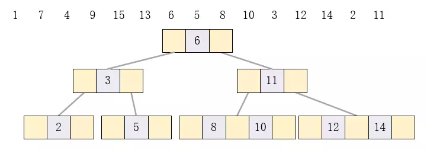 删除13

接下来要删除的元素6是根结点，做法是先找到它的前驱（第一个比它小的元素）5代替它，此时2、3结点需要合并，合并后左右子树不再平衡，所以还需要5和11合并，结果如下：

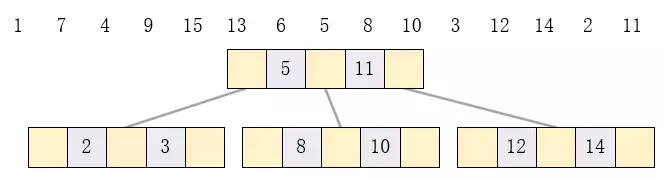 删除6

其余的删除操作其实和前面的都类似，这里不再演示了，感兴趣的可以自己试一试，很快就可以发现规律。

## 总结

这里介绍的2-3树是B树的一个特例，B树就是把2-3树的阶扩展到了m，它的每个结点特性和2-3树一致，除叶结点外每个结点的指针域和数据域都必须填充。那么B树是如何解决IO访问问题的呢？假设我们有一棵阶为1001的B树，也就是每个结点可以存储1000个数据和1001个指针，那么在高度为2的层上，可以存储的数据是1001X1000个，而它的指针数量为1001X1001个，这些指针可以指向的数据为1001X1001X1000个，大概有10亿条数据。这意味着，只要我们把根结点保存在内存中，访问这10亿条数据最多需要两次IO操作，这是其他结构无法比拟的。

那么B树的问题在哪里呢？在实际使用时，通常阶数是和磁盘页面大小匹配的，也就是每次都会读取一页的数据，因为磁盘在页面内连续读取速度非常快，但在页间就相对慢些。这是它的优点，也恰恰是它的问题所在。假设每个结点都在不同的页面，我们要对它进行中序遍历，其经过大概如下：

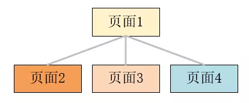 遍历

其中序遍历为页面2->页面1->页面3->页面1->页面4。可以发现位于页面1的结点会被多次访问，且位于该结点的元素也会被多次遍历，这样一来效率会变得很低，所以B树对遍历是不友好的。接下来介绍的B+树就是对此问题的优化。

# B+树

遍历的需求主要来源于“扫库”，比如网站大量充斥着各种列表，如果使用B树遍历，效率实在太低了。B+树在B树的基础上做了改进，在B+树中，出现在分支结点中的元素会被当作它们在该分支结点位置的中序后继者（叶子结点）中再次列出，且每一个叶子结点都会保存一个指向后一叶子结点的指针。如下就是一棵B+树：

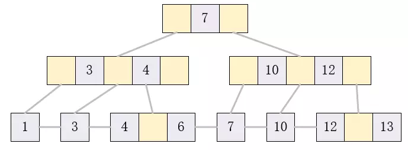 B+树示例

为了简化，叶子结点的左右两侧指针域省略。它的特点就是任何非叶子结点都会在叶结点上再次出现一次，并且所有叶子结点从左到右链接了起来。总体来说，它也具备B树的特性，只是在两个方面有所区别。第一就是查找元素时，即使在非叶子结点找到了目标值，它也只是用来索引的，还需要继续找到它在叶子结点的位置。第二就是如果要遍历，只需要遍历一次叶子结点即可。B+树的结构也十分适合范围查找，只需要找到范围的最小值所在位置，然后沿链表遍历即可。

# B树与B+树对比

B树与B+树都是对磁盘友好的数据结构，能大幅降低磁盘访问次数。B树的优点在于数据存储在每个结点中，可以更快访问到，而不必须走到叶子结点，B树更多的用在文件系统中。B+树的每个非叶子结点都只充当索引，所以查询必须到叶子结点结束，但它十分适合“扫库”和区间查找，而且因为大多结点只用于索引，所以并不会存储真正的数据，在内存上会更紧凑，相同的内存就可以存放更多的索引数据了。比如字典的拼音和汉字是分离的，只需要几十页就能得到完整的拼音表，但是如果拼音和汉字掺杂在一起，要得到完整的索引（拼音）表就需要整个字典。B+树的这些特性使得它更适合用来做数据库的索引。

---

本文到此就结束了，如果您喜欢我的文章，可以关注我的微信公众号： **大大纸飞机** 

或者扫描下方二维码直接添加：

 扫描二维码关注

您也可以关注我的简书：https://www.jianshu.com/u/9ee83a8ee52d

编程之路，道阻且长。唯，路漫漫其修远兮，吾将上下而求索。