# 图的概念和图的存储

图（Graph）是数据结构中最复杂的一种结构，线性表描述的是一对一关系，树描述的是一对多关系，而图描述的是多对多关系。无论是一对一还是一对多，都有一个明确的切入点，而图却不具备这种简单的属性。正因为此，关于图的基础知识也是最多，下面我们就先对这些基础知识进行梳理。

# 图的概念

## 图的定义

> 图（Graph）是由顶点的有穷非空集合和顶点之间边的集合组成，通常表示为：G(V, E)，其中 G 表示一个图， V 是图 G 中顶点的集合， E 是图 G 中边的集合。顶点，就是图中的数据元素，边则用来表示数据之间的逻辑关系。顶点是有穷非空的，边则可以为空集。

## 有向边和无向边

边，根据是否有方向，分为无向边和有向边。无向边指顶点vi到vj之间的边没有方向，用(vi, vj)表示。有向边指顶点vi到vj之间的边有方向，也称作弧，用<vi, vj>表示，其中vi称为弧尾或初始点，vj称为弧头或终端点，也就是箭头从vi指向vj，顺序不能交换。如下图所示，左边的图都是无向边，右边的图都是有向边：

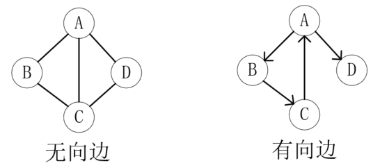 边的分类

左图可以表示为G1 = (V1, {E1})，其中顶点集合V1={A, B, C, D}，边集合E1={(A, B), (B, C), (C, D), (D, A), (A, C)}。右图可以表示为G2 = (V2, {E2})，其中顶点集合V2={A, B, C, D}，弧集合E2={<A, B>, <B, C>, <C, A>, <A, D>}。

## 有向图和无向图

如果图中任意两个顶点之间的边都是无向边，则称该图为无向图。在无向图中，如果任意两个顶点之间都存在边，则称该图为无向完全图。含有 n 个顶点的无向完全图有 n(n-1)/2 条边。

同样地，如果图中任意两个顶点之间的边都是有向边，则称该图为有向图。在有向图中，如果任意两个顶点之间都存在方向互为相反的两条弧，则称该图为有向完全图。含有 n 个顶点的有向完全图有 n(n-1) 条边。

如下所示，左图为无向完全图，右侧为有向完全图：

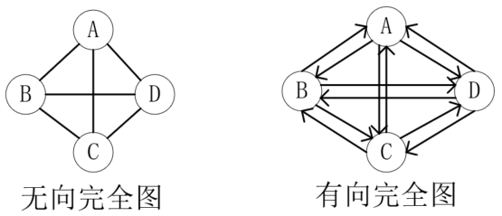 有向图和无向图

## 简单图

在图中，若不存在顶点到其自身的边，且同一条边不重复出现，则称这样的图为简单图。我们要研究的图都是简单图。如下所示，都不是简单图，不属于我们学习的范畴。

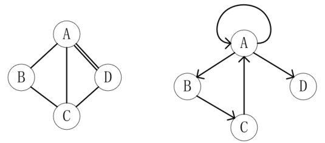 非简单图示例

## 稀疏图和稠密图

有很少条边或弧的图称为稀疏图，反之称为稠密图。这是一个相对的概念。

## 网

带权的图称为网，权指的是在图的边或弧上的数字，例如下图就是一张带权的图：

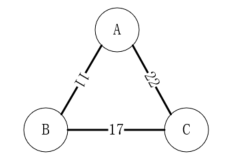 网

## 子图

假设有两个图G=(V, {E})和G'=(V', {E'})，如果V'∈V且E'属于E，则称G'为G的子图。简言之，就是部分与整体的关系。

## 顶点与边的关系

对于无向图G=(V, {E})，如果边(v, v')∈E，则称顶点 v 和 v' 互为邻接点，即 v 和 v' 相邻接，边(v, v')依附于顶点 v 和 v'，或者说(v, v')与顶点 v 和 v' 相关联。顶点 v 的度是和 v 相关联的边的数目，记为**TD(v)**。无向图的边的个数和顶点度数的关系如下：

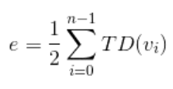 无向图边和度

对于有向图G=(V, {E})，如果弧<v, v'>∈E，则称顶点 v 邻接到 v'，v' 邻接自 v，弧<v, v'>和顶点 v,  v'相关联。以顶点 v 为头的弧的数目称为 v 的入度，记为**ID(v)**，以 v 为尾的弧的数目称为 v 的出度，记为**OD(v)**，顶点 v 的度为**TD(v) = ID(v) + OD(v)**。有向图的弧的个数和出度、入度的关系如下：

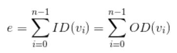 有向图弧和度

## 路径

无向图G=(V, {E})中从顶点 v 到 v' 的路径是一个顶点序列(v=vi,0,vi,1,...,vi,m=v')，其中(vi,j-1,vi,j)∈E，1≤j≤m。

如果是有向图，则路径也是有向的，顶点序列满足<vi,j-1, vi,j>∈E，1≤j≤m。

路径的长度是路径上的边或弧的数目。

第一个顶点到最后一个顶点相同的路径称为回路或环。序列中顶点不重复出现的路径称为简单路径。除了第一个顶点和最后一个顶点之外，其余顶点不重复出现的回路，称为简单回路或简单环。

## 连通图

在无向图G中，如果从顶点 v 到 v' 有路径，则称 v 和 v' 是连通的。如果对于图中的任意两个顶点 vi,vj∈V，vi 和 vj 都是连通的，则称G是连通图。无向图中的极大连通子图称为连通分量。如下图，左图不是连通图，但它有两个连通分量：

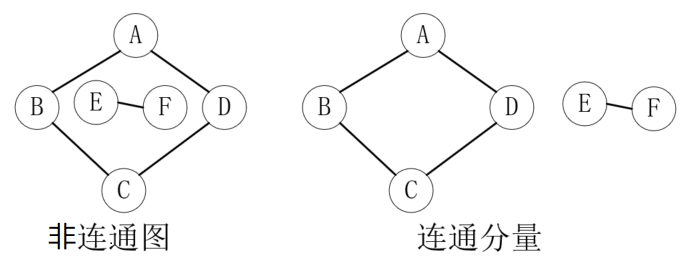 连通图

在有向图G中，如果对于每一对vi,vj∈V、vi≠vj，从 vi 到 vj 都存在路径，则称G是强连通图。有向图中的极大强连通子图称为有向图的强连通分量。如下图所示，虽然它不是强连通图，但它有两个强连通分量：

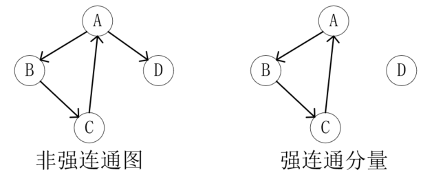 强连通图

## 生成树和有向树

连通图的生成树是一个极小的连通子图，它含有图中全部的 n 个顶点，但只有足以构成一棵树的 n-1 条边。如下所示，图1是一个连通图，图2和图3都是它的生成树：

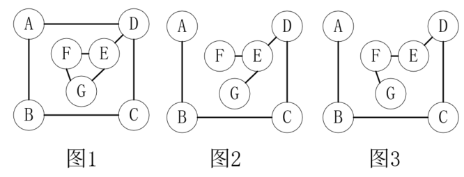 生成树

n个顶点和 n-1 条边是构成生成树的必要条件，但是它并不充分，如下所示，就不是一个生成树：

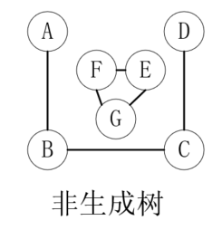 非生成树

如果一个有向图恰有一个顶点的入度为0，其余顶点的入度均为1，则是一棵有向树。一个有向图的生成森林由若干棵有向树组成，含有图中全部顶点，但只有足以构成若干棵不相交的有向树的弧。如下图所示，图1就可以拆分成图2和图3两棵有向树。

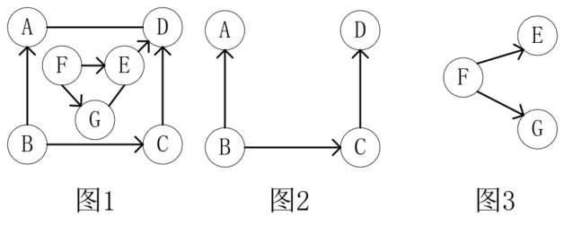 生成森林

# 图的存储

线性表和图都有一个明确的切入点，但是对图而言，每个顶点都可以当做是起点，而且每个顶点之间都可能有逻辑关系，也就是说，单纯的使用数组或链表是无法完成图的存储的。图的存储当前主要有以下五种方式：

## 1. 邻接矩阵

图的邻接矩阵（Adjacency Matrix）存储方式是用两个数组来表示图。一个一维数组存储图中顶点信息，一个二维数组（称为邻接矩阵）存储图中的边或弧的信息。

设G有n个顶点，则邻接矩阵是一个n*n的方阵，定义为：

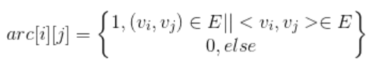 邻接矩阵

下面，我们就无向图、有向图和网分别演示邻接矩阵的存储方式。

### 无向图

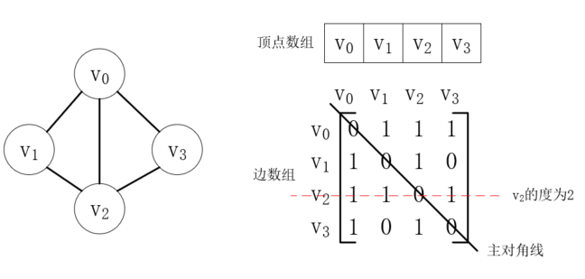 无向图的邻接矩阵

其中主对角线的值为0，表示顶点到其本身没有边。无向图的邻接矩阵一定是对称的，也就是以主对角线划分的右上方和左下方对称。从矩阵中我们可以获取以下信息：

- 判断两个顶点之间是否有边
- 获取某个顶点的度，只需要求第 i 行或第 i 列的和即可。
- 获取某个顶点的所有临界点，只需要遍历第 i 行即可。

### 有向图

有向图的表示和无向图类似，如下所示：

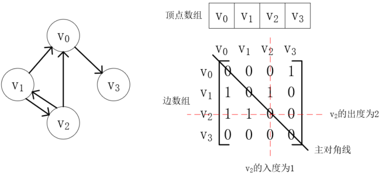 有向图的邻接矩阵

### 网

因为网的每条边都有权值，所以对应的公式稍有改变，如下所示：

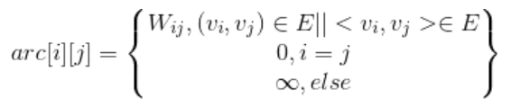 网的邻接矩阵

这里∞表示的是不可能出现的值。网的邻接矩阵存储示例如下：

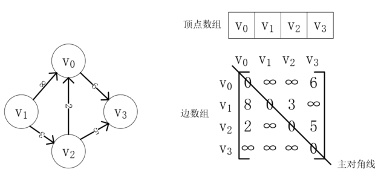 网的邻接矩阵

## 2. 邻接表

数组的优缺点我们都已经熟知，那么使用邻接矩阵就一定会面临空间浪费的问题，上述示例中0或者∞越多，对应图中边数相对于顶点数而言较少时，空间的使用率也就越低。邻接表的思想和哈希表类似，使用数组结合链表的方式来存储图。

### 无向图

邻接表使用一个数组来存储每个顶点，数组的每一位都包含一个链表，用来存储与此顶点相邻的边，示例如下：

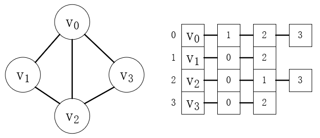 无向图的邻接表

从邻接表中，也可以轻易地获取到顶点、边和度的值。

### 有向图

有向图的邻接表和无向图类似，但是它获取出度容易，获取入度却比较困难，如下所示：

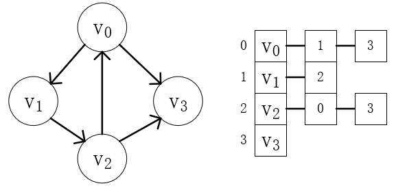 有向图邻接表

获取一个顶点的出度只需要计算链表的长度即可，但是入度却没有有效的获取方式，所以通常还会建立一个逆邻接表作为补充，如下所示：

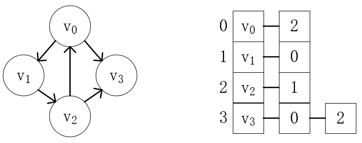 有向图逆邻接表

### 网

用邻接表来存储网的结构只需要增加一个weight字段即可，这里不再演示。

## 3. 十字链表

邻接表在表示有向图时，需要邻接表和逆邻接表两张表配合使用，较为繁琐，我们可以把邻接表和逆邻接表结合为一张表，这就是十字链表。

十字链表也使用数组来存储顶点，只是每一位数据除了顶点外，还有两个链表分别表示出边表和入边表，数据的结构如下所示：

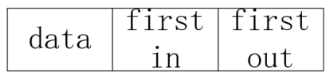 顶点结构定义

边表的结构也有所改变，结构如下：

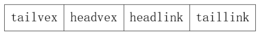 边表结构定义

其中，tailvex表示弧起点在顶点表的下标，headvex表示弧终点在顶点表的下标，headlink是入边表指针域，指向下一个终点相同的边，taillink是出边表指针域，指向下一个起点相同的边。

接下来，我们以下图为例，演示十字链表的建立过程：

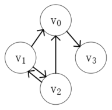 图

首先，把全部顶点存储起来，如下所示：

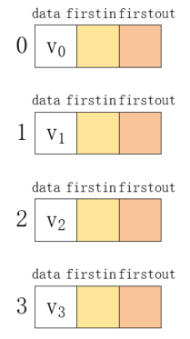 存储顶点

然后，我们建立顶点v0的出边表，可以发现只有<v0, v3>这一条边，所以它的出边表如下：

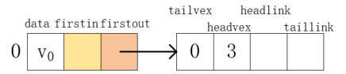 出边表

同理，其他顶点的出边表如下：

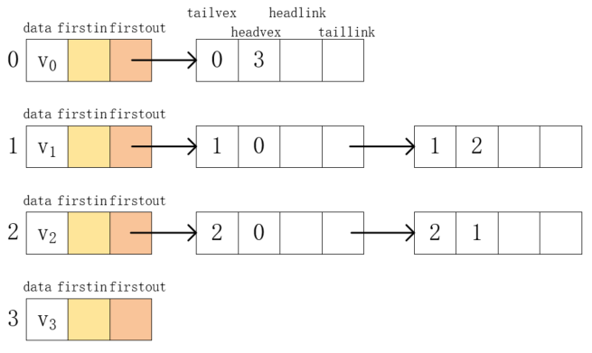 出边表完整表

现在，我们来建立入边表，对于顶点v0，它的入边有两条，分别是<v1, v0>和<v2, v0>。可以看到，这两个边在出边表中已经存在了，直接为其建立起关系即可，如下所示：

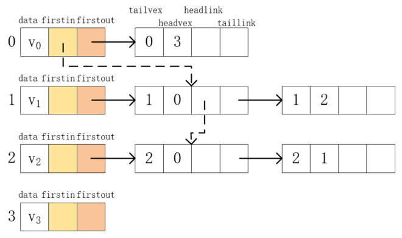 入边表

同理建立起其他顶点的入边表，结果如下：

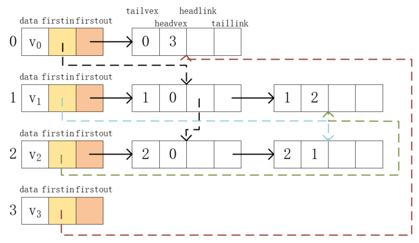 入边表完整表

可以看到，十字链表除了结构较为复杂之外，不仅解决了邻接表无法同时获取入度和出度的问题，也没有增加所需的时间复杂度等，因此十分适合有向图的存储。

## 4. 邻接多重表

十字链表是针对有向图的优化，而邻接表在表示无向图时也存在一定的问题。比如我们要把下图的边(v2, v0)删除，在邻接表中就要删除两个位置：

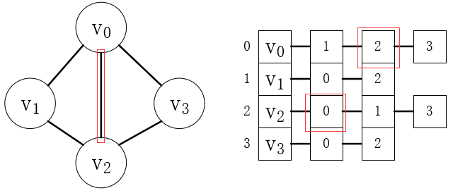 无向图的邻接表删除数据

可以看到，这是因为数据的重复造成的，所以我们可以仿照十字链表的方式构造一个邻接多重表，来解决以上问题。为此，需要重新定义边表结构，如下：

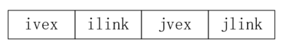 邻接多重表的边表结构

其中，ivex和jvex是某条边依附的两个顶点在顶点表的下标，ilink表示依附于顶点ivex的下一条边，jlink表示依附于顶点jvex的的下一条边。

有了十字链表的经验，构建一个邻接多重表十分容易，我们以上图为例，首先建立好顶点结点和边表结点，如下所示：

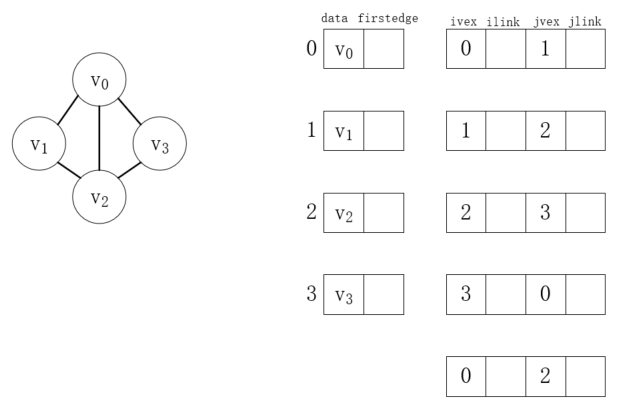 建立结点

这里需要注意的是，边表的每个结点仅出现一次，接下来我们按照规定把这些结点间关系连接起来即可，如下所示：

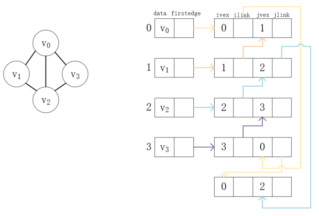 邻接多重表

## 5. 边集数组

如果我们仅关注边的操作，还可以使用边集数组，它由两个一维数组组成，一个数组用来存储顶点的信息，另一个数组存储边的信息。边的数组的每个元素都由一条边的起点下标、终点下标和权组成。这个存储方式主要用于寻找连通网的最小生成树算法：克鲁斯卡尔算法。

---

本文到此就结束了，如果您喜欢我的文章，可以关注我的微信公众号： **大大纸飞机** 

或者扫描下方二维码直接添加：

 扫描二维码关注

您也可以关注我的简书：https://www.jianshu.com/u/9ee83a8ee52d

编程之路，道阻且长。唯，路漫漫其修远兮，吾将上下而求索。