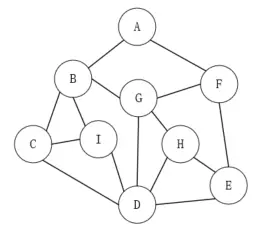
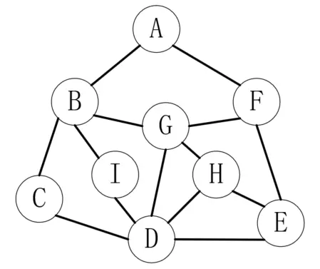
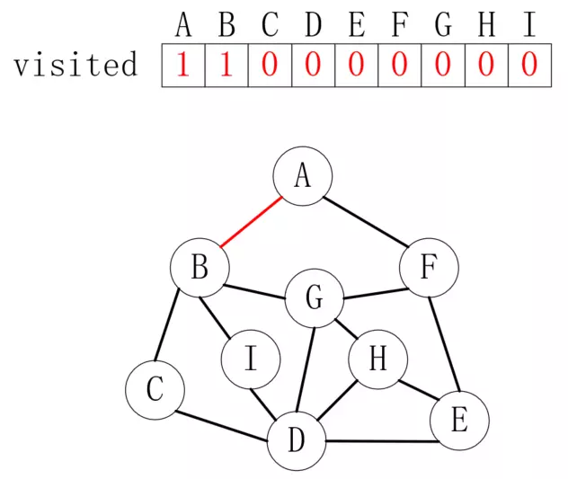
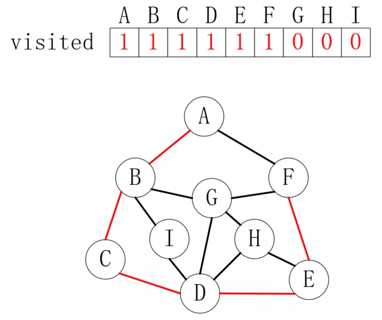
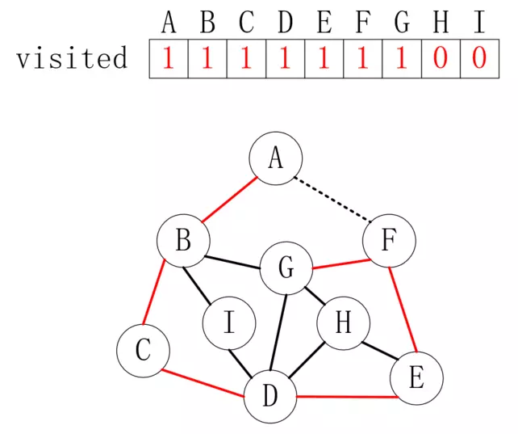
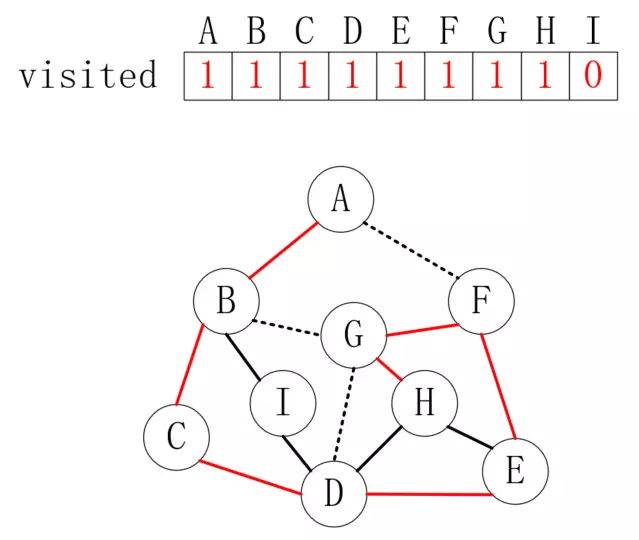
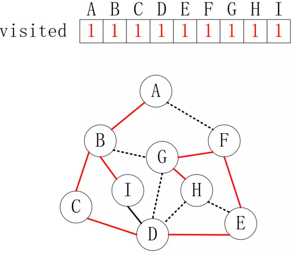
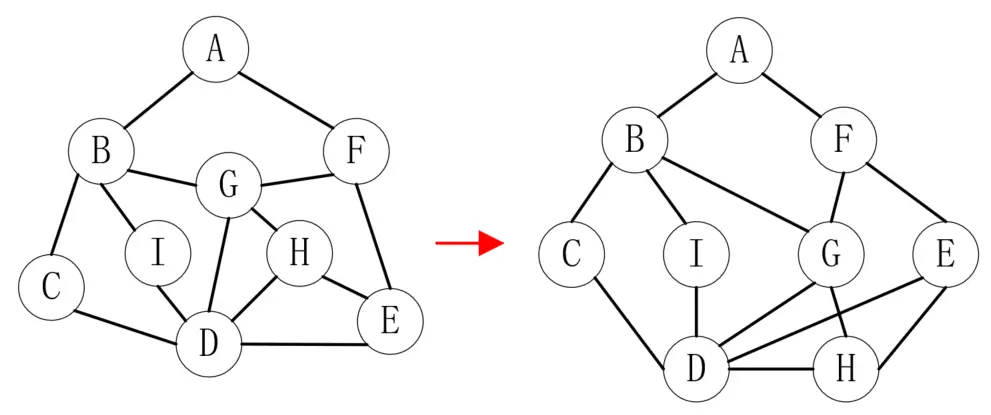

# 图的遍历

如果是遍历一个数组，只需要从下标0到下标N-1循环就好了，遍历一个链表只需要从头指针开始直到没有next为止，即使是遍历一棵树，也可以从根结点开始，按照前序、中序和后序等方式进行。之所以可以这样，是因为这些结构都可以找到一个明确的起点，但图不同。如下图所示，有的人希望从A开始遍历，有的人喜欢从C开始...，没有办法规定一个明确的起点。

<div align="center"><br/>图</div>

如果没有策略，遍历一个图就像走迷宫一样，有可能在一个结点停留多次，也可能有几个结点永远不会访问到。而图的遍历，通常有深度优先和广度优先方式，接下来我们就看看这两种方式是怎么做的，有什么区别。

# 深度优先遍历

深度优先遍历（Depth_First_Search）也称为深度优先搜索，简称为DFS。它是从图中某个顶点v出发，访问此顶点，然后从v的未被访问的邻接点出发深度优先遍历图，直至图中所有和v有路径相通的顶点都被访问到。对于非连通图，只需要对它的连通分量分别进行深度优先遍历即可。接下来我们以一个示例演示图的深度优先遍历。如下图所示：

<div align="center"><br/>图的深度优先遍历</div>

在开始进行遍历之前，我们还要准备一个数组，用来记录已经访问过的元素。其中0代表未访问，1代表已访问，如下所示：

<div align="center"><br/>visited数组</div>

为了便于演示，假设我们是在走迷宫，A是入口，每次都向右手边前进。首先从A走到B，结果如下：

<div align="center"><br/>A-B</div>

B之后有三个路，我们依然选择最右边，如此下去，直到走到F，如下所示：

<div align="center"><br/>B-F</div>

到达F后，如果我们继续按照向右走的原则，就会再次访问A，此时我们访问除了A后的最右侧通道，也就是访问G，如下所示：

<div align="center"><br/>F-G</div>

到达G后，可以发现B和D都走过了，这时候走到H，如下所示：

<div align="center"><br/>G-H</div>

到达H后，可以发现D和E都走过了，也就是说走到了尽头，但是并不代表所有的顶点都访问过了，因为除了最右侧顶点，每个顶点还可能和更多的顶点连通，所以我们从H退回到G，发现全部走过了，再向前退回到F，也全部走过了，直到退回到B时，发现 I 还没走过，于是访问顶点 I，如下所示：

<div align="center"><br/>B-I</div>

同理，访问 I 之后，发现与 I 连通的顶点都访问过了，所以再向前回退，直到回到顶点A，发现全部顶点都访问过了，至此遍历完毕。

# 广度优先遍历

深度优先遍历可以认为是纵向遍历图，而广度优先遍历（Breadth_First_Search）则是横向进行遍历。还以上图为例，不过为了方便查看，我们把上图调整为如下样式：

<div align="center"><br/>广度优先遍历图</div>

我们依然以A为起点，把和A邻接的B和F放在第二层，把和B、F邻接的C、I、G、E放在第三层，剩下的放在第四层。广度优先遍历就是从上到下一层一层进行遍历，这和树的层序遍历很像。我们依然借助一个队列来完成遍历过程，因为和树的层序遍历很像，这里只展示结果，如下所示：

<div align="center"><br/>广度优先遍历队列</div>

对于非连通图，依然通过visited数组来进行判断即可。

# 代码实现

图的存储方式有很多种，但是用来实现遍历的思路是一致的，我们以邻接矩阵为例，给出DFS和BFS的参考实现。

## 深度优先遍历实现

```java
private void DFS(int i) {
    // 标记当前元素已经访问
    visited[i] = true;
    System.out.println("当前访问顶点：" + getVertexByIndex(i));

    int next = getFirstNeighbor(i);

    while (next != -1) {
        if (!visited[next]) {
            DFS(next);
        }
        next = getNextNeighbor(i, next);

    }
}

public void DFS() {
    for (int i = 0; i < vertexList.size(); i++) {
        visited[i] = false;
    }
    // 非连通图，不同的连通分量要单独进行DFS
    for (int i = 0; i < vertexList.size(); i++) {
        if (!visited[i]) {
            DFS(i);
        }
    }
}
```

## 广度优先遍历实现

```java
private void BFS(int i) {
    // 标记当前元素已经访问
    visited[i] = true;
    System.out.println("当前访问顶点：" + getVertexByIndex(i));

    int cur, next;
    LinkedList<Integer> queue = new LinkedList<>();
    queue.addLast(i);
    while (!queue.isEmpty()) {
        cur = queue.removeFirst();
        next = getFirstNeighbor(cur);
        while (next != -1) {
            if (!visited[next]) {
                // 标记当前元素已经访问
                visited[next] = true;
                System.out.println("当前访问顶点：" + getVertexByIndex(next));
                queue.addLast(next);
            }
            next = getNextNeighbor(cur, next);
        }
    }
}

public void BFS() {
    for (int i = 0; i < vertexList.size(); i++) {
        visited[i] = false;
    }
    for (int i = 0; i < vertexList.size(); i++) {
        if (!visited[i]) {
            BFS(i);
        }
    }
}
```

以上涉及代码请参考[GraphSearchSample.java](./sample/GraphSearchSample.java)。

---

本文到此就结束了，如果您喜欢我的文章，可以关注我的微信公众号： **大大纸飞机** 

或者扫描下方二维码直接添加：

<div align="center"><br/>扫描二维码关注</div>

您也可以关注我的简书：https://www.jianshu.com/u/9ee83a8ee52d

编程之路，道阻且长。唯，路漫漫其修远兮，吾将上下而求索。