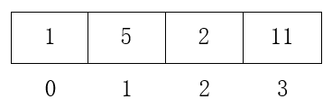
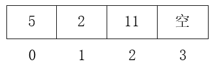
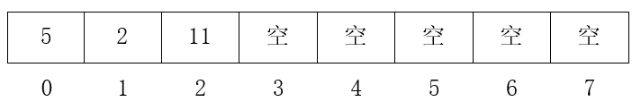
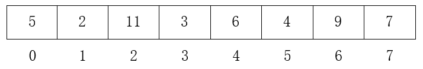
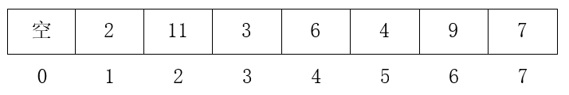
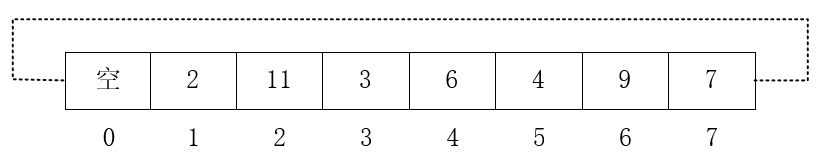
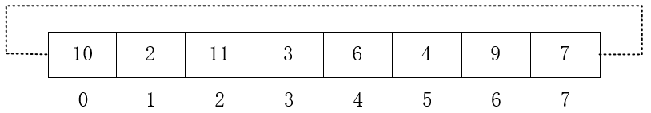
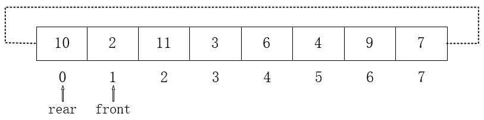

# 栈与队列

# 前言

数组与链表结构能够解决很多一对一的线性表问题，但是在许多情况下，使用最原始的数据结构过于复杂，而且不够安全。数组和链表都可以在任意位置增加和删除数据，但在一些场景下这个机制并不适用。比如我们要做一个排队系统，如果人们可以随意插队，那么所有人都会不满吧？栈与队列，就是在一些场景下对数组或链表的包装，使其严格符合需求，大大增加了安全性。

# 栈

栈，定义为**限定仅在表尾进行插入和删除操作的线性表**，也就是不允许插队，仅允许在表尾操作。这就好比我们洗碗后把碗叠在一起时，总是**后来者居上**，而且取出时也是先取出后来者。这种结构在编程中有很多应用场景，比如编辑文档时的撤销操作，肯定是先撤销最后一步操作，再比如递归函数的调用，也必须保证函数执行的顺序，等等。栈的这种后入先出的特性，称为**LIFO(last in first out)**。

栈一般有大小限制，（不可能把碗叠的无限高），当然也不是绝对的。我们以建立一个有大小限制的栈为例，说明栈的使用，和它在增、删、查方面的表现。

## 1. 顺序结构实现

如果栈的大小限定，我们就可以使用数组来实现它了。

1. 声明一个空栈

```java
class LinearStack{
    Integer[] stack = new Integer[10];
    // 栈顶，也就是可以操作的队尾
    int top = -1;
}
```

2. 增加一条数据

向栈中增加数据也叫做入栈，代码如下：

```java
public void push(Integer data){
    // 处理好边界问题
    if(top<stack.length-1){
        stack[++top] = data;
    }
}
```

3. 删除一条数据

从栈中删除数据也叫出栈，代码如下：

```java
public Integer pop(){
    if(top<0) return null;
    
    Integer ret = stack[top];
    stack[top] = null;
    top--;
    return ret;
}
```
4. 总结

可以看到，使用数组实现栈时，增删操作时间复杂度都是**O(1)**。

## 2. 链式结构实现

1. 声明一个空栈

与单链表不同，栈需要一个指针始终指向最后数据的位置，且它的指针域指向前一个结点。我们有两种思路来实现。

- 思路一：头插法

在链表头部插入数据，并使top指针指向最新数据，next指向原数据。

- 思路二：尾插法

在链表尾部插入数据，并使top指针指向最新数据，prev指向原数据。

两种做法实际上是对称的，我们以方法一为例，代码如下：

```java
class LinkStack{
    Node top = new Node(null);
    // 定义长度
    static final int SIZE = 10;
    int len = -1;
}
```

2. 增加一条数据

```java
public void push(Integer data){
    if(len<SIZE-1){
        if(top.data==null){
            top.data = data;
        }else{
            Node newNode = new Node(data);
            newNode.next = top;
            top = newNode;
        }
        len++;
    }
}
```

3. 删除一条数据

```java
public Integer pop(){
    if(len<0) return null;
    Integer ret = top.data;
    Node next = top.next;
    top.next = null;
    top = next;
    len--;
    return ret;
}
```

4. 总结

用链表实现栈时，增删复杂度也都为**O(1)**，但它的优点在于可以动态调整大小，而不会像数组那样需要处理扩容性能问题。栈**Stack**在JDK中也有实现，大家可以阅读相关源码深入了解。

# 队列

除了栈这种场景，还有一种场景不能直接使用链表，这就是队列。它定义为**只允许在一端进行插入操作，而在另一端进行删除操作的线性表**。比如我们买车票要排队，坐公交要排队，有时吃饭人多时还是要排队。在编程中也有很多场景要用到队列，典型的应用场景就是阻塞队列，在多线程编程环境下使用非常频繁。

队列也可以使用数组和链表两种方式来实现。但是由于队列的增加和删除不在一端，这就意味着使用数组实现时，删除操作要移动所有数据，比如有数组如下：

<div align="center"><br/>数组</div>

现在要进行出队操作，也就是把数据1删除，后续的5、2、11都要向前移动一个位置，如下所示：

<div align="center"><br/>出队</div>

这样一来，出队的时间复杂度就是**O(n)**。那么，有没有办法解决此问题呢，还是数组不适合用来实现队列？

实际上，这个问题是有解的，那就是使用循环。假设有数组如下：

<div align="center"><br/>数组</div>

我们向其中插入一些数据，使它全部填充，如下：

<div align="center"><br/>填充</div>

现在进行出队操作，也就是删除数据5，与之前不同的是，这次数据不再向前移动，而仅仅把5原先的位置空出来，如下：

<div align="center"><br/>5出队</div>

现在队列不是满的了，至少位置0是空闲的。那么我们要入队数据10，应该怎么操作呢？我们把数组看做是循环的，假设位置7的下一个位置是0，也就是把首尾连接起来，如下：

<div align="center"><br/>循环数组</div>

这样数据10就可以插入到位置0了，如下：

<div align="center"><br/>10入队</div>

要这样使用数组，我们就需要两个标记，一个用来标记队列开始的位置，一个用来标记队列结束的位置，如上图队列的队首在位置1，队尾在位置0，标记如下：

<div align="center"><br/>标记</div>

有了标记，对队列的操作就变得容易多了，队列空和满也都可以根据标记来判断。关于循环队列的Java实现，大家可以参考我分析的ArrayDeque源码：[Java集合源码分析之Queue（三）：ArrayDeque](../java/collection/Java集合源码分析之Queue（三）：ArrayDeque.md)

接下来，我们用单链表来实现一个队列。

1. 声明一个空队列

```java
class LinkQueue{
    Node front = new Node(null);
    Node rear = new Node(null);
    int len = 0;
}
```

2. 增加一条数据 

```java
public void enqueue(Integer data){
    // 空表时数据放入front中
    if(front.data == null){
        front.data = data;
        len++;
        return;
    }

    // 第二条数据放在rear中，其他数据向后追加
    if(rear.data==null){
        rear.data= data;
        front.next = rear;
    }else{
        Node newNode = new Node(data);
        rear.next = newNode;
        rear = newNode;
    }
    len++;
}
```

3. 删除一条数据

```java
public Integer dequeue(){
    if (front.data == null) {
        return null;
    }
    Integer ret = front.data;
    front = front.next;
    len--;
    return ret;
}
```

# 总结

栈与队列都是在数组或链表的基础上改造而来，它们的应用十分广泛，在实际开发使用中，我们应该灵活选用。

以上涉及代码请参考[StackSample.java](./sample/StackSample.java) 和 [QueueSample.java](./sample/QueueSample.java)。

---

本文到此就结束了，如果您喜欢我的文章，可以关注我的微信公众号： **大大纸飞机** 

或者扫描下方二维码直接添加：

<div align="center"><br/>扫描二维码关注</div>

您也可以关注我的简书：https://www.jianshu.com/u/9ee83a8ee52d

编程之路，道阻且长。唯，路漫漫其修远兮，吾将上下而求索。