# 树与二叉树

早在分析Java集合源码时，我们对树和二叉树就有了基本的了解，部分知识可以查看[Java集合源码分析之基础（三）：树与二叉树](../java/collection/Java集合源码分析之基础（三）：树与二叉树.md)。本文在此基础上，介绍树和二叉树的存储、特性，以及部分知识的Java参考代码。

# 树的存储结构
数据结构中定义的树，类似于下图：

<div align="center">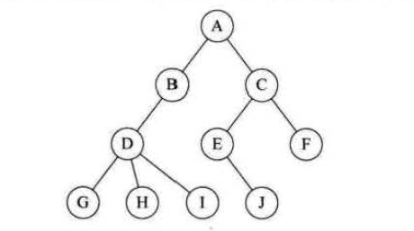<br/>树示意图</div>

前面我们说过，计算机只能顺序或者链式存储数据，所以树这样的结构是不能直接存储的，所以要将其转换为顺序或链式来存储。主要有以下三种方式：

## 双亲表示法

这一方法基于数组，也基于树的每个结点（除了根结点）都有且仅有一个父结点。做法是存储每个结点时，增加一个域指向其父结点的位置。比如上图，按照双亲表示法存储在数组中，结构就是这样的：

<div align="center">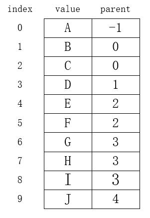<br/>双亲表示法</div>

实际操作时，就是从上往下，层序遍历一棵树，并为相应的域赋值即可。这种存储方式，可以快速获取任意结点的父结点位置，但相反的操作，要获取一个结点的子结点，就需要遍历了。

但是以上问题可以通过增加一个域来解决，可以增加一个firstChild域，表示一个结点最左边的子结点，例如对于以上这棵树，A的firstChild是B，B的firstChild是D。这样我们就可以得到任何一个结点的第一个子结点了，而所有的子结点又是连续的，所以就可以方便的获取到所有的子结点。

这引发了我们的思考，是不是通过增加域，我们可以获取任何想要的关系？比如可以存储兄弟结点的位置。是的，这是很灵活的，但是也要注意设计合理，过于庞大的数据单元，会占用大量内存空间，这就仁者见仁，智者见智了。

## 孩子表示法

这一方式，是建立多个指针域，指向它所有子结点的地址。也就是任何一个结点，都掌握它所有子结点的信息。我们使用数组+链表的方式来实现。以上这棵树使用孩子表示法示意结构如下：

<div align="center">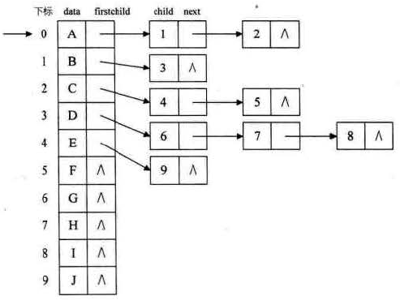<br/>孩子表示法</div>

这样对任何一个结点，都可以直接找到它的全部子结点了。我们还可以把它和上述的双亲表示法结合起来，以赋予它更多的能力。

## 孩子兄弟表示法

这种方式，可以把一棵普通的树，转换成二叉树。它的做法是用两个指针分别指向它的第一个子结点和它的第一个右兄弟结点。

文章开始处的这棵树，用孩子兄弟表示法结果如下所示：

<div align="center">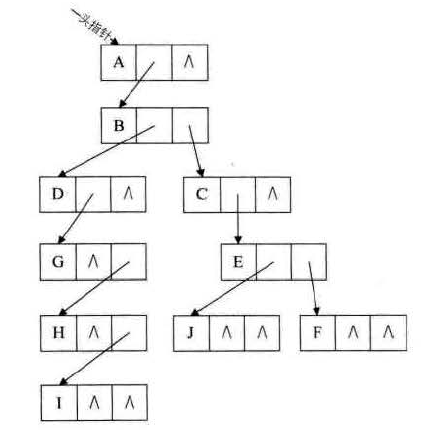<br/>孩子兄弟表示法</div>

# 满二叉树与完全二叉树

之前的文章里介绍了二叉树的概念，其实二叉树中还有几种特殊的二叉树，这里介绍两种。

## 满二叉树

> 在一棵二叉树中，如果所有分支结点都存在左子树和右子树，并且所有叶子都在同一层上，这样的二叉树称为满二叉树。

满二叉树是一棵完美的二叉树，它的每一棵子树都是左右对称的。如下就是一棵满二叉树：

<div align="center">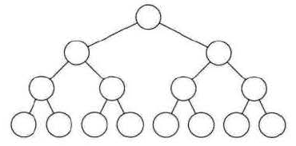<br/>满二叉树</div>

## 完全二叉树

> 对一棵具有n个结点的二叉树按层序编号，如果编号为i (1≤i≤n) 的结点与同样深度的满二叉树中编号为i的结点在二叉树中位置完全相同，则这棵二叉树称为完全二叉树。

这句话可能说的不太好理解，简单来说，完全二叉树就是满二叉树少几个叶子，而且叶子是从右向左少的。比如下图就是一棵完全二叉树，把它和上方的满二叉树对比可以发现，从上往下一层一层数过去，它们是一模一样的，仅在最后完全二叉树缺少几个叶子。如果中间有任何一个结点对应不上，它就不是一棵完全二叉树。

<div align="center">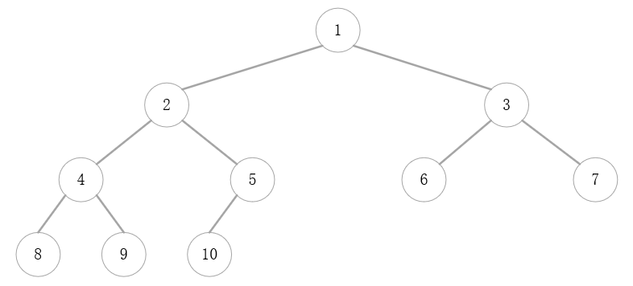<br/>完全二叉树</div>

# 二叉树的存储

二叉树也可以顺序或链式存储，链式存储和树的孩子表示法差不多，定义一个lchild和rchild指针分别指向左孩子和右孩子即可。它的顺序存储却比普通的树要简单的多，接下来我们看下二叉树的顺序存储是如何实现的。

## 顺序存储

以上述完全二叉树为例，可以发现每个结点的位置和它在线性表中的位置是一样的，所以不需要指针指向它的父结点或者子结点，我们直接按照层序遍历方式把它存储在数组中即可。结果如下：

<div align="center">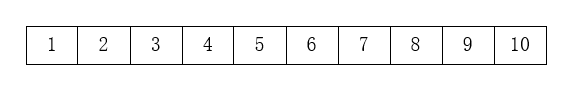<br/>顺序存储</div>

以上是针对完全二叉树而言，那如果不是一棵完全二叉树呢？比如以下这棵树：

<div align="center">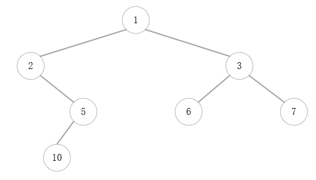<br/>一般二叉树</div>

从第三行开始，数据的位置和存储在数组中的位置不再一样了，比如5在数组中的下标是4。这时我们需要用空位补充，把这棵二叉树和一棵完全二叉树对比，缺少的部分在数组中以空或者特定的字符补充。以此二叉树为例，它对应的完全二叉树如下，其中虚线连接的部分实际不存在。

<div align="center">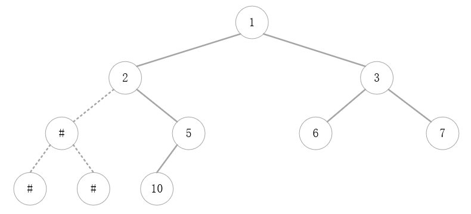<br/>构造完全二叉树</div>

然后按照完全二叉树的方式，在数组中存储时遇到实际不存在的元素就以空表示，结果如下：

<div align="center">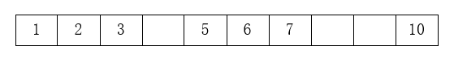<br/>存储结果</div>

这样数组就可以正确的对应原二叉树了。这种方式的可行性在于，对一棵一般的二叉树而言，可以构造的最小的完全二叉树是唯一的，这里最小指不在完全二叉树结尾增加无用的叶子结点。

顺序存储的问题也就由此暴露了，相对于完全二叉树而言，更多的树都是这种一般结构，也就意味着数组中会有大量的空位，这大大的浪费了内存。

# 二叉树的遍历实现

二叉树的遍历分为前序、中序、后序三种，还有一种叫做层序遍历，就是从上往下一层一层进行遍历。之前介绍了这几种遍历的概念，接下来我们以上述的一般二叉树为样例来演示这几种遍历。

<div align="center"><br/>一般二叉树</div>

## 1. 构造二叉树

我们以链式存储方式进行演示，结点的结构如下：

```java
class TreeNode{
    Integer data;
    TreeNode lChild;
    TreeNode rChild;

    public TreeNode(Integer data){
        this.data = data;
    }
}
```

## 2. 层序遍历

层序遍历的特点是先获取根结点的值，然后获取它的左孩子，再获取它的右孩子，如上方这棵树中，获取顺序1->2->3，这部分非常简单。但下一步却要从3回到2，获取到5后再回到3，这样在2和3之间来回跳跃，便不那么好处理了。我们可以借助队列来完成。

为了便于演示，我们用黑色代表当前结点，蓝色代表它的左孩子，红色代表它的右孩子，建立如下模型：

<div align="center">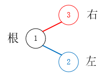<br/>演示模型</div>

以上述树为例，借助Queue实现的原理如下：

首先根结点入队，入队时，剪掉它的两个孩子，并按照左右顺序把两个孩子都入队，然后根结点丢弃：

<div align="center">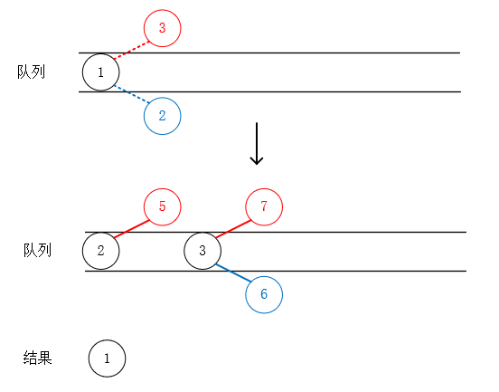<br/>步骤1</div>

然后对结点2进行同样的处理：

<div align="center">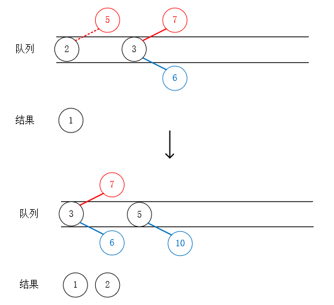<br/>步骤2</div>

接下来处理结点3：

<div align="center">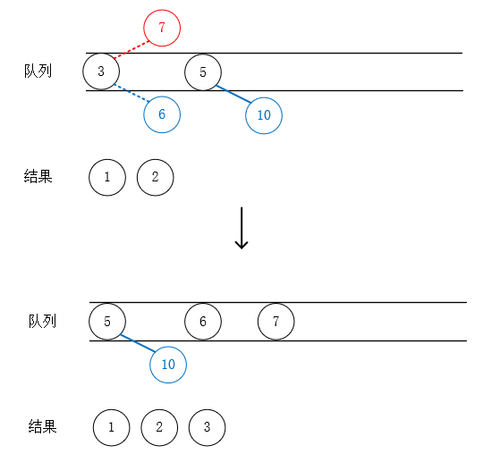<br/>步骤3</div>

到这里相信大家已经发现了，获取到2之后下一步获取的是3，而获取5被巧妙的放在了3之后，这样我们就可以一层层的遍历二叉树了。Java代码如下所示：

```java
private void levelTraverse(TreeNode tree){
    if(tree == null) return;
    Queue<TreeNode> queue = new LinkedList<>();
    queue.add(tree);
    TreeNode node;
    while (!queue.isEmpty()) {
        node = queue.poll();
        System.out.println("Node is " + node.data);

        if(node.lChild!=null){
            queue.offer(node.lChild);
        }
        if(node.rChild!=null){
            queue.offer(node.rChild);
        }
    }
}
```

## 3. 前序遍历

前序遍历可以简单的使用递归实现，代码一目了然，如下：

```java
private void preOrderTraverse(TreeNode tree){
    if (tree == null) {
        return;
    }
    System.out.println("Node is " + tree.data);

    preOrderTraverse(tree.lChild);
    preOrderTraverse(tree.rChild);
}
```

## 4. 中序遍历

```java
private void inOrderTraverse(TreeNode tree){
    if (tree == null) {
        return;
    }
    inOrderTraverse(tree.lChild);

    System.out.println("Node is " + tree.data);

    inOrderTraverse(tree.rChild);
}
```

## 5. 后续遍历

```java
private void postOrderTraverse(TreeNode tree){
    if (tree == null) {
        return;
    }
    postOrderTraverse(tree.lChild);
    postOrderTraverse(tree.rChild);
    System.out.println("Node is " + tree.data);
}
```

# 总结

关于树和二叉树的基础知识就介绍到这里了，关于二叉树遍历的代码实现，并不限于以上一种，大家可以思考一下还可以怎么实现？友情提示下，层序可以利用树的深度，其他遍历可以利用栈的特点。

以上涉及代码请参考[BinaryTreeTraverseSample.java](./sample/BinaryTreeTraverseSample.java)。

---

本文到此就结束了，如果您喜欢我的文章，可以关注我的微信公众号： **大大纸飞机** 

或者扫描下方二维码直接添加：

<div align="center"><br/>扫描二维码关注</div>

您也可以关注我的简书：https://www.jianshu.com/u/9ee83a8ee52d

编程之路，道阻且长。唯，路漫漫其修远兮，吾将上下而求索。