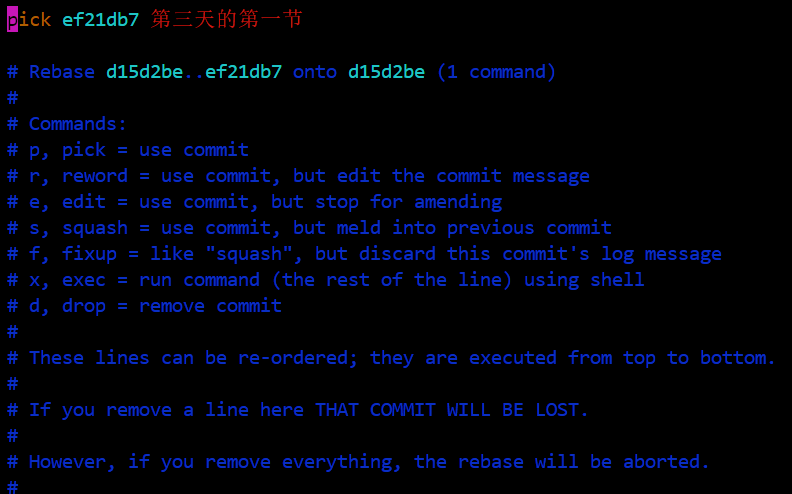
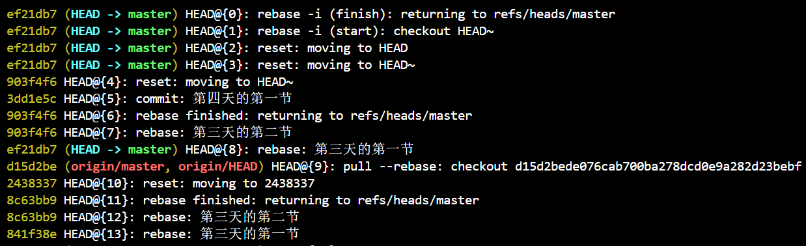
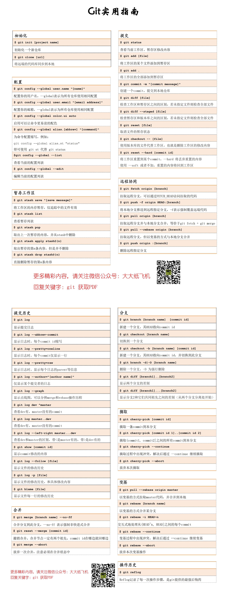

Git是什么？代码管理工具。Git是怎么实现的？我们不需要关心。我们只要把目光盯着每个commit，知道git的每个命令都是为此服务的，足矣。

正如我在模型里形容的，git的每个分支都可以理解为一根竹子，而每个commit就是竹子的一节，这就是我们需要的全部信息。merge、rebase、cherry-pick就是维护和改造commit的三把利器。

merge就是从两根竹子的根部，一节节向上对比它们的不同，当有不同发生时，有两条路走就两条路都保留，并用一个新的节点糅合起来，只有一条路就直接走过去，当然两条路可能有冲突，解决一下就好了。

rebase也同样是从两根竹子的根部出发，只不过当遇到不同时，就把你的这条路多出的部分剪掉，先把别人的放进来，再一节一节安回去，因为每一节都重新安，所以commitId都会变，而且每一节都有可能产生冲突，理论上最糟糕的情况是有多少节竹子要安，就得解决多少次冲突。所以务必勤快些，随时随地`git pull --rebase`。

cherry-pick就简单了，不需要从竹子根部出发，只取需要的commit就行，它像是rebase的后半段，也有可能产生一堆冲突。。

除了merge的Non Fast Forward（非快进式合并），其他的所有方式都会丢失操作记录，所以一定要牢记自己的关注点是操作记录还是整洁。

还有一个概念需要了解一下，HEAD和FETCH_HEAD。HEAD就是头节点，是一个指针，也就是始终指向竹子最上一节。FETCH_HEAD是当你执行 git fetch 时，拉取下来的代码的头结点。

只要真的把每个分支都想象成一根竹子，记得我上边说的区别，把自己当成git，你在操作git时就能游刃有余，遇到的大多数问题都有把握搞定，而不至于被git整的焦头烂额。大多数人遇到问题往往就是因为对git的理念不熟悉，不了解每条命令的目的造成的。包括之前的我也是，经常忙碌到最后，发现自己渴求的不过是回到最开始的状态，好给自己一次重新来过的机会。。

以下是我在平时会使用到的一些命令的总结，希望能够对大家有所帮助。

# 初始化相关

```
// 初始化一个仓库
git init [project name]
// clone一个已有的仓库
git clone [url]
```

# config相关

```
// 设置用户名
git config [--global] user.name "Your user name"
// 设置邮箱
git config [--global] user.email "Your user email"
// 配置缩写，例如此处 git status 就可以简写成 git st
git config [--global] alias.st "status"
// 查看配置列表
git config [--global] --list
// 编辑配置列表
git config [--global] --edit
```

# commit相关

```
// 查看工作区改动
git status
// 添加一个文件
git add [file]
// 添加所有文件
git add .
// 创建一个commit
git commit -m "commit message"
// 检查工作区和暂存区之间的区别，如果跟上文件，就是只看当前文件的区别
git diff [file]
// 检查暂存区和版本库之间的区别
git diff --staged [file]
// 检查工作区和版本库之间的区别
git diff HEAD
// 将文件从暂存区去除，回到工作区
git reset [file]
// 将工作区的更改去除
git checkout -- [file]
// 回到某个commit，不加--hard回完之后更改的文件会进到工作区，加上--hard这些文件就不见了
// HEAD~1 表示第二新的commit，如果是HEAD~1，可以简写成HEAD~ 这里也可以跟上具体的commitId
git reset [--hard] HEAD~1
```

# 暂存未完成的工作

```
// 暂存工作区的内容，前提是文件已经被追踪了
// 不想写message，可以简单使用 git stash
git stash save [save message]
// 查看stash列表
git stash list
// 弹出暂存的工作，会从暂存里删除
git stash pop
// 只把stash里的内容取出来，但不弹出
git stash apply stash@{0}
// 删除某个stash
git stash drop stash@{0}
```

# 提交历史相关

```
// oneline 表示只显示一行，raw可以查看树的结构，还有其他可以配置的
// --abbrev-commit 可以显示简短的commitId
// --author 只显示该作者的
git log --pretty=[oneline, raw, ...] --abbrev-commit --author=[author name] 
// 查看提交的点线图
git log --graph
// 查看dev有，master没有的commit
git log dev ^master
// 查看 dev 中比 master 中多提交了哪些内容
git log master..dev
// 查看两个分支的区别，包含 < 是master的，包含 > 是dev的
git log --left-right master...dev
// 显示一次commit的内容
git show [commitId]
// 显示一个文件的修改历史
git log --follow [file]
// 显示一个文件的修改历史，和具体修改内容
git log -p [file]
// 显示一个文件每一行的修改历史
git blame [file]
```

# 分支相关

```
// 新建一个branch，如果跟上commitId，则新建分支的HEAD将指向它
git branch [branch name]  [commitId]
// 切换一个branch
git checkout [branch name]
// 新建一个branch并切换到它，如果跟上commitId，则新建分支的HEAD将指向它
git checkout -b [branch name] [commitId]
// 删除一个分支，如果是-D表示强制删除
git branch -d|-D [branch name]
// 检查两个branch之间的差别
git diff [branch1]..[branch2]
// 检查两个branch共有父节点和branch2的差别
git diff [branch1]...[branch2]
```

# merge相关
```
// 合并某个分支到当前分支 可选的--no-ff 表示不允许快进
git merge [branch name] --no-ff
// 回退一次merge，commitId在哪条路就回到哪条路
git reset --merge [commitId]
// 中断一次merge，相当于回到merge前，必须在merging状态使用
git merge --abort
```

# cherry-pick相关

```
// 将某个commit摘取过来
git cherry-pick [commitId]
// 摘取(commitId1, commitId2]之间的commit
git cherry-pick [commitId1]..[commitId2]
// 当出现冲突后，解决完冲突，并执行 git add，之后执行--continue就可以
git cherry-pick --continue
// 放弃一次cherry-pick
git cherry-pick --abort
```

# rebase相关

```
// 拉取origin master的代码，并进行rebase
git pull --rebase origin master
// 和cherry-pick类似，解决完冲突后执行
git rebase --continue
// 放弃一次rebase
git rebase --abort
// 交互式地修改从(commitId|HEAD~n, HEAD]之间的每个commit
git rebase -i HEAD~n | [commitId]
```

# reflog

```
// 非常强大的功能，记录了你每次干了什么，确保任何时候都可以进行回退
git reflog
```

最后演示一下 `git rebase -i` 和 `git reflog` 的作用。输入 `git rebase -i HEAD~` 会打开以下页面：

<div align="center"><br/></div>

在选中范围内的commit会依次列出，前面有一个 **pick** 单词，替换这个单词为提示中的某一个就可以进行变更。例如改为 r 或者 reword，表示只修改commit message，保存之后git会再次弹出一个框，就可以修改对应的commit message了。

git reflog记录的是你的操作记录，而不是commit记录，这点一定要分清。以下就是一个示例：

<div align="center"><br/></div>

这时候，你想回到哪一步，直接 `git reset --hard [commitId]` 就可以了，这是git为你提供的一份超级后悔药，请合理食用哦。

本文的分享到此就结束了，git还有很多五彩斑斓的命令，但是本文目的不在于把git的每个命令都介绍给你，遇到特定问题查一下资料就可以做到。我们是希望你能够理解git的主要目的，时刻谨记自己在操作哪根竹子，关注哪个竹节，不要陷于无穷无尽的命令中无法自拔，让git成为提高工作效率的利器，而不是你前进道路上的绊脚石。git的好处，使用越久就会越有体会，希望git能够陪伴你成长，记录你进步的旅途。

附一张高清的图片总结，你可以通过扫码关注微信获取PDF版哦～

<div align="center"><br/></div>

---

本文到此就结束了，如果您喜欢我的文章，可以关注我的微信公众号： **大大纸飞机** 

或者扫描下方二维码直接添加：

<div align="center"><br/>扫描二维码关注</div>

您也可以关注我的简书：https://www.jianshu.com/u/9ee83a8ee52d

编程之路，道阻且长。唯，路漫漫其修远兮，吾将上下而求索。