**本篇提要：git的核心理念、结构、代码库的创建和Merge**

从开始使用git至今看过无数文章，大多时候是为了解决一个特定问题，寻求一个特定的解决方案，偶尔也会看一些新手向的教程。对于前者，可能需要你具备一定的git能力，这无可厚非。但大多新手向的教程主要铺陈git的常用命令，看的时候觉得自己懂了，但实际使用时就会问题重重。

磕磕绊绊至今，我对git也算是有了一些了解，当然都是使用向而不是原理向。在此希望能够以我自己理解的方式，描述我在使用git时的一些心得，希望能够帮助一些新手或者常常被git困扰的伙伴。

# git的核心理念和结构

五花八门的命令是使用git的手段，并不是git的核心。在我看来，与其掌握100条命令，不如先大致了解一下git的思想和大体架构。从使用者角度出发，git的目的就是为了方便我们随时找到需要的代码并进行处理，而我们常用的大多数命令，都是为了这一点服务的，确切的来说这一点就是一条commit。

从结构来说，git主要有工作区、暂存区和版本库三大区域。工作区就是我们写代码的地方，git会追踪你干了什么，并告诉你你的操作和版本库有哪些不同。暂存区就是对你现在的工作拍照，也就是所谓快照，继续在工作区操作，暂存区还是会停留在拍照那一刻，就像手机截屏一样。版本库就是当你觉得暂存区的代码没问题之后，就可以入库了，这时候git就真正把你所做的事变成了一条有价值的commit。

使git变得错综复杂的概念是分支，但分支又是必不可少的，很多时候你不得不放下手头的工作，先去处理其他的问题，处理完后再回来继续工作。这种情况下，必须要保证的是被中断的工作就停留在它刚才的状态，否则现有的工作就无法继续下去了。分支看起来就像一个副本（虽然git肯定不是这么实现的，但我们还是可以简单的理解它就是复制了一次），确保了在某个分支上操作，不会影响到其他分支的内容。

以上就是我们日常使用git的全部了，在工作区工作，到某个节点拍照存到暂存区，确认无误后合并到版本库。偶尔来个突发事件，停下手头的工作到另一个分支处理，结束后回来继续工作。不过这都是概念性的，相当于定义了游戏规则，接下来就是看git给我们提供了哪些手段来完成此事。

# 建模，让git更有趣

在正式操作git命令之前，我觉得对概念建模能对我们理解git提供有效帮助。我们把git看做一片竹林，我是一个园丁，我和其他的园丁一起照料这片林子，只不过这里的每根竹子要生长一节都是我们园丁说了算，而不是大地（看起来我们都是上帝？）。而我们每个人的工作，就是决定什么时间让竹子长一节，记录我们工作的工具是分配给每个人的一台电脑。

我们的模型就是这么简单，一堆人一起“造”竹子，接下来跟随着时间的脚步看下我们的模型如何运作吧。（PS：看起来怪怪的，莫不是我们开了一个竹子蜡像馆？问题是能吸引来哪怕一个游客吗？不管那么多了，老板的想法不是我们普通工人应该琢磨的，有钱拿就行了。。。）

# git命令和模型结合，推进时间线

## 第一天：项目的建立和代码合并（Merge）

### 1. 项目启动仪式

一开始我们很穷，除了钱什么都没有。要想造竹子，得先有地盘吧，所以我们就拿钱买了块地，它大概是

<div align="center">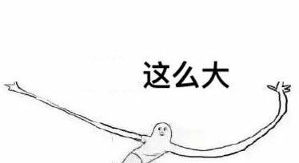<br/></div>

好了，不开玩笑，它大概这么大：

<div align="center"><br/></div>

打开你的命令行，输入以下字母，你就得到了一样大的土地：

```
mkdir first_git
cd ./first_git/
git init
```
当你看到这样的输出，就成功了：

<div align="center">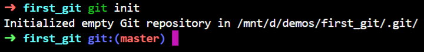<br/></div>

这里看到了 master，这是git默认给我们创建的分支，也叫主分支，毕竟git需要在某个分支工作。给我们的模型挖一个坑，稍大一点，以后就是我们的明星产品了。

<div align="center">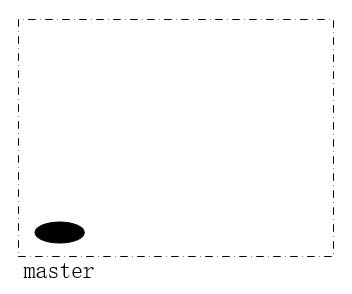<br/></div>

我（飞机酱）和我的小伙伴（姑且叫他路人丙）深得老板器重，所以这块地目前全部属于我们。虽说我们只有两个人，但也要衡量谁做的多做的好，发给每个人的电脑就是用来记录我们每天都做了什么，最后每个人的成果还要汇总一下交给老板。所以还需要一台公共的电脑用来汇总我们的信息，把我们各自的工作整理后发到这台电脑上，最终整合成美观的结果报告等待老板查阅。既然这台电脑已经开了头，就把它充公吧。

事情要由老板牵头，所以老板在这台电脑上签了名，并写下以下内容：“竹林001号项目启动”。接下来就什么都不管了...

使用git完成老板的操作可不简单，你得依次做以下几个事情：

```
git config --global user.name "boss"
git config --global user.email "boss@git.com"
```

以上就是老板签名的步骤，`--global` 是说这个电脑上的全部项目都是老板的，操作者也是他自己，而且他也没必要每次开一个项目都再次签名认证了（这样一来，路人丙如果想捣乱，老板一定会发现他）。

接下来老板新建了一个`README.txt`并将内容`竹林001号项目启动`写进去保存了起来

```
echo 竹林001号项目启动 > README.txt
```

写好了开场白，还得按照规矩把它存到版本库里，不然事情就白做了。先用 `git status` 看看现在版本库的状态：

<div align="center">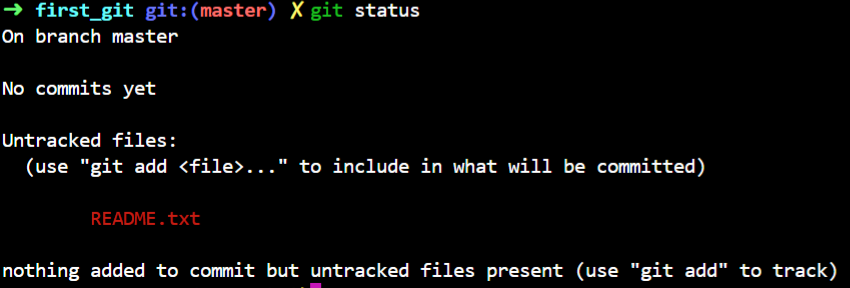<br/>README</div>

那个红色的 README.txt 就是我们的工作区，git发现了工作区改动，但是暂存区里没有它，版本库里也没有。既然用git工具，就务必按照规则来，先把工作区拍照存到暂存区，再进入版本库：

```
// 添加到暂存区
git add README.txt
```

再看看状态，发现红色变成绿色了，这时候就进了暂存区：

<div align="center">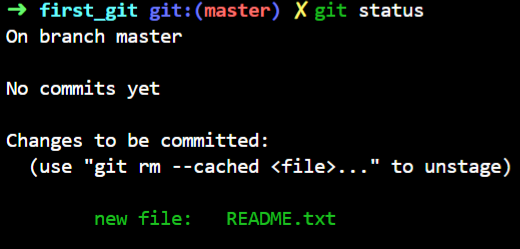<br/>暂存区</div>

最后，终于可以入库了，我们的项目也算正式启动。

```
// 并入版本库
git commit -m "老板写下了启动标语"
```

-m 后边加的内容表示这次做了什么，方便以后查阅。执行完成之后，我们就拥有了第一个commit，也就是第一个有价值的节点。

<div align="center">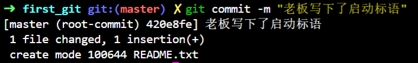<br/>first commit</div>

使用 `git log` 可以看看我们做过什么：

<div align="center">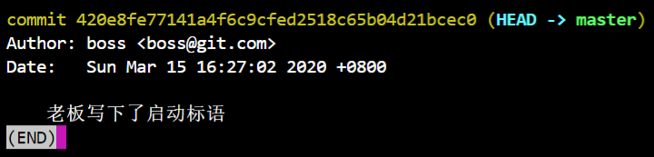<br/>log</div>

commit 后边那个长长的字符串，它是这次commit的唯一标识，后边我们会明白它的意义。

现在，我们有了第一节竹子（画图不好，勿吐槽）：

<div align="center">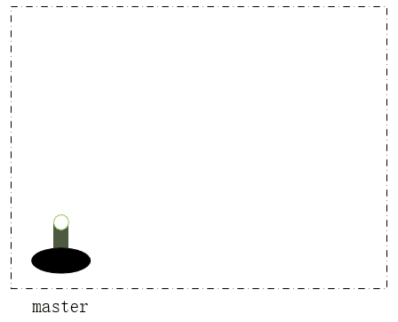<br/>first commit</div>

### 2. 开工，各自为战

老板只在公共的电脑上写下了标语，我们自己的电脑还没有呢，总不能让老板挨个写吧？（老板：……）所以我们要有个办法把公共电脑的内容搞过来，这就是`git clone`。我们只要在自己的电脑上，执行 `git clone + 版本库的路径`，就能把代码同步过来，我这里只能在同一个电脑操作，所以用仓库名称进行 clone（同时在源版本库执行`git config receive.denyCurrentBranch warn`）：

<div align="center">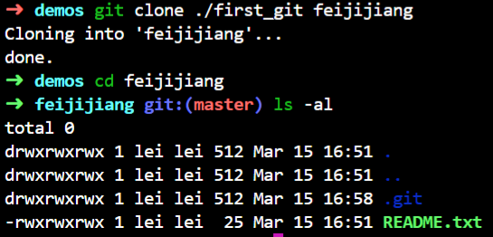<br/>clone</div>

可以看到老板修改的内容已经过来了。路人丙也执行了同样的操作，这样就可以各做各的。为了知道是谁做的工作，我们还分别设置了自己的名字，这样以后的每个commit都会携带作者（路人丙干了坏事，我们看看 git log 就能抓到他！）。如果只有一个项目，可以不加`--global`。现在我们的土地上有了三根一样的竹子：

<div align="center"><br/>clone</div>

一切准备就绪，接下来就可以开始干活了，飞机酱和路人丙都在全力造竹子，并记录到自己的电脑里，此时公共电脑并不知道他们干了什么。第一天因为没有经验，工作中出现了多次失误，飞机酱只造好了一竹节，路人丙好一些，造好了两节。所以他们的竹子是这样的：

<div align="center">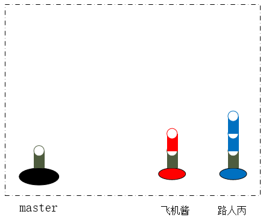<br/>第一天</div>

在他们自己的版本库里，都在 `work_01.txt`文件里记录了自己的工作，并保存到了版本库：

<div align="center">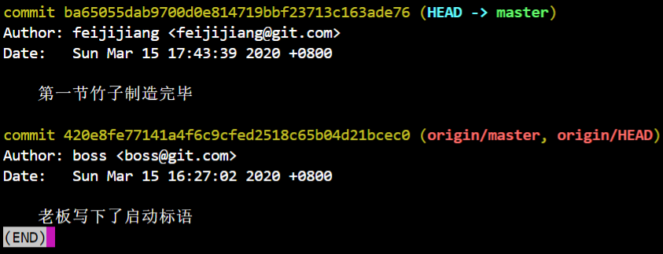<br/>飞机酱的日志</div>

<div align="center">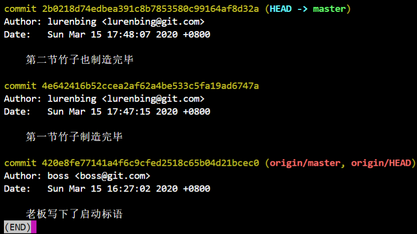<br/>路人丙的日志</div>

下班后，飞机酱把记录同步到了公共电脑上，然后开心的回家了。他是这么操作的：

```
git push origin master:master
```

<div align="center">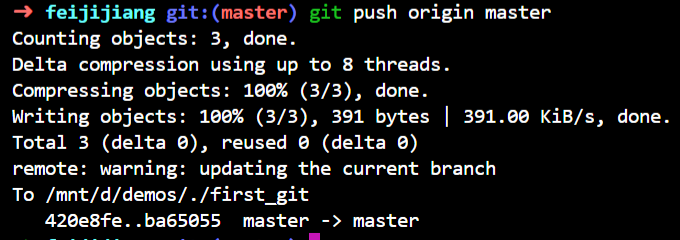<br/>push</div>

origin是远程版本库名称，虽然我们没有配置它，但它默认就是origin，第一个master是飞机酱电脑上使用的分支，第二个master是远程版本库的分支。（飞机酱可能提前补课了，命令写的很全）

接下来到路人丙同步了，他也使用了类似的操作，但是却发生了意外：

<div align="center">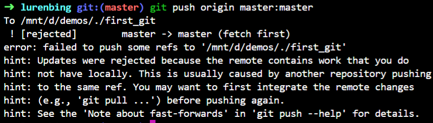<br/>push</div>

一样的操作，结果却迥异，路人丙的内心一定是凌乱的，但他还认识几个单词，大致明白了提示的意思。原来飞机酱在他前面进行了push操作，导致他这里文件不够新，git就拒绝了他。所以他按照提示中 `(e.g., 'git pull ...') before pushing again.` 又试了一次。结果在`git pull`时再次发生意外：

<div align="center">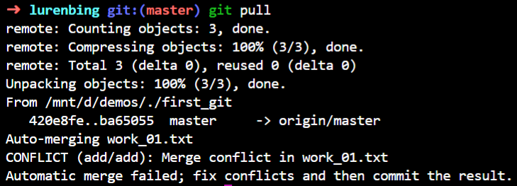<br/>pull</div>

conflict的意思是冲突，conflict出现在对同一个文件的同一行进行了不同修改的时候。我们记得飞机酱和路人丙都创建了 `work_01.txt`文件并写入了内容，所以git合并时发现第一行都写入了内容，就没法决定让谁的修改在前，就会要求我们手动解决。现在我们打开路人丙的 `work_01.txt`，看看它的内容：

<div align="center">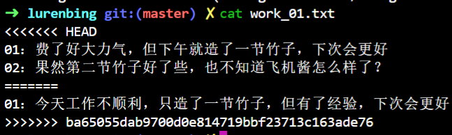<br/>conflict</div>

可以看到，两人输入的内容用 `<<<<HEAD...====...>>>>{commitId}`这样的格式包裹起来了。前面是路人丙的内容，后边是飞机酱的内容。想要合并到远程版本库，就一定要先解决掉这个问题，否则老板看到就要发火了~所以路人丙改了它，并把飞机酱的内容放在了下边（老板肯定会先看到前面的内容）：

<div align="center">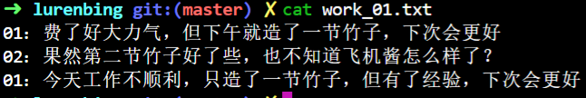<br/>修改内容</div>

因为又发生了修改，所以内容现在还在工作区，就需要再次把它加到暂存区，再入库。一通操作后，总算合并成功了：

<div align="center">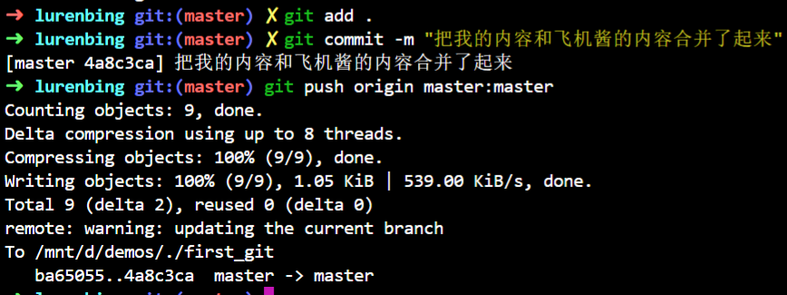<br/>push</div>

现在让我们更新一下当前模型的状态，路人丙为了解决冲突增加了一个commit，这时候公共电脑的log看起来是这样的：

<div align="center">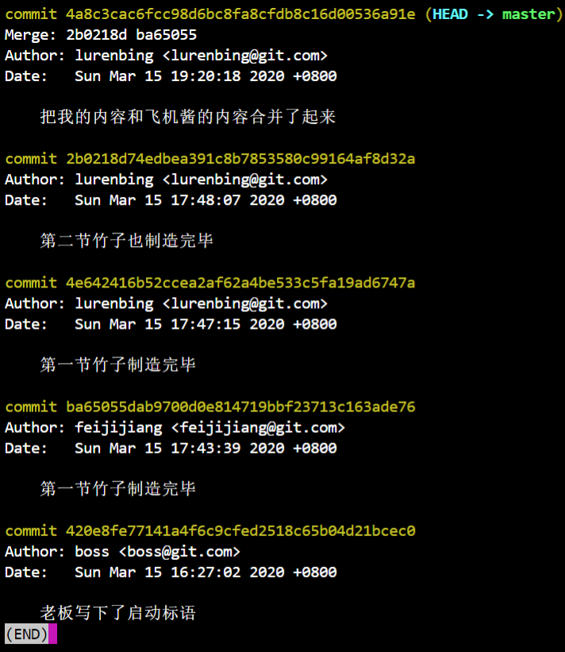<br/>远端版本库</div>

是不是理所当然的认为竹子长这样呢：

<div align="center">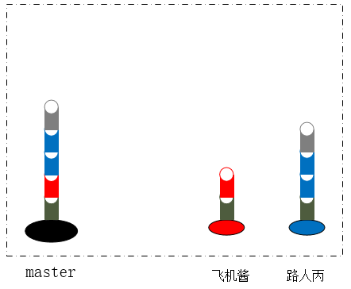<br/>想象中</div>

看起来没有问题，而且git log显示也是如此。但是这里有个问题，大家都是今天干完的活，都要把自己的竹子安到明星产品上，凭什么你先放？路人丙的工作又快又好，难道不是更有资格先放吗？路人丙认为把两个人的竹子拧在一起，最后再用灰色的那节整合在一起最公平了，老板一眼就明白我们是同时完成的工作：

<div align="center"><br/>整合</div>

看起来很奇怪吧？好好的竹子因为互相争抢鼓了一个包，看起来十分不美观（话说这样老板不会生气吗？还是可能会吸引来奇怪的旅客？）。

实际上`git pull`操作是由两个命令组成的，第一个是`git fetch`，表示把远端版本库的内容拉取到本地，第二步才是执行`git merge`操作把拉取下来的新内容和我们自己的内容合并在一起。既然都想占第一个位置，干脆git帮你整合一下，然后用一个新的commit代替就好了。要想证明事实上的确如此，使用上面的 `git log` 是不行的，你要在后边加上 `--pretty=raw`：

```
git log --pretty=raw
```

<div align="center">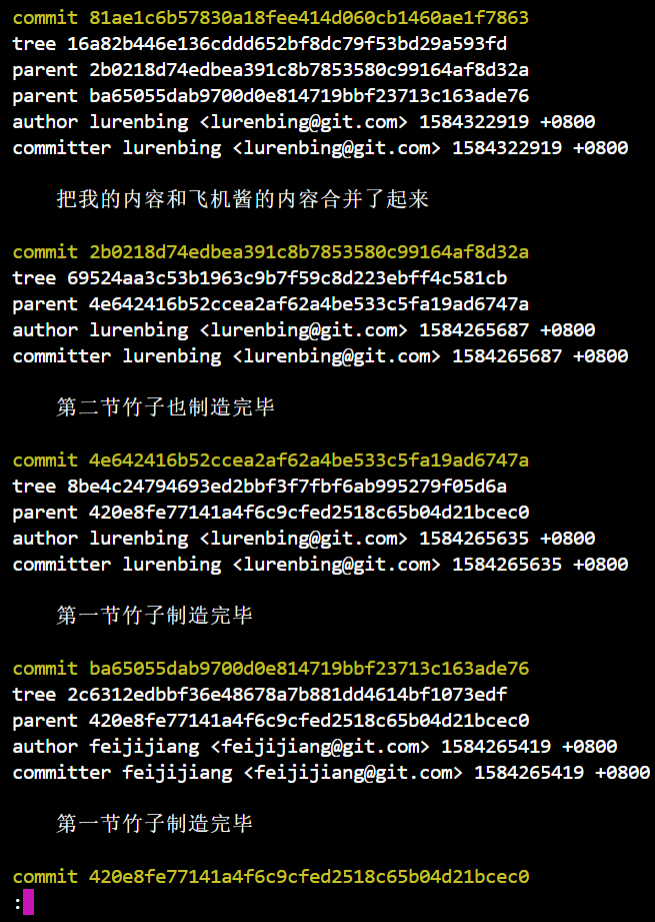<br/>pretty</div>

commit较多，但最后一条显示不全的是老板的提交，并不影响我们分析它。我们主要看每条commit的parent字段，可以发现最上方的那一条有两个parent，分别指向了飞机酱的第一条和路人丙的第二条，而被指向的这两条数据的parent都是老板的那次提交，这和我们预期的完全一致。

### 3. 老板的怒火，推倒重来

解决了问题，路人丙很开心。关掉电脑，背上背包，正准备回去美餐一顿，老板却过来视察工作了，先是夸了一顿路人丙工作努力，转眼看到造好的竹子，怒发冲冠，责令路人丙马上把问题解决掉！

这问题难不倒他，既然能把竹子合起来，再拆开岂不是相当容易，于是他拿起那台公共电脑，输入了以下命令：

```
// reset --merge 重置merge，后边跟上之前的commitId，就可以回到过去
git reset --merge 2b0218d74edbea391c8b7853580c99164af8d32a
```

再看看日志，完蛋，纸飞机的记录不见了，被路人丙的记录取而代之！

<div align="center">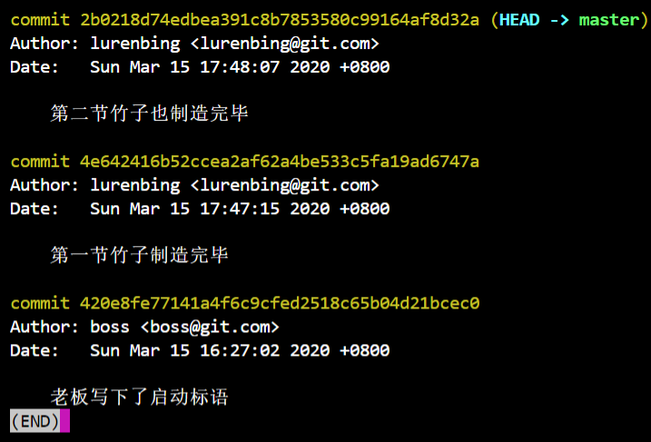<br/>重置merge</div>

这下可怎么好，明天飞机酱来了不好交代呀，而且把别人的工作整丢也不符合道义，有后悔药吃就好了。这时候一边的老板看不下去了，拿起电脑飞快的敲了一条指令：

```
git reset --hard HEAD@{1}
```

然后把电脑交回路人丙，丢下一句：好了，后悔药吃下去了。（路人丙：我@#$*&^^，发生了什么事？）再一看，果然又回到刚才的状态了，原来老板是大神呀，可惜太冷漠，苦事还得我来做。

检查一下刚才的 `git reset xxx` ，后边跟了路人丙的commitId，结果就剩下了他的工作，这里一共两条路，指到飞机酱那边是不是就好了呢，再试一次，反正有老板在随时能吃后悔药（话说这么大胆的么）。

```
git reset --merge ba65055dab9700d0e814719bbf23713c163ade76
```

<div align="center">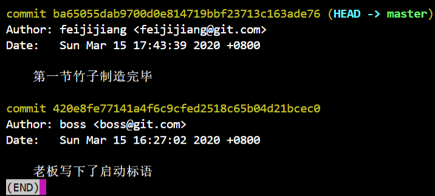<br/>再次重置merge</div>

果然是，我路人丙就是个天才，哈哈哈！

等等，这不是飞机酱离开时的状态吗，刚刚的路行不通，我该怎么办好呢？回想一下刚刚好像是因为冲突才多了一个commit，那如果我不让它冲突岂不就好了？这工作记录都写一个文件里看着也有些乱，我再换个文件也许就好了呢。路人丙用求助的眼神看着老板，意思是希望老板能把他自己的工作记录删一下，他已经有了好的idea想再试一下。接下来又是老板炫技的时间，不过这次是在路人丙的电脑上：

```
git log
// 重置到老板自己的commitId
git reset --hard 420e8fe77141a4f6c9cfed2518c65b04d21bcec0
```

于是路人丙的工作全不见了，一切仿佛回到了刚开始。

<div align="center">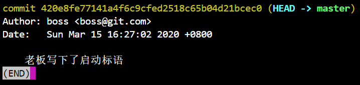<br/>重新来过</div>

这次路人丙给文件起了一个不一样的名字 `lurenbing_01.txt`，又把工作记录写了进去，再次进行提交：

<div align="center">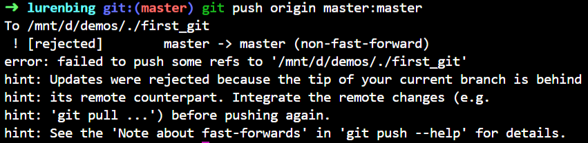<br/>push</div>

果然还是需要先pull，再pull一下看看结果：

<div align="center">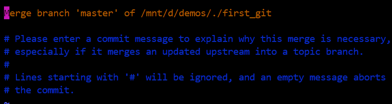<br/></div>

这次确实没有了冲突，但是弹出了一个框，内容说明这是一次merge，先不管它，直接下一步，再看`git log --pretty=raw`：

<div align="center">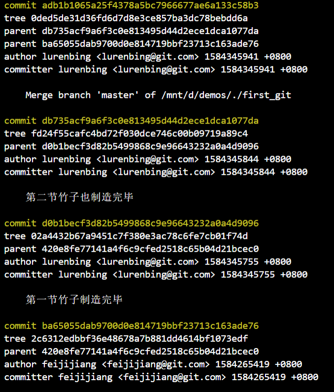<br/>log</div>

为什么，都不在一起了还是这样，路人丙都要崩溃了。一定是刚刚pull的问题，我要是先pull，再写我的工作记录是不是就好了。再次让老板帮忙重置后，路人丙先pull了一次：

<div align="center">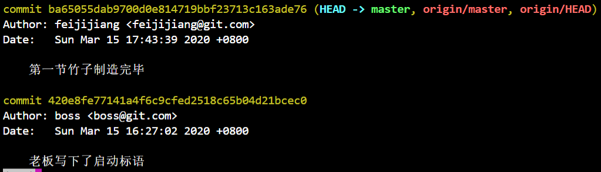<br/>先pull</div>

这下飞机酱的工作记录都到我这了，我再写应该没问题了吧，一顿操作下来，这一次顺利的合并了进去，既没有冲突，也没有弹出框。到公共电脑上一看，很好很顺利：

<div align="center">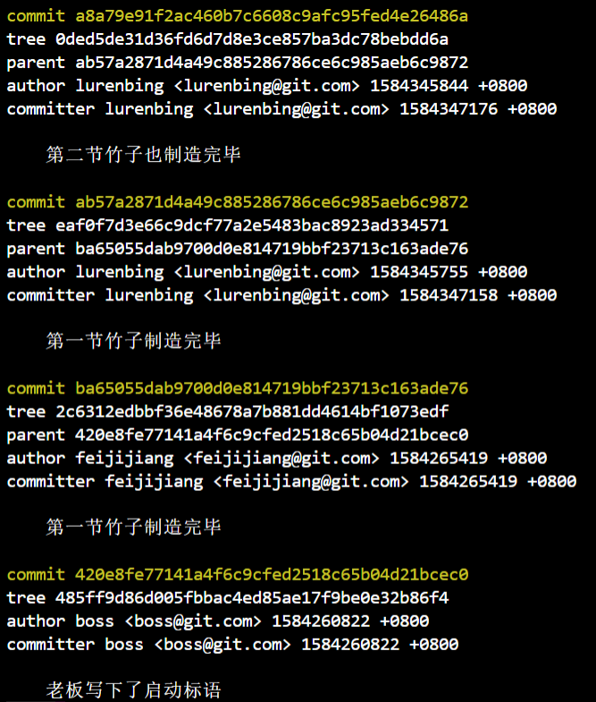<br/>完成工作</div>

时间太晚，工作也马马虎虎算搞定了，老板打算放过路人丙，但临走前问了一个令路人丙瞬间凌乱的问题：如果每次都要先pull再开始写你自己的commit，那你每天都要等飞机酱下班后才开始工作？（路人丙：那我每天岂不是比飞机酱多工作一倍的时间？明天我要找他研究研究，这实在不是人干的事啊~）

最后更新一下我们的模型，可以看到路人丙的竹节最后还是放在了上边，所以干的又快又好有什么用呢，快要快在关键时刻。

<div align="center">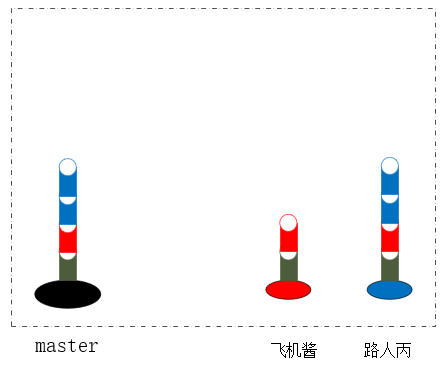<br/>模型的最终状态</div>

第一天的工作就到此结束了，可以看到，只要路人丙希望两个人的工作能够平等的占据第一的位置，就一定会形成鼓包，通过一个新竹节把这两条路归一。而如果他自愿把工作放在后边，一切就很顺畅，有时候真的是退一步海阔天空啊。

---

本文到此就结束了，如果您喜欢我的文章，可以关注我的微信公众号： **大大纸飞机** 

或者扫描下方二维码直接添加：

<div align="center"><br/>扫描二维码关注</div>

您也可以关注我的简书：https://www.jianshu.com/u/9ee83a8ee52d

编程之路，道阻且长。唯，路漫漫其修远兮，吾将上下而求索。