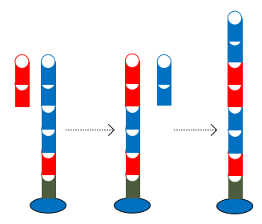
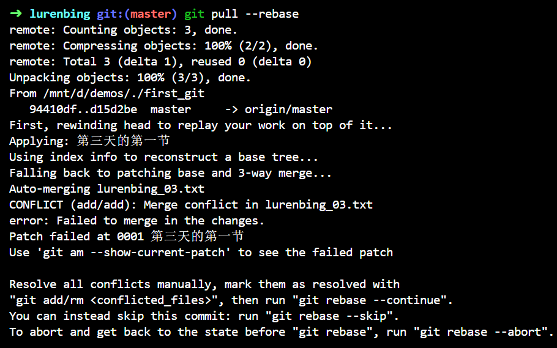
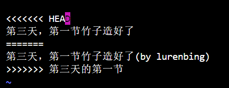
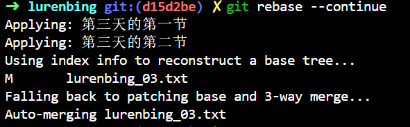
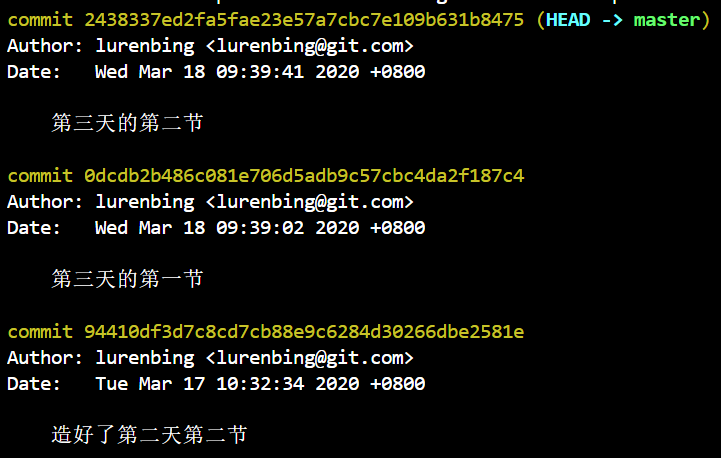
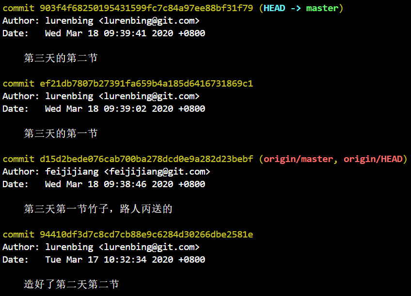

**本篇提要：Rebase**

# 第三天：Rebase的传说

路人丙是个有探索精神的人，虽然昨天通过分支+cherry-pick成功解决了问题，但他总觉得有些怪异，哪里怪异又具体说不上来。哦，大概是这样的问题，既然要摘取竹节再安在上边，我能不能直接在我的竹子上操作，而不是在副本操作呢？就像这样：

<div align="center"><br/></div>

最上面两节是我新做的竹子，等我要合并时发现了飞机酱的竹节，我就先把这两节取下来，把飞机酱的安上去，最后再把取下来的安回去：

<div align="center"><br/></div>

如此一来，不就不需要副本了吗。但问题是，怎么才能达到这个目的呢？路人丙想起来曾经和飞机酱聊过**Rebase**的传说。传闻Rebase神通广大，有神鬼莫测之术，但如果使用它的人实力不够强大，会因为无法完全控制产生灾难性的后果，最后不得不删库跑路。

越是如此，路人丙对它的兴趣越大，赶紧查了资料，不禁看得入迷，越发无法控制（不好，难道这玩意还能摄人心智？）。不得不说，Rebase的确强大，拿来做这件事绰绰有余啊。今天飞机酱请假了，刚好可以自由发挥，等他回来好好炫耀一波。

也许是兴奋吧，今天路人丙超常发挥，做了三节竹子！但是要尝试新方法，非得飞机酱配合不可，没有他的工作记录我和谁rebase呀。哎，谁让我人好呢，这最后一节竹子就送给你吧，希望你以后能念我的好。路人丙先是把第三节竹节安在了飞机酱的竹子上，并在他的电脑里做好了记录（当然先pull下昨天的工作）。

<div align="center"><br/></div>

先加暂存区，再到版本库，然后同步到公共电脑一气呵成。做完这一切赶紧在自己的电脑上试验，这一次他并没有直接pull，而是在后边追加了 `--rebase`:

```
git pull --rebase
```

<div align="center"><br/></div>

然而奇迹并没有发生，原来路人丙太兴奋了，送竹节的记录连文件名都没改，直接全套交给飞机酱了。不过merge时出现冲突，好像没有这么长的提示呀（rebase果然不是那么好降服的），原来rebase解决完冲突是 `git add` + `git rebase --continue` ，而不是像merge时 `git add` + `git commit -m`了。然后路人丙按照提示，去解决冲突：

<div align="center"><br/></div>

看起来和merge没什么区别，但是怎么只有我的一条记录呢，我的第二节竹子去哪了？（心中默念，rebase这么强大，肯定不会有问题的）先解决一下再说吧：

```
// 先解决冲突，然后add
git add .
git rebase --continue
```

<div align="center"><br/></div>

原来如此，rebase时是一条一条commit进行了，第一条有了冲突，所以需要解决，解决好之后发现第二条没有冲突，就直接合好了。推到远端看看记录：

<div align="center"><br/></div>

简直完美，以后再也不需要先在副本上干，再挪回来了。得此技能，我应该已经甩飞机酱十八条街了。不过这里有个小小的瑕疵，让我们快退回去rebase之前的状态：

<div align="center"><br/></div>

这是路人丙当时的工作记录，把目光盯紧在那串commitId上，让我们再rebase一次，仔细看commitId的变化：

<div align="center"><br/></div>

也就是不管有没有冲突，commitId都变了。就像cherry-pick一样，虽然工作记录看起来整洁，但是真实的操作记录都丢失了。看来万事万物没有完美的，就算强如rebase，也有其做不到的事情呀。

---

本文到此就结束了，如果您喜欢我的文章，可以关注我的微信公众号： **大大纸飞机** 

或者扫描下方二维码直接添加：

<div align="center"><br/>扫描二维码关注</div>

您也可以关注我的简书：https://www.jianshu.com/u/9ee83a8ee52d

编程之路，道阻且长。唯，路漫漫其修远兮，吾将上下而求索。