**本篇提要：分支、FastForward、Cherry-Pick**

# 第二天：分支与cherry-pick的作用

第一天走的比较早，到家后飞机酱听说老板过去视察工作了，内心有点慌乱，于是第二天早早去上班，看了一下竹子，完美的三节，不禁感叹路人丙干活能力确实不赖。今天来的早，要赶紧追一追，于是马上进入工作状态。先是用`git pull`把昨天路人丙的工作同步过来，才开始接着造竹节。在路人丙来之前，第一节已经造了大半了。此时他的工作记录如下：

<div align="center">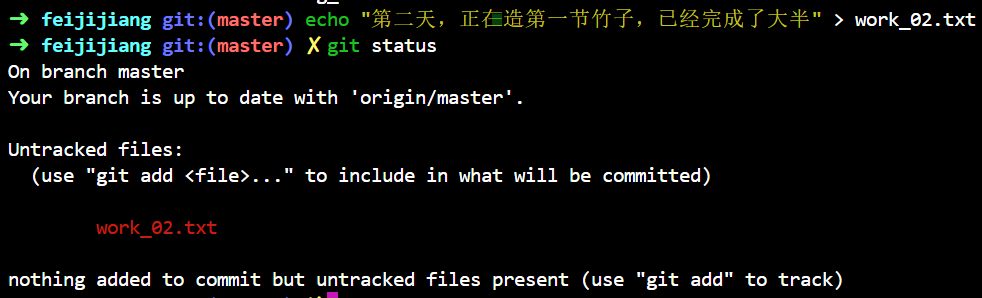<br/></div>

造的竹子距离交差也还差的远：

<div align="center">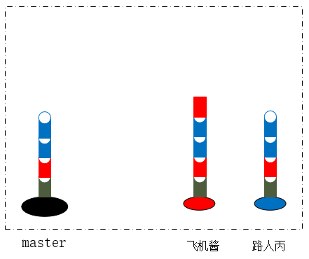<br/></div>

路人丙到来后，先是抱怨了一通，然后把昨天的事仔仔细细的说了一遍，并把老板的问题也说了出来，希望飞机酱和他一起商量个对策：怎么才能一起干活，一起交差，又不影响美观呢？

飞机酱想了一下昨日的经过，抓住了关键点，那就是路人丙必须先把自己的工作同步过去，再做他的工作，才能保证美观。那问题就出在了路人丙的工作上（对的，一定是这样），工作是同步进行的，但是记录不能同步进行，那给路人丙再挖个坑，他先在那边干活并记录，等我的记录同步过去了，他再把今天的竹节嫁接过来不就好了？虽然有点麻烦，但至少解决问题了呀。所以路人丙现在有两棵竹子了：

<div align="center">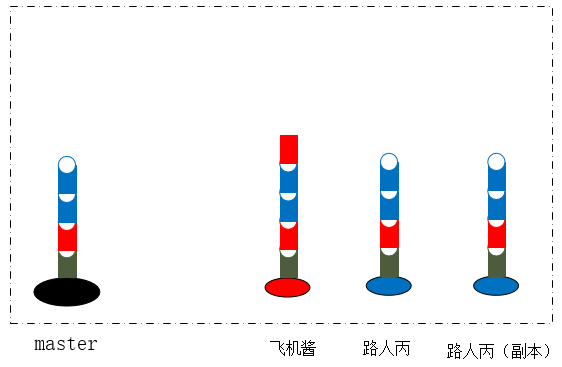<br/></div>

接下来路人丙要在副本上工作，等晚上飞机酱把工作同步了，再把工作迁过去，的确解决了很大的问题。使用git创建副本就是使用分支，路人丙只要按照下面的步骤就可以切换到副本分支工作：

```
// 创建副本分支
git branch copy
// 切换到副本分支
git checkout copy
```

<div align="center">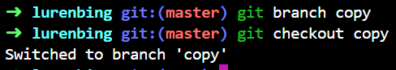<br/></div>

又是忙碌的一天，飞机酱今天因为早到，完成了两节半，路人的发挥很平稳，还是两节。到了晚上，按照约定要先同步飞机酱的工作，但飞机酱觉得半节工作提交上去不太合适，怎么办呢？原来暂存区不仅可以用来存快照，它还有一个区域可以存放未完成的工作，这个区域叫 **stash**。

<div align="center"><br/></div>

这是飞机酱的工作记录，前两节竹子都完工了，所以各自有各自的commit，第三节现在还在工作区，我们要使用 **stash** 把这份工作保存起来：

```
git stash save "第三节竹子还没完工，先存起来"
```

<div align="center"><br/></div>

可以看到，飞机酱的工作区干净了，未完成的工作存起来了，第二天来了取回来就可以接着工作。现在把记录提交，让路人丙拉回来。

```
// 飞机酱的操作
git push origin master:master
// 路人丙的操作
// 先回到master，这是约定好的
git checkout master
git pull
```

这时候飞机酱的工作已经同步到路人丙这边了，但怎么把副本的工作拿过来呢？我们可以继续使用`merge`：

```
// 把copy分支合并到master分支
git merge copy
```

<div align="center">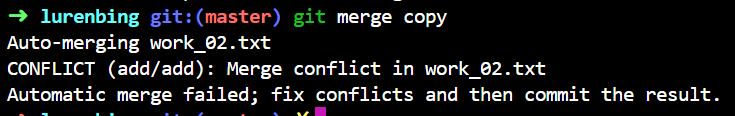<br/></div>

又出现了冲突，看起来路人丙又忘了用专属文件名，没办法只能改改名字再来，不然还是得合并。但是现在切换回copy出现了问题：

<div align="center">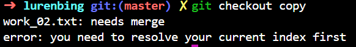<br/></div>

说是merge还没解决呢，你怎么能走呢？经过昨天的折腾，路人丙已经是这方面的高手了，于是他随手敲下了以下命令，就可以成功切换了：

```
// 放弃这次merge
git merge --abort
```

一顿操作后，路人丙又回到了merge状态：

<div align="center">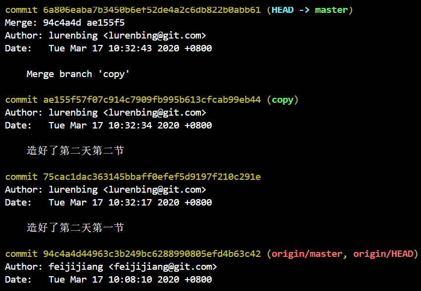<br/></div>

很遗憾，还是会有合并的记录，看来使用merge一定要有两条路了，怎么办，这也不行！

此时，让我们分析一下，为什么没有了冲突，而且先pull再merge，还是会有一个合并的记录？靠想比较麻烦，我们看看模型就知道了，路人丙把飞机酱的竹节安在了自己的竹子上，又在副本新造了两节竹子：

<div align="center"><br/></div>

路人丙期望的是把新造的两节放在上边，但是从副本合并过来时这两根竹子一样高，所以git认为你想放一起，你想有两条路（路人丙：我是这么想的？），反过来想一想，如果没有同步飞机酱的工作过来，这两节竹子是不是就能安在上方了？

<div align="center">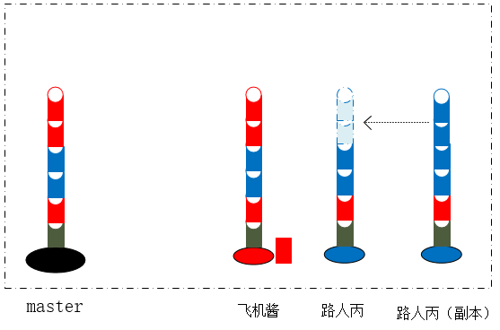<br/></div>

看起来是可行的？让我们用老板的方法，先把飞机酱的工作移除出去：

```
// 飞机酱合并之前的那条commit
git reset --hard a8a79e91f2ac460b7c6608c9afc95fed4e26486a
```

再次merge，果然可行！

<div align="center">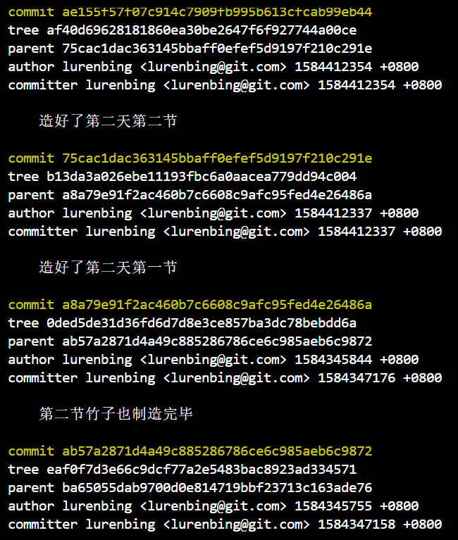<br/></div>

这里我们就不得不提出一个概念，叫作 **Fast Forward** ，也就是快进。我们仔细观察一下路人丙的竹子和他副本的竹子，真的有必要把副本上多出的两节取下来再安在原竹子上吗？安完之后原竹子和副本的竹子一模一样，我直接说副本的竹子就是原竹子，不也一样的效果吗？何必再费力的取一遍呢！git在进行合并时，也是如此。我们从最下方的commit开始进行比对，到了某个commit，两个分支开始出现分歧，就把两条路都走一遍，最后用一个新的commit整合在一起。而如果没有出现分歧，某个分支走到头了，就直接往另一个分支走就可以了。

Fast Forward 确实走的干净利索，但是有个问题正是由它带来的。在出现冲突时，git用一个新的commit整合两个分支，我们就能轻易的回到任何一条路，也就是原样保持了我们的操作记录。但是使用 Fast Forward 后，主分支master和我们自己的分支copy是一样的，现在我们还记得最新的两节竹子是从copy分支拿过来的，再过一段时间就谁都想不起副本分支的存在了，我们的操作记录就此丢失了。此时路人丙辛辛苦苦做的副本竹子被丢弃在一边，再也无人问津，真是闻者伤心呢。

要解决Fast Forward带来的问题却也不难，不用它就好了（真是优秀的解决办法呢），使用git merge时加入 `--no-ff` 就可以禁止它：

```
git merge copy --no-ff
```

这时候git就会强行生成一个新的commit，从而保留我们的操作记录。

好了，言归正传，老板强制要求竹子不能鼓包，看来使用merge是行不通了。merge不行的原因是因为它要从头比对，遇到问题之后就只能快进或者变成两条路。既然我们清楚的知道自己就想要新做的那两节竹子，能不能只把它们复制过来，直接安在上边呢？

<div align="center">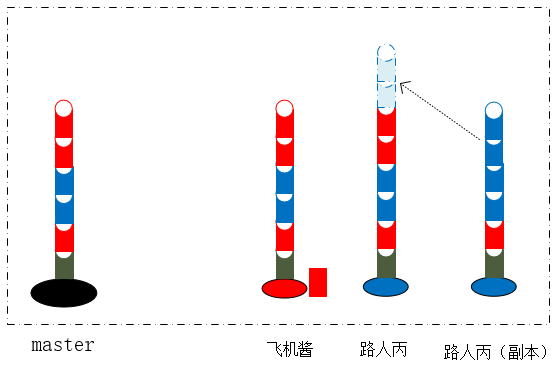<br/></div>

只要想法是合理的，办法就一定有的，`cherry-pick` 就是专门做这样事情的，这个像摘樱桃一样的单词，不管树只要果实，可是相当霸道啊。我们可以依次把这两节竹子摘过来：

```
// log 后边加上分支名，就能看到对应分支的日志，省去切分支的麻烦
git log copy
git cherry-pick 75cac1dac363145bbaff0efef5d9197f210c291e
git cherry-pick ae155f57f07c914c7909fb995b613cfcab99eb44
```

再来看看记录吧：

<div align="center">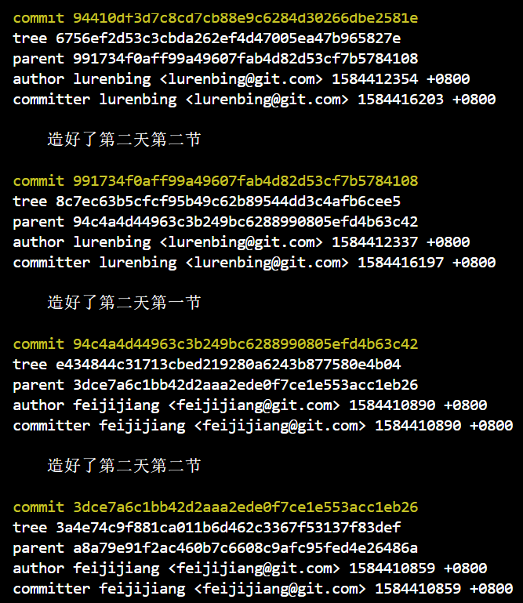<br/></div>

问题解决！等等，好像有奇怪的问题发生了，我明明摘的是 `75cac1...` ，怎么过来之后变成了 `991734...` 了？你想呀，使用merge时，不管有没有 Fast Forward，用的每节竹子还是原来的竹子，只不过把两个竹子合并起来了，并没有发生复制的行为。但是摘取就不一样了，同一节竹节长在两根不同的竹子上，这怎么可能呢？世界上有那么多树叶还不可能有完全相同的呢，所以即使摘过来的竹子和原来长的一样，但也已经不是原来的竹子了。给它贴一个独特的标签来区分，不过分吧？

虽然今天的工作也费了点力气，但是完美解决工作，终于可以早点下班了，把记录同步到公共电脑上，再看看我们的竹子，一个比一个长的好呢：

<div align="center">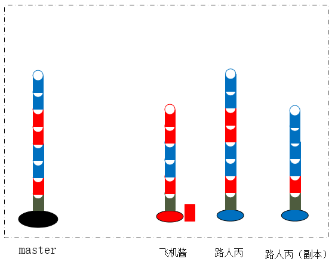<br/></div>

路人丙再次关掉电脑，拿起背包准备回家，但是好学的他又想到一个问题，一次只摘取一节会不会太麻烦了，我能不能一下子就把所有需要的都摘走？（好像有点道理啊）让我们再回到摘取前，这次使用 `git cherry-pick commitId1..commitId2`命令，表示摘取(commitId1, commitId2]之间的全部commit：

```
// commitId太长，但是前6位就能代表它，--abbrev-commit就可以只显示前6位
git log --abbrev-commit copy
// 如果后边这个commit就是最后一个，可以简单的用分支名代替
git cherry-pick a8a79e9..copy
```

看下记录，也可以达到同样的效果，之后如果有非常多的commit，就可以批量摘取了。

---

本文到此就结束了，如果您喜欢我的文章，可以关注我的微信公众号： **大大纸飞机** 

或者扫描下方二维码直接添加：

<div align="center"><br/>扫描二维码关注</div>

您也可以关注我的简书：https://www.jianshu.com/u/9ee83a8ee52d

编程之路，道阻且长。唯，路漫漫其修远兮，吾将上下而求索。