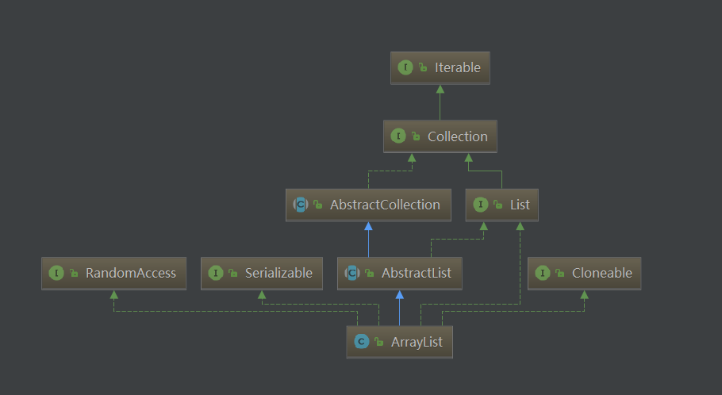

做了这么多准备，终于到了`ArrayList`了，`ArrayList`是我们使用最为频繁的集合类了，我们先看看文档是如何介绍它的：

>Resizable-array implementation of the **List** interface.  Implements all optional list operations, and permits all elements, including ***null***.  In addition to implementing the **List** interface, this class provides methods to manipulate the size of the array that is used internally to store the list.  (This class is roughly equivalent to **Vector**, except that it is unsynchronized.)

可见，`ArrayList`是`Vector`的翻版，只是去除了线程安全。`Vector`因为种种原因不推荐使用了，这里我们就不对其进行分析了。`ArrayList`是一个可以动态调整大小的`List`实现，其数据的顺序与插入顺序始终一致，其余特性与`List`中定义的一致。

# ArrayList继承结构

<div align="center"><br/>ArrayList结构图</div>

可以看到，`ArrayList`是`AbstractList`的子类，同时实现了`List`接口。除此之外，它还实现了三个标识型接口，这几个接口都没有任何方法，仅作为标识表示实现类具备某项功能。`RandomAccess`表示实现类支持快速随机访问，`Cloneable`表示实现类支持克隆，具体表现为重写了`clone`方法，`java.io.Serializable`则表示支持序列化，如果需要对此过程自定义，可以重写`writeObject`与`readObject`方法。

一般面试问到与`ArrayList`相关的问题时，可能会问`ArrayList`的初始大小是多少？很多人在初始化`ArrayList`时，可能都是直接调用无参构造函数，从未关注过此问题。例如，这样获取一个对象：
```
ArrayList<String> strings = new ArrayList<>();
```
我们都知道，`ArrayList`是基于数组的，而数组是定长的。那`ArrayList`为何不需要指定长度，就能使我们既可以插入一条数据，也可以插入一万条数据？回想刚刚文档的第一句话：

> Resizable-array implementation of the List interface. 

`ArrayList`可以动态调整大小，所以我们才可以无感知的插入多条数据，这也说明其必然有一个默认的大小。而要想扩充数组的大小，只能通过复制。这样一来，默认大小以及如何动态调整大小会对使用性能产生非常大的影响。我们举个例子来说明此情形：

比如默认大小为5，我们向`ArrayList`中插入5条数据，并不会涉及到扩容。如果想插入100条数据，就需要将`ArrayList`大小调整到100再进行插入，这就涉及一次数组的复制。如果此时，还想再插入50条数据呢？那就得把大小再调整到150，把原有的100条数据复制过来，再插入新的50条数据。自此之后，我们每向其中插入一条数据，都要涉及一次数据拷贝，且数据量越大，需要拷贝的数据越多，性能也会迅速下降。

其实，`ArrayList`仅仅是对数组操作的封装，里面采取了一定的措施来避免以上的问题，如果我们不利用这些措施，就和直接使用数组没有太大的区别。那我们就看看`ArrayList`用了哪些措施，并且如何使用它们吧。我们先从初始化说起。

# 构造方法与初始化

`ArrayList`一共有三个构造方法，用到了两个成员变量。

```
//这是一个用来标记存储容量的数组，也是存放实际数据的数组。
//当ArrayList扩容时，其capacity就是这个数组应有的长度。
//默认时为空，添加进第一个元素后，就会直接扩展到DEFAULT_CAPACITY，也就是10
//这里和size区别在于，ArrayList扩容并不是需要多少就扩展多少的
transient Object[] elementData;

//这里就是实际存储的数据个数了
private int size;
```

除了以上两个成员变量，我们还需要掌握一个变量，它是
```
protected transient int modCount = 0;
```
这个变量主要作用是防止在进行一些操作时，改变了`ArrayList`的大小，那将使得结果不可预测。

下面我们看看构造函数：

```
//默认构造方法。文档说明其默认大小为10，但正如elementData定义所言，
//只有插入一条数据后才会扩展为10，而实际上默认是空的
 public ArrayList() {
    this.elementData = DEFAULTCAPACITY_EMPTY_ELEMENTDATA;
}

//带初始大小的构造方法，一旦指定了大小，elementData就不再是原来的机制了。
public ArrayList(int initialCapacity) {
    if (initialCapacity > 0) {
        this.elementData = new Object[initialCapacity];
    } else if (initialCapacity == 0) {
        this.elementData = EMPTY_ELEMENTDATA;
    } else {
        throw new IllegalArgumentException("Illegal Capacity: "+
                                               initialCapacity);
    }
}

//从一个其他的Collection中构造一个具有初始化数据的ArrayList。
//这里可以看到size是表示存储数据的数量
//这也展示了Collection这种抽象的魅力，可以在不同的结构间转换
public ArrayList(Collection<? extends E> c) {
    //转换最主要的是toArray()，这在Collection中就定义了
    elementData = c.toArray();
    if ((size = elementData.length) != 0) {
        if (elementData.getClass() != Object[].class)
            elementData = Arrays.copyOf(elementData, size, Object[].class);
    } else {
        // replace with empty array.
        this.elementData = EMPTY_ELEMENTDATA;
    }
}
```

# 重要方法

`ArrayList`已经是一个具体的实现类了，所以在`List`接口中定义的所有方法在此都做了实现。其中有些在`AbstractList`中实现过的方法，在这里再次被重写，我们稍后就可以看到它们的区别。

先看一些简单的方法：

```
//还记得在AbstractList中的实现吗？那是基于Iterator完成的。
//在这里完全没必要先转成Iterator再进行操作
public int indexOf(Object o) {
    if (o == null) {
        for (int i = 0; i < size; i++)
            if (elementData[i]==null)
                return i;
    } else {
        for (int i = 0; i < size; i++)
            if (o.equals(elementData[i]))
                return i;
    }
    return -1;
}

//和indexOf是相同的道理
 public int lastIndexOf(Object o) {
    //...
}

//一样的道理，已经有了所有元素，不需要再利用Iterator来获取元素了
//注意这里返回时把elementData截断为size大小
public Object[] toArray() {
    return Arrays.copyOf(elementData, size);
}

//带类型的转换，看到这里a[size] = null;这个用处真不大，除非你确定所有元素都不为空，
//才可以通过null来判断获取了多少有用数据。
public <T> T[] toArray(T[] a) {
    if (a.length < size)
        // 给定的数据长度不够，复制出一个新的并返回
        return (T[]) Arrays.copyOf(elementData, size, a.getClass());
    System.arraycopy(elementData, 0, a, 0, size);
    if (a.length > size)
        a[size] = null;
    return a;
}
```

数据操作最重要的就是增删改查，改查都不涉及长度的变化，而增删就涉及到动态调整大小的问题，我们先看看改和查是如何实现的：

```
private void rangeCheck(int index) {
    if (index >= size)
        throw new IndexOutOfBoundsException(outOfBoundsMsg(index));
}

//只要获取的数据位置在0-size之间即可
public E get(int index) {
    rangeCheck(index);

    return elementData(index);
}

//改变下对应位置的值
public E set(int index, E element) {
    rangeCheck(index);

    E oldValue = elementData(index);
    elementData[index] = element;
    return oldValue;
}
```

增和删是`ArrayList`最重要的部分，这部分代码需要我们细细研究，我们看看它是如何处理我们例子中的问题的：

```
//在最后添加一个元素
public boolean add(E e) {
    //先确保elementData数组的长度足够
    ensureCapacityInternal(size + 1);  // Increments modCount!!
    elementData[size++] = e;
    return true;
}

public void add(int index, E element) {
    rangeCheckForAdd(index);

    //先确保elementData数组的长度足够
    ensureCapacityInternal(size + 1);  // Increments modCount!!
    //将数据向后移动一位，空出位置之后再插入
    System.arraycopy(elementData, index, elementData, index + 1,
                         size - index);
    elementData[index] = element;
    size++;
}
```

以上两种添加数据的方式都调用到了`ensureCapacityInternal`这个方法，我们看看它是如何完成工作的：

```
//在定义elementData时就提过，插入第一个数据就直接将其扩充至10
private void ensureCapacityInternal(int minCapacity) {
    if (elementData == DEFAULTCAPACITY_EMPTY_ELEMENTDATA) {
        minCapacity = Math.max(DEFAULT_CAPACITY, minCapacity);
    }
    
    //这里把工作又交了出去
    ensureExplicitCapacity(minCapacity);
}

//如果elementData的长度不能满足需求，就需要扩充了
private void ensureExplicitCapacity(int minCapacity) {
    modCount++;

    // overflow-conscious code
    if (minCapacity - elementData.length > 0)
        grow(minCapacity);
}

//扩充
private void grow(int minCapacity) {
    // overflow-conscious code
    int oldCapacity = elementData.length;
    //可以看到这里是1.5倍扩充的
    int newCapacity = oldCapacity + (oldCapacity >> 1);
    
    //扩充完之后，还是没满足，这时候就直接扩充到minCapacity
    if (newCapacity - minCapacity < 0)
        newCapacity = minCapacity;
    //防止溢出
    if (newCapacity - MAX_ARRAY_SIZE > 0)
        newCapacity = hugeCapacity(minCapacity);
    // minCapacity is usually close to size, so this is a win:
    elementData = Arrays.copyOf(elementData, newCapacity);
}
```

至此，我们彻底明白了`ArrayList`的扩容机制了。首先创建一个空数组***elementData***，第一次插入数据时直接扩充至10，然后如果***elementData***的长度不足，就扩充1.5倍，如果扩充完还不够，就使用需要的长度作为***elementData***的长度。

这样的方式显然比我们例子中好一些，但是在遇到大量数据时还是会频繁的拷贝数据。那么如何缓解这种问题呢，`ArrayList`为我们提供了两种可行的方案：

* 使用`ArrayList(int initialCapacity)`这个有参构造，在创建时就声明一个较大的大小，这样解决了频繁拷贝问题，但是需要我们提前预知数据的数量级，也会一直占有较大的内存。

* 除了添加数据时可以自动扩容外，我们还可以在插入前先进行一次扩容。只要提前预知数据的数量级，就可以在需要时直接一次扩充到位，与`ArrayList(int initialCapacity)`相比的好处在于不必一直占有较大内存，同时数据拷贝的次数也大大减少了。这个方法就是**ensureCapacity(int minCapacity)**，其内部就是调用了`ensureCapacityInternal(int minCapacity)`。

其他还有一些比较重要的函数，其实现的原理也大同小异，这里我们不一一分析了，但还是把它们列举出来，以便使用。

```
//将elementData的大小设置为和size一样大，释放所有无用内存
public void trimToSize() {
    //...
}

//删除指定位置的元素
public E remove(int index) {
    //...
}

//根据元素本身删除
public boolean remove(Object o) {
    //...
}

//在末尾添加一些元素
public boolean addAll(Collection<? extends E> c) {
    //...
}

//从指定位置起，添加一些元素
public boolean addAll(int index, Collection<? extends E> c){
    //...
}

//删除指定范围内的元素
protected void removeRange(int fromIndex, int toIndex){
    //...
}

//删除所有包含在c中的元素
public boolean removeAll(Collection<?> c) {
    //...
}

//仅保留所有包含在c中的元素
public boolean retainAll(Collection<?> c) {
    //...
}
```

`ArrayList`还对父级实现的`ListIterator`以及`SubList`进行了优化，主要是使用位置访问元素，我们就不再研究了。

# 其他实现方法

`ArrayList`不仅实现了`List`中定义的所有功能，还实现了`equals`、`hashCode`、`clone`、`writeObject`与`readObject`等方法。这些方法都需要与存储的数据配合，否则结果将是错误的或者克隆得到的数据只是浅拷贝，或者数据本身不支持序列化等，这些我们定义数据时注意到即可。我们主要看下其在序列化时自定义了哪些东西。

```
//这里就能解开我们的迷惑了，elementData被transient修饰，也就是不会参与序列化
//这里我们看到数据是一个个写入的，并且将size也写入了进去
private void writeObject(java.io.ObjectOutputStream s)
    throws java.io.IOException{
    // Write out element count, and any hidden stuff
    int expectedModCount = modCount;
    s.defaultWriteObject();

    // Write out size as capacity for behavioural compatibility with clone()
    s.writeInt(size);

        // Write out all elements in the proper order.
    for (int i=0; i<size; i++) {
        s.writeObject(elementData[i]);
    }

    //modCount的作用在此体现，如果序列化时进行了修改操作，就会抛出异常
    if (modCount != expectedModCount) {
        throw new ConcurrentModificationException();
    }
}
```

`readObject`是一个相反的过程，就是把数据正确的恢复回来，并将`elementData`设置好即可，感兴趣可以自行阅读源码。

# 总结

总体而言，`ArrayList`还是和数组一样，更适合于数据随机访问，而不太适合于大量的插入与删除，如果一定要进行插入操作，要使用以下三种方式：
* 使用`ArrayList(int initialCapacity)`这个有参构造，在创建时就声明一个较大的大小。

* 使用**ensureCapacity(int minCapacity)**，在插入前先扩容。

* 使用**LinkedList**，这个无可厚非哈，我们很快就会介绍这个适合于增删的集合类。

---

本文到此就结束了，如果您喜欢我的文章，可以关注我的微信公众号： **大大纸飞机** 

或者扫描下方二维码直接添加：

<div align="center"><br/>扫描二维码关注</div>

您也可以关注我的简书：https://www.jianshu.com/u/9ee83a8ee52d

编程之路，道阻且长。唯，路漫漫其修远兮，吾将上下而求索。