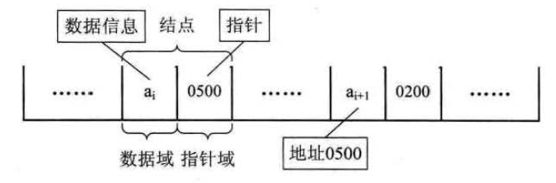

`数组`和`链表`是数据结构中最基本的部分，也是其余众多数据结构的基础。即使在Java中，这两种结构使用的也很普遍。这里我们会先对它们进行简要分析。

# 数组

在java中，数组定义为一种基本类型，其可以通过下标获取到对应位置的数据。那么这种结构的数据，在内存中是怎么存放的呢？

 数组的结构示意图

正如上图所示，数组在内存中是一段连续的存储单元，每个数据依次放在每个单元中。分析这种结构，我们可以得出以下几个结论：

* 创建一个数组，必须声明其长度，以在内存中寻找合适的一段连续存储单元。这也意味着数组的大小是固定的，我们无法动态调整其大小。
    
* 想要获取数组中第i个元素，其时间复杂度是 **O(1)**，因为可以根据其地址直接找到它。同理修改也是。

* 数组对查询表现一般，要想查找一个元素，需要遍历，时间复杂度为**O(n)**。

* 因为地址连续，想要在数组中插入一个元素是复杂的，因为从插入位置起，后边的所有元素都需要向后移动一位。同理删除也是，只是移动方向为向前。并且，当数组存满时，就无法继续插入了。

* 因为数组要占据一整块内存，有可能产生许多的碎片，也可能因为找不到合适的内存块，而导致存储失败。

总结起来就是：数组大小固定，查找迅速，增删复杂，需要完整的内存块，容易产生碎片。

# 链表

链表是一种离散存储结构，其在内存中存储不是连续的，每个数据元素都通过一个指针指向其下一个元素的地址。根据指针域的不同，链表又分为单链表、双向链表、循环链表等，这里我们只分析单链表。示意图如下所示：

 链表的结构示意图

分析这种结构，我们可以得出以下几个结论：
    
* 声明一个链表时，不需要知道其长度，也不需要连续的内存块，所以其大小可以动态调整。

* 链表的每个元素都分为数据域和指针域，前者是实际存储的数据，后者则指向下一个元素的地址。和数组相比，每个元素需要占用的内存更大了。

* 要获取链表的第 **i** 个元素变得复杂，因为其地址存放在它上一个元素的指针域里，所以只能从第一个元素起，进行 **i** 次操作。同理修改也是。

* 链表对查询表现也一般，需要遍历，时间复杂度为**O(n)**。

* 增加与删除一个元素更方便了，因为没有对内存地址的限制，我们只需要在对应节点合理处理下指针域的值，就可以把一个元素插入链表或者从链表删除。

* 链表对内存的要求很小，只要能够存储下一个数据元素的内存块都可以使用，因此不会造成碎片化。

总结起来就是：大小可以动态调整，增删迅速，查找较慢，数据元素所占内存略多，不需要整块内存块，不会造成碎片化。

# 数组与链表的选择
通过以上分析，`数组`和`链表`对我们影响最大的几点区别在于：
* 数组按位置查找迅速，链表增删方便
* 数组是固定大小，链表可以随时扩充与缩减
* 链表每个元素占据内存略多于数组
* 数组和链表在查询方面表现都比较一般，耗时较长

在数据量很小，内容基本固定时，我们选择何种数据结构的影响并不大。但当数据量较大时，如果我们需要对数据进行频繁的插入删除，我们应该选择链表，如果我们需要频繁的获取某个位置的元素，我们应该选择数组。数组与链表并没有明确的优劣之分，根据不同的使用场景进行不同的选择，才是这两种结构使用的最佳方式。

本文到此就结束了，如果您喜欢我的文章，可以关注我的微信公众号： **大大纸飞机** 

或者扫描下方二维码直接添加：

 扫描二维码关注

您也可以关注我的简书：https://www.jianshu.com/u/9ee83a8ee52d

编程之路，道阻且长。唯，路漫漫其修远兮，吾将上下而求索。