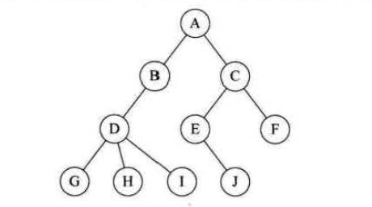
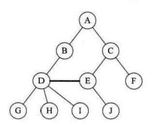
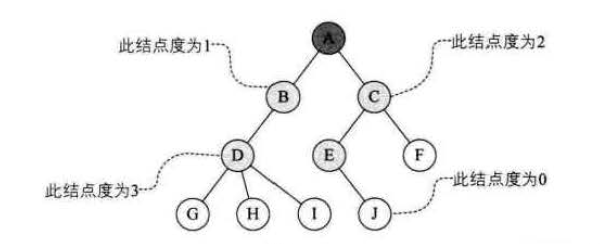
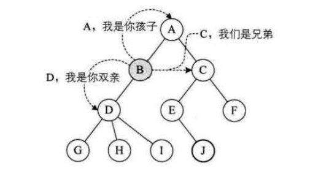
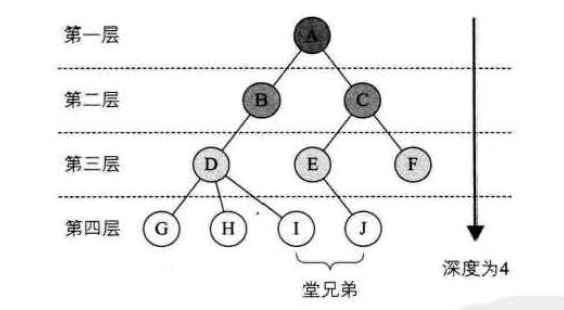
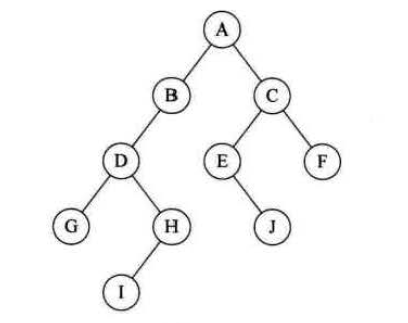
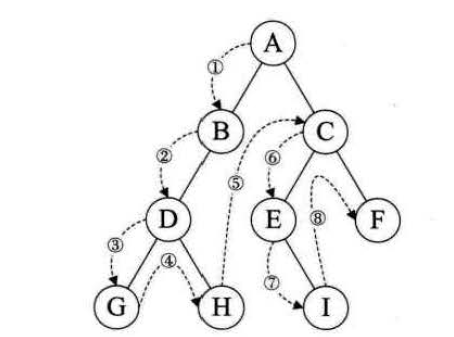
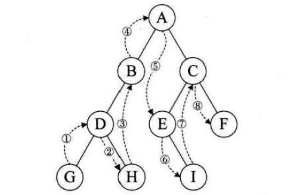
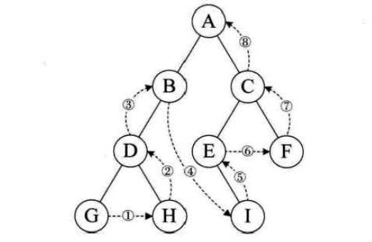

数组和链表都是用来解决一对一问题的，而一对多问题则需要树来解决。这里，我们重点关注二叉排序树，所以只会介绍一些必需了解的概念，关于树的更多知识，大家可以查看相关书籍进行系统的学习。

# 树的定义

**树(Tree)**是n(n≥0) 个结点的有限集。n=0 时称为**空树**。在任意一棵非空树中: 
    1. 有且仅有一个特定的称为**根(Root)**的结点；
    2. 当n>1 时，其余结点可分为m (m>0) 个互不相交的有限集T1 、T2、……、Tm，其中每一个集合本身又是一棵树，并且称为根的**子树(SubTree)**。

下图就是一棵树：

 树示意图

与现实中的树不同，数据结构里的树的根在最上方，并且只有一个根，就像一棵倒置的树。树的每个结点往下都是一棵子树，且这些子树不能相交，如下所示就不是一棵正确的树：

 树的错误示例

# 相关概念

## 结点分类

树的结点包含一个数据元素及若干指向其子树的分支。结点拥有的子树数称为结点的**度(Degree)** 。度为0的结点称为**叶结点(Leaf)** 或**终端结点**；度不为0 的结点称为**非终端结点**或**分支结点**。除根结点之外，分支结点也称为**内部结点**。树的度是树内各结点的度的最大值。

如下图所示，A结点为根节点，G、H、I、J、F为叶节点，其余节点则为内部节点，此树的度为3。

 度

## 结点间关系

结点的子树的根称为该结点的**孩子(Child)**，相应地，该结点称为孩子的**双亲(Parent)**。同一个双亲的孩子之间互称**兄弟(Sibling)**。结点的**祖先**是从根到该结点所经分支上的所有结点。反之，以某结点为根的子树中的任一结点都称为该结点的**子孙**。

 关系示意图

## 深度

结点的**层次(LeveI)**从根开始定义起，根为第一层，根的孩子为第二层。若某结点在第L层，则其子树的根就在第L+1 层。其双亲在同一层的结点互为堂兄弟。树中结点的最大层次称为树的**深度(Depth)**或**高度** 。

 深度示意图

## 有序树，无序树

如果将树中结点的各子树看成从左至右是有次序的，不能互换的，则称该树为有序树，否则称为无序树。

# 二叉树

**二叉树(Binary Tree)**是n(n ≥ 0) 个结点的有限集合，该集合或者为空集(称为**空二叉树**)，或者由一个根结点和两棵互不相交的、分别称为根结点的**左子树**和**右子树**的二叉树组成。

下图就是一个二叉树，二叉树就是每个结点的度≤2的树。

 二叉树示意图

二叉树有许多有用的性质，还有一些详细的分类，相关知识大家可以自行查阅资料。

# 二叉树遍历

二叉树的**遍历(traversing binary tree)**是指从根结点出发，按照某种次序依次访问二叉树中所有结点，使得每个结点被访问一次旦仅被访问一次。

## 前序遍历

规则是若二叉树为空，则空操作返回，否则先访问根结点，然后前序遍历左子树， 再前序遍历右子树。

如下图所示，遍历结果为：ABDGHCEIF。

 前序遍历

## 中序遍历

规则是若树为空，则空操作返回，否则从根结点开始(注意并不是先访问根结点) ，中序遍历根结点的左子树，然后是访问根结点，最后中序遍历右子树。

如下图所示，遍历结果为：GDHBAEICF。

 中序遍历

## 后序遍历

规则是若树为空，则空操作返回，否则从左到右先叶子后结点的方式遍历访问左右子树，最后是访问根结点。

如下图所示，遍历结果为：GHDBIEFCA。

 后序遍历

---

本文到此就结束了，如果您喜欢我的文章，可以关注我的微信公众号： **大大纸飞机** 

或者扫描下方二维码直接添加：

 扫描二维码关注

您也可以关注我的简书：https://www.jianshu.com/u/9ee83a8ee52d

编程之路，道阻且长。唯，路漫漫其修远兮，吾将上下而求索。