二叉排序树很好的平衡了插入与查找的效率，但不平衡的二叉排序树效率大打折扣。今天介绍的AVL树就是一种解决此问题的方案。

# 定义

**平衡二叉树(Self-Balancing Binary Search Tree 或Height-Balanced Binary Search Tree)**，是一种二叉排序树，其中每一个节点的左子树和右子树的高度差至多等于1 。它是一种高度平衡的二叉排序树。意思是说，要么它是一棵空树，要么它的左子树和右子树都是平衡二叉树，且左子树和右子树的深度之差的绝对值不超过1 。我们将二叉树上结点的左子树深度减去右子树深度的值称为**平衡因子BF (Balance Factor)**，那么平衡二叉树上所有结点的平衡因子只可能是-1 、0 和1。

如下图就不是一棵AVL树，因为结点18的左子树高度为2，右子树高度为0，高度差大于1。

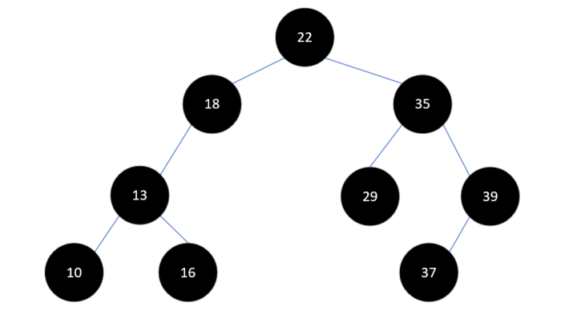 不平衡

但通过一定的步骤调整之后，可以将其转为一棵平衡二叉树，如下图：

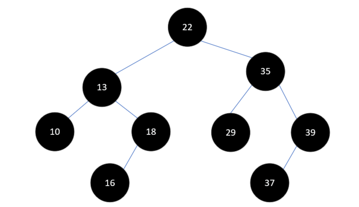 平衡二叉树

# 实现原理

平衡二叉树构建的基本思想就是在构建二叉排序树的过程中，每当插入一个结点时，先检查是否因插入而破坏了树的平衡性，若是，则找出**最小不平衡子树**。在保持二叉排序树特性的前提下，调整最小不平衡子树中各结点之间的链接关系，进行相应的旋转，使之成为新的平衡子树。**最小不平衡子树**是指距离插入结点最近的，且平衡因子的绝对值大于1 的结点为根的子树。

下面通过一个实例，了解平衡二叉树的构建过程。

假如我们要将数组`int[] a = {3, 2, 1, 4, 5, 6, 7, 10, 9, 8}`构建成一棵二叉排序树，如果直接按照二叉排序树的定义，会得到下面的结果：

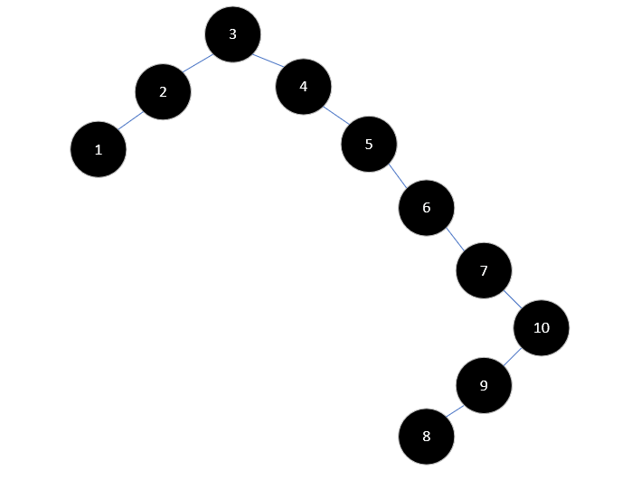 二叉排序树

这样的结果对查找是十分不利的，树的高度达到了8，而且大多数只有一个孩子。所以我们需要一些操作，将它变成一棵AVL树。

首先，插入元素3和2时，没有什么影响，此时3的平衡因子为1，2的平衡因子为0，结果如下：

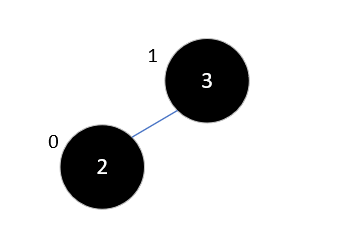 插入3和2

现在，要把1插入树中，这时结果如下所示：

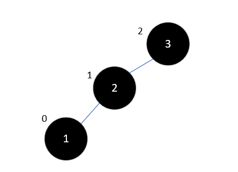 插入1

此时3的平衡因子为2了，不再符合平衡二叉树的规则。此时，整棵树就是最小不平衡子树，我们将其右旋：

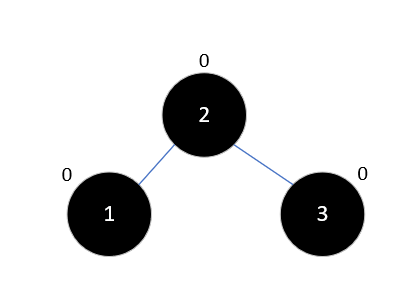 右旋

再插入4，也不会影响平衡，结果如下：

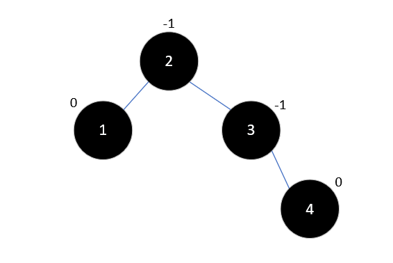 插入4

此时，插入元素5，以3为根结点的子树成为了最小不平衡子树，如下所示：

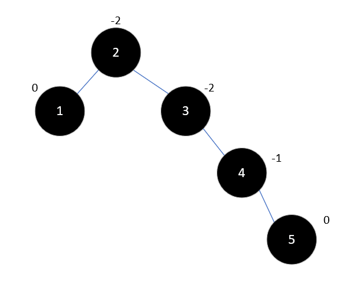 插入5

现在要对其进行左旋：

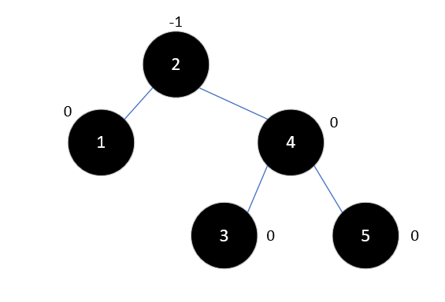 左旋

现在继续插入元素6，此时以2为根结点的右子树为最小不平衡子树，结果如下：

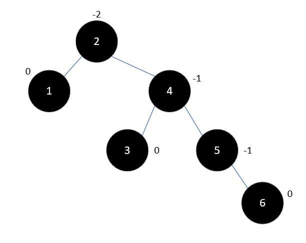 插入6

这时再次需要对其进行左旋，这次旋转后要将4的左孩子变为2的右孩子，以满足二叉排序树的定义，如下所示：

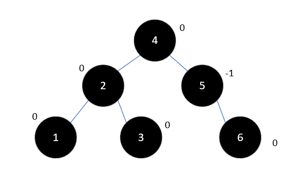 左旋

再插入7时，情况和之前有些类似了，结果如下：

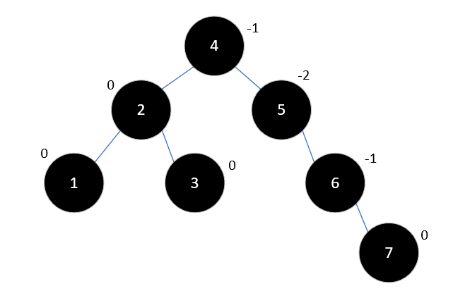 插入7

左旋后结果如下：

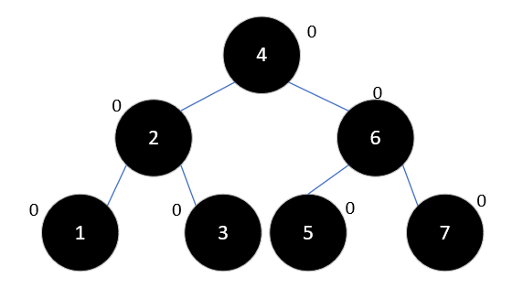 左旋

现在，继续插入10，此时无需调整，结果如下：

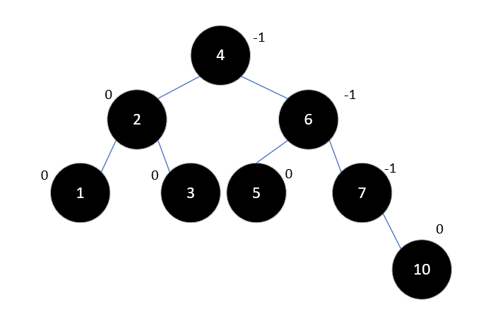 插入10

下一步，插入元素9，此时结果如下：

 插入9

按照之前的经验，这时我们应该进行左旋了，但是左旋之后9将变为10的右孩子，这会不符合二叉排序树的定义。和之前不同的是，7和10的平衡因子符号相反，这是造成这一结果的原因。这种情况下，要先以10为根节点右旋，再进行左旋，结果如下所示：

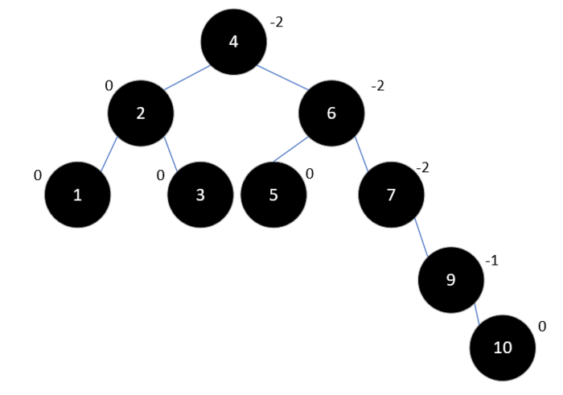 右旋

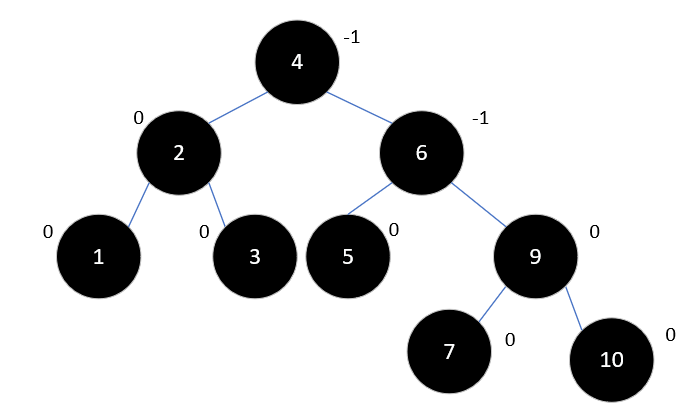 左旋

最后插入元素8，如下所示：

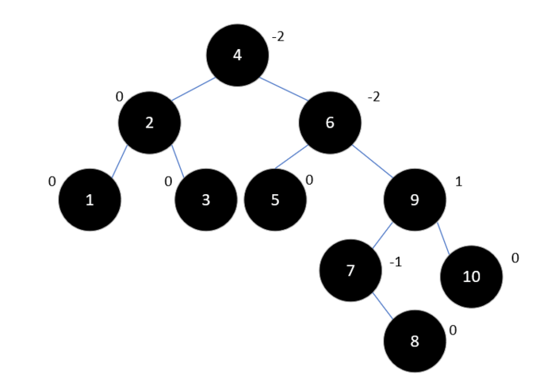 插入8

此时情况和上述类似，6是最小不平衡子树的根结点，9和6的平衡因子符号相反，所以先以9为根结点右旋：

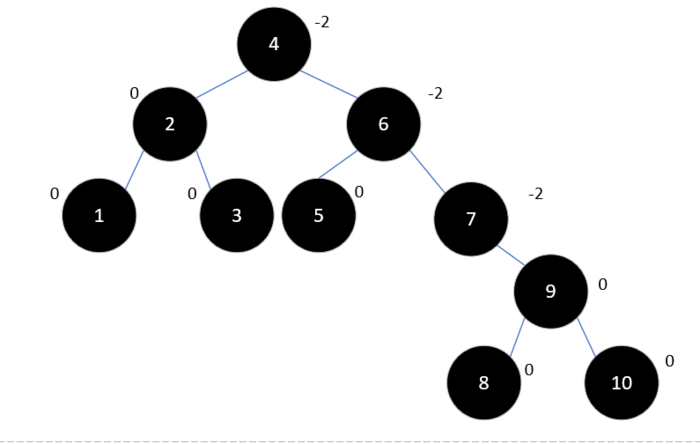 右旋

然后再以6左旋：

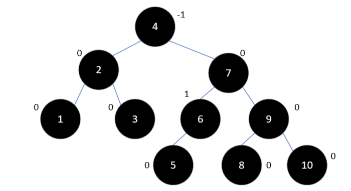 左旋

可以看到，此树的高度仅为4，与之前的8相差很多，性能自然也好很多。

平衡二叉树的删除操作与插入类似，这里将不再介绍。大家可以自己思考如何最高效地删除元素，可以分叶结点、仅有一个子结点和有两个子结点三种情况考虑，这里还用到了递归的思想。

接下来我们将介绍另一种实现方式，红黑树。

---

本文到此就结束了，如果您喜欢我的文章，可以关注我的微信公众号： **大大纸飞机** 

或者扫描下方二维码直接添加：

 扫描二维码关注

您也可以关注我的简书：https://www.jianshu.com/u/9ee83a8ee52d

编程之路，道阻且长。唯，路漫漫其修远兮，吾将上下而求索。