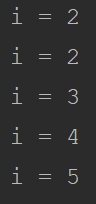

多年来，并发就像是阻在程序员面前的一座大山，令无数人“闻之色变”。我们或者不知道何为并发，或者不知道为何需要并发，即使知道了也不一定能写出一个安全的并发程序。如果写的并发程序出了问题，我们也不知道问题出在哪里，连为什么会出现问题都要考虑好一阵子。它就是这么“可恶”，但却谁都没有办法摆脱。

多线程的出现，有很深的历史背景。可以说多线程是计算机硬件、操作系统以及CPU多核化发展的必然产物。在改进人机交互体验方面，多线程也有着无与伦比的优势。

# 计算机硬件发展

多年来，计算机的发展一直与摩尔定律十分吻合，这一定律表明：集成电路上可容纳的晶体管数目，约每隔两年便会增加一倍。以下介绍来源维基百科：

> 摩尔定律（英语：Moore's law）是由英特尔（Intel）创始人之一戈登·摩尔提出的。其内容为：集成电路上可容纳的晶体管数目，约每隔两年便会增加一倍；经常被引用的“18个月”，是由英特尔首席执行官大卫·豪斯（David House）提出：预计18个月会将芯片的性能提高一倍（即更多的晶体管使其更快）。
>
> 半导体行业大致按照摩尔定律发展了半个多世纪，对二十世纪后半叶的世界经济增长做出了贡献，并驱动了一系列科技创新、社会改革、生产效率的提高和经济增长。个人计算机、因特网、智能手机等技术改善和创新都离不开摩尔定律的延续。

计算机的摩尔定律我们每个人都切身体会过，从这短短十多年智能手机的发展就能窥得一二。然而，计算机并不能如摩尔定律所述的那样，无限制的发展下去。

再厉害的芯片，再多的晶体管，最终都不得不受限于物理结构的极限。CPU的时钟频率不能无限制的提高，内存的读写速度也不会无限制的增加，当这一切用尽，想要提升计算机的能力，就只好另寻他法了。

有一个定论应当显而易见：越大的东西会越显笨重。计算机的组成部分也逃不开这个定论。所以从寄存器到一级缓存、二级缓存，再到内存，再到磁盘，虽然存储量越来越大，但是速度却越来越慢了，不过价格也低了许多。

寄存器位于CPU内部，是最快的存储组件，CPU访问寄存器时可以即读即取，然而寄存器只有几百字节大小，主要用来存储指令和程序计数器。

寄存器之后，是高速缓存，通常有一级缓存和二级缓存，现在许多PC上都有了三级缓存。一级缓存比寄存器慢3-10倍，二级缓存又比一级缓存慢5-10倍，三级缓存就更慢了，但是容量会更大一些。

而内存，我们都十分熟悉的，要比缓存慢5-10倍，这样就和CPU速度相差了百倍以上。

那磁盘呢？我们通常说IO是性能的瓶颈是有道理的，传统的机械硬盘速度比内存相差百倍有余，即使是新的SSD硬盘也没有显著减小这一差距。所以当CPU读取磁盘时，本可以一个指令完成的操作，要等待一万倍的时间之后才能完成。

而等待中如果CPU什么都不做，就白白浪费了大量的时间，这个问题直到操作系统出现才得以解决。

# 操作系统的发展

计算机发展早期是没有现在的桌面系统的，例如在Windows中通过 cmd 打开的命令行，要执行任何指令都必须等待上一条指令完成。如果进行一次IO耗时操作，CPU只能“空转”许久。

操作系统的出现也不是一蹴而就的，它经历了批处理系统、多道程序系统、分时系统和实时系统等多个阶段。这部分历史可以在许多讲述计算机系统的书籍中看到，但不是我们关注的重点。我们主要关注计算机可以同时（“伪”）处理多个程序，并且每个程序都在独立的进程中，互相独立。

虽然CPU依然只能按序执行指令，但它具备无与伦比的速度，使得它可以在各进程间迅速切换，给人造成同时执行的错觉。

CPU的速度早就一骑绝尘，内存和硬盘却依然在负重前行，此时此刻进一步提高CPU的运行速度显然毫无意义，于是CPU向多核心化发展。

# CPU的多核化

即使依靠CPU的高速切换实现了“伪并行”，计算机的能力也远没有到达极限。CPU在进程间切换并不能瞬间完成，所以切换本身也是一种对性能的消耗。给CPU增加多个核心，可以减小切换的影响。

如果计算机有两颗CPU，或者同一颗CPU有两个核心，计算机就可以真正同时执行两条指令，也就可以使两个程序真正并行执行，计算机的性能也就翻了一倍。

现在只剩下一个问题，虽然增加CPU核心数可以同时运行多个进程，但是每个进程还是只能在一个CPU调度下执行。假如在一个网页中同时加载文字和多张图片，那么直到所有的文字和图片全部下载完毕后，用户才能看到网页，这个过程随着图片的增多也会变得格外漫长，很可能大部分用户会直接关闭网页，这种体验可能是任何人都不想看到的。

# 线程的出现

经历了以上种种问题，我们的线程终于派上用场了。要在一个进程中还拥有同时做多件事的体验，就要让CPU处理进程的能力渗透进来，但是在进程间操作和在进程内部有质的区别。

每一个进程都是一个独立的空间，它拥有自己的堆栈，自己的方法区等等，进程之间除了争夺CPU时间片之外再无交集，甚至一个进程挂了也不影响其他进程执行。但是在进程内部，所有的区域都是公共的，如果要同时访问一个内存单元，很可能造成数据混乱，这也是书写多线程程序较为复杂的原因之一。

最后我们还是用一个经典案例，来说明进行多线程开发时面临的问题。

考虑统计一个网页被用户打开的次数，每有一个用户访问，计数器加一。这个问题可以抽象成多个线程对一个数字进行自增的操作，以下是一个可能的结果：

 多线程操作数据混乱

出现以上问题的原因是 i++ 是一个组合操作，实际完成的过程是先取得 i 的值，给它加 1，然后把新的值写回 i 。如果两个线程一起执行，有可能它们会取到相同的值，然后又一起写入，所以就出现了上图的情况。

# 总结

现在，我们已经知道为何需要多线程，就不会在处理多线程时带着“它怎么搞的这么复杂”的负面情绪。我们知道它解决了多么复杂的事情，也就有了足够的动力去研究如何实现它。

好在，多线程的技术有了长足的发展，在JDK中也有了一整套完备的方案，使我们能够轻松的应对大部分场景。但要学会如何使用它，就要先了解它是什么，它做了哪些事情，使用时需要注意哪些问题。而了解何为多线程，就是这一切的开始。

---

本文到此就结束了，如果您喜欢我的文章，可以关注我的微信公众号： **大大纸飞机** 

或者扫描下方二维码直接添加：

 扫描二维码关注

您也可以关注我的简书：https://www.jianshu.com/u/9ee83a8ee52d

编程之路，道阻且长。唯，路漫漫其修远兮，吾将上下而求索。