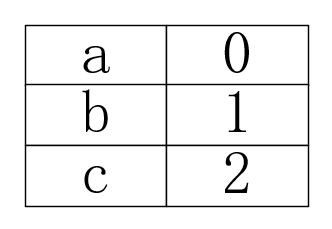
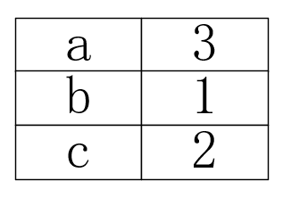
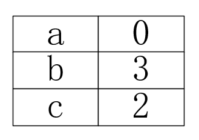
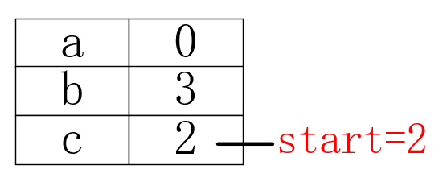

# 无重复字符的最长子串

> 题目：无重复字符的最长子串

> 描述：给定一个字符串，请你找出其中不含有重复字符的最长子串的长度。

> 示例：
* 输入: "abcabcbb"
* 输出: 3
* 解释: 因为无重复字符的最长子串是 "abc"，所以其长度为 3。

# 解析

有了题目001的经验，我们应该不会再使用暴力搜索方式来解此题。若使用暴力搜索，要得到所有的子字符串，需要双重for循环，时间复杂度为O(n<sup>2</sup>)，得到的每个字符串还需要判断它是否包含重复字符，这一操作也需要O(n)的耗时，从而使得总时间复杂度达到O(n<sup>3</sup>)。这是无法接受的，所以我们应该寻求更好的解题方式。

此题有一个特定条件：无重复字符。如果使用哈希表来存储每个字符，我们就可以在构建子串时得知它是否包含重复字符。下面，我们以示例中的输入"abcabcbb"为例，来说明哈希表是如何在此问题中发挥作用的。

首先，我们建一个空的哈希表，key值是每个字符，value是字符的下标。每当遇到一个哈希表中不存在的字符，我们就把它存入表中，所以我们可以依次存入'a'->'b'->'c'三个字符，哈希表中的数据如下图：

<div align="center"><br/>存储a、b、c</div>

当我们要存入第四个字符时，哈希表中已经存在了该字符 'a'，也就是说"abca"这个子串中包含了重复字符。现在，我们可以确定，以第一个字符 'a' 为起点的最长无重复字符子串就是"abc"，且它的长度是 ( 字符 'b' 的下标 - 字符 'a' 的下标 + 1)，这个值和哈希表的value正好对应。但是以第二个字符 'b' 为起点的子串有可能比"bca"更长，我们还需要看下一个字符是否重复，为了保证哈希表中的value值和子串中字符的下标值一致，我们需要把 'a' 的value更新成 3，也就是后一个 'a' 的下标。如下所示：

<div align="center"><br/>更新a</div>

下一个字符是 'b'，和上一步情况一致，我们确认了以第二个字符 'b' 为起点的最长无重复字符子串是"bca"，且它的长度是 ( 字符 'a' 的下标 - 字符 'b' 的下标 + 1)，但是以第三个字符 'c' 为起点的子串有可能比"cab"更长。重复这个过程，我们就可以找到以每个字符为起点的最长无重复字符子串。

除了示例的情况，我们还要考虑第二种情况，比如把输入换成"abcbcad"，一开始的结构是一致的，依然是依次存入'a'->'b'->'c'三个字符。当我们要存入第四个字符时，哈希表中已经存在了该字符'b'，但是 'b' 却是处于中间的字符，这样一来以第一个字符 'a' 为起点的最长无重复字符子串是"abc"，以第二个字符 'b' 为起点的最长无重复字符子串是"bc"。而以第三个字符 'c' 为起点的子串，在当前只包含 'c' 和 'b' 两个字符，也就是说字符 'a' 是多余的，如下所示：

<div align="center"><br/>多余的a</div>

可以考虑把 'a' 从表中删除，但更优雅的方式是使用标记，因为无用字符一定在当前被当做起点的字符之前，所以只要标记好这个字符的位置，就可以忽略无用字符的存在，如下所示：

<div align="center"><br/>标记起点</div>

之所以不选择删除字符，是因为无法确定后续是否还会再次出现这个字符，例如本例中字符 'a' 就会在第6位再次出现，这样我们之前的删除操作就毫无意义了。

上述过程，我们只需要对字符串进行一次遍历就能得到结果，时间复杂度仅为O(n)，这比暴力搜索好得多。参考代码如下：

```java
public int lengthOfLongestSubstring(String s){
    Map<Character,Integer> map = new HashMap<>();
    int maxLen = 0;
    int startIndex = 0;
    int tempMaxLen = 0;
    for (int i = 0, len = s.length(); i < len; i++) {
        if (map.containsKey(s.charAt(i)) && map.get(s.charAt(i)) >= startIndex) {
            startIndex = map.get(s.charAt(i)) + 1;
        }

        map.put(s.charAt(i), i);
        tempMaxLen = i - startIndex + 1;
        maxLen = maxLen < tempMaxLen ? tempMaxLen : maxLen;
    }
    return maxLen;
}
```

# 总结

以上思路也被称作**滑动窗口法**，这个比喻还挺形象，希望大家能记住这个思路，当遇到此类问题时能够多往这方面想一想，极大可能想到比暴力搜索好得多的算法。

# 下题预告

> 题目：寻找两个有序数组的中位数

> 描述：给定两个大小为 m 和 n 的有序数组 nums1 和 nums2。请你找出这两个有序数组的中位数，并且要求算法的时间复杂度为 O(log(m + n))。你可以假设 nums1 和 nums2 不会同时为空。

> 示例 1：
* nums1 = [1, 3]
* nums2 = [2]
* 则中位数是 2.0

> 示例 2：
* nums1 = [1, 2]
* nums2 = [3, 4]
* 则中位数是 (2 + 3)/2 = 2.5

**相关源码请在code目录查看。**

---

本文到此就结束了，如果您喜欢我的文章，可以关注我的微信公众号： **大大纸飞机** 

或者扫描下方二维码直接添加：

<div align="center"><br/>扫描二维码关注</div>

您也可以关注我的简书：https://www.jianshu.com/u/9ee83a8ee52d

编程之路，道阻且长。唯，路漫漫其修远兮，吾将上下而求索。