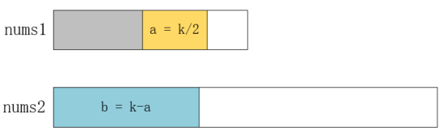

# 寻找两个有序数组的中位数

> 题目：寻找两个有序数组的中位数

> 描述：给定两个大小为 m 和 n 的有序数组 nums1 和 nums2。请你找出这两个有序数组的中位数，并且要求算法的时间复杂度为 O(log(m + n))。你可以假设 nums1 和 nums2 不会同时为空。

> 示例 1：
* nums1 = [1, 3]
* nums2 = [2]
* 则中位数是 2.0

> 示例 2：
* nums1 = [1, 2]
* nums2 = [3, 4]
* 则中位数是 (2 + 3)/2 = 2.5

# 解析

看到题目之后，第一感觉这不就是归并排序吗？所以可以很快写出以下代码：

```java
public double findMedianSortedArrays(int[] nums1, int[] nums2) {
    if(nums1 == null || nums1.length == 0){
        return findMedianSortedArrays(nums2);
    }
    if(nums2 == null || nums2.length == 0){
        return findMedianSortedArrays(nums1);
    }

    int[] nums = new int[nums1.length+nums2.length];
    int index1 = 0;
    int index2 = 0;
    int index = 0;
    while (index1<nums1.length && index2<nums2.length) {
        if(nums1[index1]<nums2[index2]){
            nums[index++] = nums1[index1++];
        }else{
            nums[index++] = nums2[index2++];
        }
    }

    while(index1<nums1.length){
        nums[index++] = nums1[index1++];
    }

    while(index2<nums2.length){
        nums[index++] = nums2[index2++];
    }

    return findMedianSortedArrays(nums);
}

private double findMedianSortedArrays(int[] nums){
    int len = nums.length;
    if(len%2==1){
        return nums[len/2];
    }else{
        return (nums[len/2-1]+nums[len/2])/2.0;
    }
}
```

然而，归并排序的这个过程需要O(max(m, n))的时间复杂度，这和题目的要求不符。要想达到O(log(m + n))级别的时间复杂度，必须使用一种和折半查找类似的方式。使用归并排序的方式会把两个数组合并成一个有序数组，再寻找它的中间值，有没有可能不排序就找到这个值呢？

我们假设两个数组的中间值位置为k，其中 k=(m+n)/2，只要找到这个值，也就找到了中位数，所以我们可以把问题转换成查找两个数组中第 k 大的数。

为了更快的获取到结果，我们对较短的数组使用二分法，利用第 k 大的数前面一定有 k-1 个数这个属性，确定较长的数组应该划分的位置，如下所示：

<div align="center"><br/>二分法</div>

因为第 k 大的值一定比第 a 大的值大，也一定比第 b 大的值大，所以我们可以将 a 和 b 中较小者之前的值全部抛弃，从而将求 m+n 个数中第 k 大的值，转换成求 m+n-a(或 m+n-b)个数中第 k-a(或 k-b) 大的值。例如 a 处的值比 b 处的值小，我们便将 a 之前的值全部抛弃，再进行下一次比较，如下所示：

<div align="center"><br/>递归</div>

寻找第 k 大的值的过程代码如下：

```java
/**
 * 获取第 k 大的值
 * 
 * @param nums1
 * @param nums2
 * @param len1 数组 1 使用的长度
 * @param len2 数组 2 使用的长度
 * @param start1 数组 1 有效的起点
 * @param start2 数组 2 有效的起点
 * @return 第 k 大的值
 */
private static int findMedianSortedArraysOptimize(int[] nums1, int[] nums2, int len1, int len2, int start1, int start2, int k){
    if(len1 > len2){
        return findMedianSortedArraysOptimize(nums2, nums1, len2, len1, start2, start1, k);
    }
    if(len1 == 0){
        return nums2[start2 + k - 1];
    }

    if(k == 1){
        return Math.min(nums1[start1], nums2[start2]);
    }

    int ignore1 = Math.min(k/2, len1);
    int ignore2 = k - ignore1;
    if(nums1[start1 + ignore1 - 1] < nums2[start2 + ignore2 - 1]){
        // 抛弃数组 1 比较位之前的值
        return findMedianSortedArraysOptimize(nums1, nums2, len1-ignore1, len2, start1+ignore1, start2, k-ignore1);
    }else if(nums1[start1 + ignore1 - 1] > nums2[start2 + ignore2 - 1]){
        // 抛弃数组 2 比较位之前的值
        return findMedianSortedArraysOptimize(nums1, nums2, len1, len2-ignore2,  start1, start2+ignore2, k-ignore2);
    }else{
        // 寻找到了第 k 大的值
        return nums1[start1+ignore1-1];
    }
}
```

找到了第 k 大的值，再寻找中位数就很简单了，调用的代码如下：

```java
public double findMedianSortedArraysOptimize(int[] nums1, int[] nums2) {
    int len1 = nums1.length;
    int len2 = nums2.length;
    int k = (len1+len2)/2;
    if((len1+len2)%2 == 1){
        return findMedianSortedArraysOptimize(nums1, nums2, len1, len2, 0, 0, k+1);
    }else{
        return (findMedianSortedArraysOptimize(nums1, nums2, len1, len2, 0, 0, k) + findMedianSortedArraysOptimize(nums1, nums2, len1, len2, 0, 0, k+1))/2.0;
    }
}
```

# 总结

此题目告诉我们同一个问题可以有许多个解决方案，有时将问题转换成其他问题更有利于解决它。

# 下题预告

> 题目：最长回文子串

> 描述：给定一个字符串 s，找到 s 中最长的回文子串。你可以假设 s 的最大长度为 1000。

> 示例：
* 输入: "babad"
* 输出: "bab"
* 注意: "aba" 也是一个有效答案。

**相关源码请在code目录查看。**

---

本文到此就结束了，如果您喜欢我的文章，可以关注我的微信公众号： **大大纸飞机** 

或者扫描下方二维码直接添加：

<div align="center"><br/>扫描二维码关注</div>

您也可以关注我的简书：https://www.jianshu.com/u/9ee83a8ee52d

编程之路，道阻且长。唯，路漫漫其修远兮，吾将上下而求索。