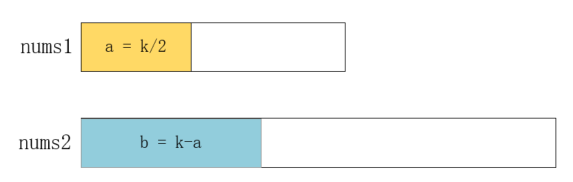

# 寻找两个有序数组的中位数

> 题目：寻找两个有序数组的中位数

> 描述：给定两个大小为 m 和 n 的有序数组 nums1 和 nums2。请你找出这两个有序数组的中位数，并且要求算法的时间复杂度为 O(log(m + n))。你可以假设 nums1 和 nums2 不会同时为空。

> 示例 1：
* nums1 = [1, 3]
* nums2 = [2]
* 则中位数是 2.0

> 示例 2：
* nums1 = [1, 2]
* nums2 = [3, 4]
* 则中位数是 (2 + 3)/2 = 2.5

# 解析

看到题目之后，第一感觉这不就是归并排序吗？所以可以很快写出以下代码：

```java
public double findMedianSortedArrays(int[] nums1, int[] nums2) {
    if(nums1 == null || nums1.length == 0){
        return findMedianSortedArrays(nums2);
    }
    if(nums2 == null || nums2.length == 0){
        return findMedianSortedArrays(nums1);
    }

    int[] nums = new int[nums1.length+nums2.length];
    int index1 = 0;
    int index2 = 0;
    int index = 0;
    while (index1<nums1.length && index2<nums2.length) {
        if(nums1[index1]<nums2[index2]){
            nums[index++] = nums1[index1++];
        }else{
            nums[index++] = nums2[index2++];
        }
    }

    while(index1<nums1.length){
        nums[index++] = nums1[index1++];
    }

    while(index2<nums2.length){
        nums[index++] = nums2[index2++];
    }

    return findMedianSortedArrays(nums);
}

private double findMedianSortedArrays(int[] nums){
    int len = nums.length;
    if(len%2==1){
        return nums[len/2];
    }else{
        return (nums[len/2-1]+nums[len/2])/2.0;
    }
}
```

然而，归并排序的这个过程需要O(max(m, n))的时间复杂度，这和题目的要求不符。要想达到O(log(m + n))级别的时间复杂度，必须使用一种和折半查找类似的方式。使用归并排序的方式会把两个数组合并成一个有序数组，再寻找它的中间值，有没有可能不排序就找到这个值呢？

我们假设两个数组的中间值位置为k，其中 k=(m+n)/2，只要找到这个值，也就找到了中位数，所以我们可以把问题转换成查找两个数组中第 k 大的数。

为了更快的获取到结果，我们对较短的数组使用二分法，利用第 k 大的数前面一定有 k-1 个数这个属性，确定较长的数组应该划分的位置，如下所示：

<div align="center"><br/>二分法</div>


# 总结

以上思路也被称作**滑动窗口法**，这个比喻还挺形象，希望大家能记住这个思路，当遇到此类问题时能够多往这方面想一想，极大可能想到比暴力搜索好得多的算法。

# 下题预告

> 题目：寻找两个有序数组的中位数

> 描述：给定两个大小为 m 和 n 的有序数组 nums1 和 nums2。请你找出这两个有序数组的中位数，并且要求算法的时间复杂度为 O(log(m + n))。你可以假设 nums1 和 nums2 不会同时为空。

> 示例 1：
* nums1 = [1, 3]
* nums2 = [2]
* 则中位数是 2.0

> 示例 2：
* nums1 = [1, 2]
* nums2 = [3, 4]
* 则中位数是 (2 + 3)/2 = 2.5

**相关源码请在code目录查看。**

---

本文到此就结束了，如果您喜欢我的文章，可以关注我的微信公众号： **大大纸飞机** 

或者扫描下方二维码直接添加：

<div align="center"><br/>扫描二维码关注</div>

您也可以关注我的简书：https://www.jianshu.com/u/9ee83a8ee52d

编程之路，道阻且长。唯，路漫漫其修远兮，吾将上下而求索。