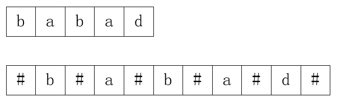
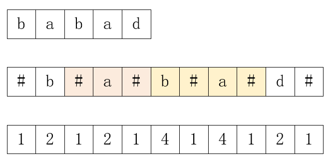
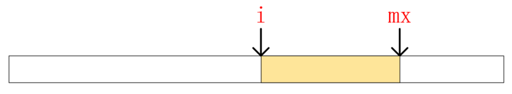
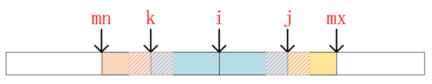
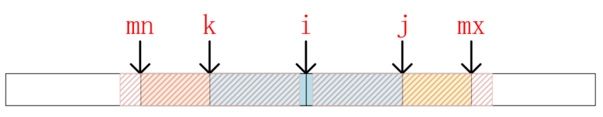
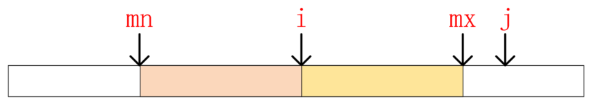

# 最长回文子串

> 题目：最长回文子串

> 描述：给定一个字符串 s，找到 s 中最长的回文子串。你可以假设 s 的最大长度为 1000。

> 示例：
* 输入: "babad"
* 输出: "bab"
* 注意: "aba" 也是一个有效答案。

# 解析

回文字符串可能我们很多人在学习编程语言基础时都练习过，但是只是判断了一个字符串是否是回文的而已，而今天的题目要复杂得多了。如果我们要找出所有的子串，再一一判断它是不是回文的，可能需要O(n<sup>3</sup>)的时间复杂度，所以我们要对它进行优化。下面我们要介绍的两种方法，可以将此问题的时间复杂度分别降低到O(n<sup>2</sup>)和O(n)。

## 方法一：中心扩展

回文字符串的特性就是中心对称，那么我们可以假定每个字符都是一个回文子串的中心字符，然后以此字符为中心向两侧扩展，直到不再是回文子串为止。这样我们就找到了以每个字符为中心的最长回文子串，也就等于找到了最长的回文子串。不过这里有一点需要注意，那就是一个回文串的中心可能是一个字符，例如"aba"就是以字符 'b' 为中心，也可能是在两个字符之间，例如"abba"的中心就在两个 'b' 字符之间，只要处理好这两种情况，代码就很简单了，参考如下：

```java
public String longestPalindrome(String s) {
    int len = s.length();
    if(len==0)return "";

    int i = 0;
    int[] ends = new int[2];
    
    while(i<len){
        // 处理 "aba" 的情况
        getEnds(s, len, i-1, i+1, ends);
        // 处理 "abba" 的情况
        getEnds(s, len, i, i+1, ends);
        i++;
    }

    return s.substring(ends[0], ends[1]);
}

private void getEnds(String s, int len, int left, int right, int[] ends){
    while(left >= 0 && right < len && s.charAt(left)==s.charAt(right)){
        left--;
        right++;
    }
    if((ends[1]-ends[0])<(right-left-1)){
        ends[0] = left+1;
        ends[1] = right;
    }
}
```

## 方法二：Manacher算法

这个方法也称为“马拉车”算法，可以说是解决回文字符串最好的算法了，因为它的时间复杂度仅为O(n)。下面我们一步步分析这个算法是如何做到如此高效的。

首先，我们用 '#' 或某个字符串中不存在的字符将字符串的每个字符分隔开，并在首尾也插入一个 '#'，如下所示：

<div align="center"><br/>分割字符串</div>

以上操作解决了因为长度的奇偶性带来的问题，新的字符串长度是 2*n+1，是始终为奇数的。

接下来和中心扩展一样，我们也要确定以一个字符为中心的最长回文子串的长度。Manacher算法中有一个概念叫作“回文半径”，它指的是从中心字符到最右侧（或最左侧）字符的距离，例如"#a#"的半径就是2,。用此距离构造一个半径回文数组radius，我们根据数组中的最大值就可以确定最长回文子串的长度了。例如，以上示例中间的字符 'b' 的回文半径为4，构成的回文数组如下：

<div align="center"><br/>回文数组</div>

可以发现，以原串第 i 个字符为中心的最长回文子串，就是radius数组第 i 位的值减 1 。那么，我们如何构造这个数组呢？

假设我们已经求得了位置 i 处（相对于Manacher构造的字符串）的回文半径，也就是radius[i]的值，并记它的最右侧位置为 mx，如下所示：

<div align="center"><br/>记录i的回文半径</div>

然后我们要计算位置 j 处的回文半径，其中 j>i。由于radius[i]的值可能为0，也可能较大，所以 j 可能小于 mx，也可能大于 mx，我们先来看 j<=mx 时的情况。如下所示，j<mx 时，j 关于 i 的对称点 i-(j-i)（我们记为 k），也一定大于 mx关于 i 的对称点 i-(mx-i)（我们记为mn），如下所示：

<div align="center"><br/>j在i和mx之间</div>

现在，让我们把目光聚焦到 j 的对称点 k 上，它将为我们计算 j 的回文半径提供线索。因为radius[k]的值可能很小，以 k 为中心的回文子串完全被以 i 为中心的子串覆盖，也可能较大超出了 i 的范围，如下所示：

<div align="center"><br/>k被i覆盖</div>

<div align="center"><br/>k超出i的范围</div>

对于第一种情况，可以肯定 j 也将被 i 完全覆盖，所以它的回文半径和 k 是相等的。第二种情况则表明从 mx 之后的部分是未知的，需要进一步计算。

现在我们再来考虑 j>=mx 的情况，如下图所示，这时 j 的回文半径一点都没计算过，所以只能进一步进行计算。

<div align="center"><br/>j>=mx时</div>

根据以上思路，可以参考的代码如下：

```java
public String longestPalindromeOptimize(String s) {
    if (s == null || s.length() == 0) {
        return "";
    }

    char[] charArr = manacherStr(s);
    // 构造回文半径数组
    int[] radius = new int[charArr.length];
    // 当前已经计算过的最右侧下标
    int mx = -1;
    // i 表示 mx 最大时，对应的回文子串的中心
    int i = -1;
    // 最长回文子串的长度
    int max = 0;
    // 最长回文子串的起点下标
    int maxIndex = -1;

    for (int j = 0; j < radius.length; j++) {
        // 2*i-j 是 j 相对于 i 的对称点，也就是文章中的 k。
        // 当 j<mx 时，由于以 k 为中心的子串可能被 i 完全覆盖，也可能超出 i 的范围
        // 所以，计算 我们只能计算出 radius[j] 在 mx-j这个范围内的值
        // 而当 j>mx 时，就需要完全从头开始计算了
        radius[j] = j < mx ? Math.min(radius[2 * i - j], mx - j + 1) : 1;

        // 计算 j<mx 时超出 mx-j 范围内的部分，或者 j 本就大于 mx时
        while (j + radius[j] < charArr.length && j - radius[j] >= 0
                && charArr[j - radius[j]] == charArr[j + radius[j]]) {
            radius[j]++;
        }

        // 更新 mx 的值和 i 的值
        if (j+radius[j]>mx) {
            mx = j+radius[j]-1;
            i = j;
        }

        // 更新max的值
        if (max<radius[j]) {
            max = radius[j];
            // j 的起点坐标，相对于Manacher字符数组而言是 j-radius[j]+1
            // 而相对于原数组而言，这个值是由原数组的位置乘以2再加一得到的，所以直接除以2即可
            maxIndex = (j-radius[j]+1)/2;
        }
    }

    return s.substring(maxIndex,maxIndex+max-1);
}

private char[] manacherStr(String s){
    StringBuilder sb = new StringBuilder();
    for (int i = 0; i < s.length(); i++) {
        sb.append('#');
        sb.append(s.charAt(i));
    }
    sb.append('#');
    return sb.toString().toCharArray();
}
```

# 总结

Manacher算法如果我们没有听过还是很难想到的，不过不要气馁，我们只是来学习的，想不到能学到也算赚到，能够理解它也算一笔不小的收获。下面这个题目较为简单，让我们放松一下吧。

# 下题预告

> 题目：Z 字形变换

> 描述：将一个给定字符串根据给定的行数，以从上往下、从左到右进行 Z 字形排列。

> 比如输入字符串为 "LEETCODEISHIRING" 行数为 3 时，排列如下：

```
    L   C   I   R
    E T O E S I I G
    E   D   H   N
```

> 之后，你的输出需要从左往右逐行读取，产生出一个新的字符串，比如："LCIRETOESIIGEDHN"。

> 请你实现这个将字符串进行指定行数变换的函数：`string convert(string s, int numRows);`

> 示例 1：
* 输入: s = "LEETCODEISHIRING", numRows = 3
* 输出: "LCIRETOESIIGEDHN"

> 示例 2：
* 输入: 输入: s = "LEETCODEISHIRING", numRows = 4
* 输出: "LDREOEIIECIHNTSG"
* 解释：

```
    L     D     R
    E   O E   I I
    E C   I H   N
    T     S     G
```

**相关源码请在code目录查看。**

---

本文到此就结束了，如果您喜欢我的文章，可以关注我的微信公众号： **大大纸飞机** 

或者扫描下方二维码直接添加：

<div align="center"><br/>扫描二维码关注</div>

您也可以关注我的简书：https://www.jianshu.com/u/9ee83a8ee52d

编程之路，道阻且长。唯，路漫漫其修远兮，吾将上下而求索。