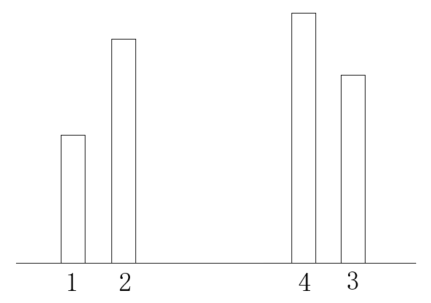

# 题目介绍

> **题目**：盛最多水的容器
>
> **描述**：给定 n 个非负整数 a<sub>1</sub>, a<sub>2</sub>, ..., a<sub>n</sub>，每个数代表坐标中的一个点 (i, a<sub>i</sub>) 。在坐标内画 n 条垂直线，垂直线 i 的两个端点分别为 (i, a<sub>i</sub>) 和 (i, 0)。找出其中的两条线，使得它们与 x 轴共同构成的容器可以容纳最多的水。
>
> **说明**：你不能倾斜容器，且 n 的值至少为 2。
>
> **示例**：
> * 输入: [1,8,6,2,5,4,8,3,7]
> * 输出: 49
>
> <div align="center"><br/>图中垂直线代表输入数组 [1,8,6,2,5,4,8,3,7]。在此情况下，容器能够容纳水（表示为蓝色部分）的最大值为 49。</div>

# 解析

使用暴力法可以解决此问题，但是我们当然不会这么做，因为暴力法一定会进行许多不必要的计算，这意味着我们需要设计一个更巧妙的方式，从而减少无用计算的数量。

容器的最大盛水量取决于它的短边，这是我们优化的前提。首先，我们从所有的垂直线中选择四条，它们满足以下特点：

1. 有一条线最短，其它两条线都比它长，记为 线1。
2. 一条线与最短线相邻，记为 线2。
3. 另一条与 线2 在最短线的同一侧，且它是可以找到的距离这条短线最远的，且比它长的线，记为 线3。
4. 最后一条线与 线3 相邻，且处于 线1 和 线3 之间，记为 线4。

基于以上几个规则，我们得到如下的模型，可以把它对比示例中的第 0 条、第 1 条、最后一条和倒数第二条线：

<div align="center"><br/>模型</div>

根据以上规则，我们可以得出以下几个结论：

1. 以 线1 为**短边**的最大矩形，在这个方向上就是 线1 和 线3 组成的矩形，因为在 线3 之后没有比 线1 更长的线了。
2. 如果 线1 和 线3 组成的矩形面积比 线 2 和 线 3 组成的面积小，那么**在这个方向上**，以 线1 为**短边**所能组成的全部矩形，都比 线2 和 线3 组成的矩形面积小。也就是说，计算 线1 和位于 线2 与 线3 间的所有垂直线组成的矩形面积是无用的。
3. 即使 线1 和 线3 组成的矩形面积大于 线2 和 线3 组成的矩形面积，线1 和  线4 组成的矩形面积也一定小于 线2 和 线3组成的矩形面积。因为 线1 和 线4 的距离与 线2 和 线3 的距离一样，而后者的短边更长一些。

示例就可以完美的证明以上两点，对于第 0 条线而言，最后一条对应上图的 线3，倒数第二条对应 线4，第 1 条线对应 线2。以第 0 条线为短边，在它的右侧可以构成的最大矩形，就是它和最后一条线组成的矩形，其面积是 8，而第 1 条线和最后一条线所构成的面积是 49。那么第 0 条线和第 2 条线、第 3 条线，...，之间的比较都没有意义了。即使把第 0 条线的长度增加到 6，而把倒数第二条线增加到8，它们之间的矩形面积也只有 42。这样一来，第 0 条线在这个方向上的计算止步于此，后续的计算和它完全没有关系了。

现在，让我们把目光聚焦到如何解决问题上来。如果我们从左向右遍历，寻找 线1 对应的 线3，则 线3 一定是从最右侧开始的，相反，如果我们从右向左遍历，寻找 线1 对应的 线3 一定是从最左侧开始的。这意味着我们需要两个指针，一个表示短边，一个表示长边，因为对称性，有可能短边在左边，也可能长边在左边。而我们要做的就是把它们之间的矩形面积和最大面积对比，然后抛弃这个短边，把问题从 n 转化到 n-1。这个思路可以参考以下代码：

```java
public int maxArea(int[] height) {
    int max = 0;
    int i = 0;
    int j = height.length - 1;
    while (i < j) {
        int width = j - i;
        // 计算短边的最大矩形面积
        int area = width * Math.min(height[i], height[j]);
        max = Math.max(area, max);
        // 抛弃短边
        if (height[i] < height[j]) {
            i++;
        } else {
            j--;
        }
    }

    return max;
}
```

# 总结

通过对问题的深入思考，抓住了短边决定面积这个条件，我们寻找到了时间复杂度为**O(n)**的解法，这再一次提醒我们不要简单的使用暴力法解决问题，而要先思考有没有更优秀的方式。

# 下题预告

> **题目**：整数转罗马数字
> **描述**：罗马数字包含以下七种字符： I， V， X， L，C，D 和 M。 
> ```
> 字符          数值
> I             1
> V             5
> X             10
> L             50
> C             100
> D             500
> M             1000
> ```
> 例如， 罗马数字 2 写做 II ，即为两个并列的 1。12 写做 XII ，即为 X + II 。 27 写做  XXVII, 即为 XX + V + II 。
>
> 通常情况下，罗马数字中小的数字在大的数字的右边。但也存在特例，例如 4 不写做 IIII，而是 IV。数字 1 在数字 5 的左边，所表示的数等于大数 5 减小数 1 得到的数值 4 。同样地，数字 9 表示为 IX。这个特殊的规则只适用于以下六种情况：
> * I 可以放在 V (5) 和 X (10) 的左边，来表示 4 和 9。
> * X 可以放在 L (50) 和 C (100) 的左边，来表示 40 和 90。 
> * C 可以放在 D (500) 和 M (1000) 的左边，来表示 400 和 900。
>
> 给定一个整数，将其转为罗马数字。输入确保在 1 到 3999 的范围内。
>
> **示例 1**:
> * 输入: 3
输出: "III"
> 
> **示例 2**:
> * 输入: 4
输出: "IV"
>
> **示例 3**:
> * 输入: 9
输出: "IX"
>
> **示例 4**:
> * 输入: 58
输出: "LVIII"
解释: L = 50, V = 5, III = 3.
>
> **示例 5**:
> * 输入: 1994
输出: "MCMXCIV"
解释: M = 1000, CM = 900, XC = 90, IV = 4.

**相关源码请在code目录查看。**

---

本文到此就结束了，如果您喜欢我的文章，可以关注我的微信公众号： **大大纸飞机** 

或者扫描下方二维码直接添加：

<div align="center"><br/>扫描二维码关注</div>

您也可以关注我的简书：https://www.jianshu.com/u/9ee83a8ee52d

编程之路，道阻且长。唯，路漫漫其修远兮，吾将上下而求索。