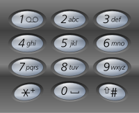

# 最接近的三数之和

# 题目介绍

> **题目**：最接近的三数之和
> **描述**：给定一个包括 n 个整数的数组 nums 和 一个目标值 target。找出 nums 中的三个整数，使得它们的和与 target 最接近。返回这三个数的和。假定每组输入只存在唯一答案。
> 
> 例如，给定数组 nums = [-1，2，1，-4], 和 target = 1.
> 与 target 最接近的三个数的和为 2. (-1 + 2 + 1 = 2).

# 解析

此题我们可以参考三数之和的思路，接近某个值可以理解为三数之和与此值的差接近于0。记 a, b, c 是目标值，那么 a+b+c - target 的值可能大于0，也可能小于0，这就为我们判断提供了条件。于是我们依然可以使用左右指针，将这个差值向 0 调整即可。参考代码如下：

```java
public int threeSumClosest(int[] nums, int target) {
    int sum = 0;
    int sub = 0;
    int absSub = Integer.MAX_VALUE;

    int len = nums.length;
    // 从小到大排序
    Arrays.sort(nums);
    for (int i = 0; i < len; i++) {
        int left = i+1;
        int right = len - 1;
        while (left<right) {
            sub = nums[i]+nums[left]+nums[right] - target;
            if (absSub>Math.abs(sub)) {
                absSub = Math.abs(sub);
                sum = nums[i]+nums[left]+nums[right];
            }
            if (sub>0) {
                right--;
            }else if(sub<0){
                left++;
            }else{
                sum = nums[i]+nums[left]+nums[right];
                break;
            }
        }
    }
    
    return sum;
}
```

# 总结

因为有三数之和的经验，这个题目变得十分简单了，然而不论在面试中，还是在生活中，遇到相似的问题，我们也不一定能很快把它与之前的经验联系起来，所以我们要关注的是解决问题的方法，这样才能以不变应万变。

# 下题预告

> **题目**：电话号码的字母组合
> **描述**：给定一个仅包含数字 2-9 的字符串，返回所有它能表示的字母组合。
> 
> 给出数字到字母的映射如下（与电话按键相同）。注意 1 不对应任何字母。
>
> <div align="center"><br/>数字字母映射</div>
>
> **示例**:
> * 输入："23"
> 输出：["ad", "ae", "af", "bd", "be", "bf", "cd", "ce", "cf"].
>
> **说明**: 尽管上面的答案是按字典序排列的，但是你可以任意选择答案输出的顺序。

**相关源码请在code目录查看。**

---

本文到此就结束了，如果您喜欢我的文章，可以关注我的微信公众号： **大大纸飞机** 

或者扫描下方二维码直接添加：

<div align="center"><br/>扫描二维码关注</div>

您也可以关注我的简书：https://www.jianshu.com/u/9ee83a8ee52d

编程之路，道阻且长。唯，路漫漫其修远兮，吾将上下而求索。