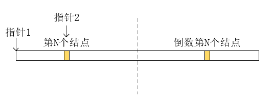

# 删除链表的倒数第N个节点

# 题目介绍

> **题目**：删除链表的倒数第N个节点
> **描述**：给定一个链表，删除链表的倒数第 n 个节点，并且返回链表的头结点。
> **示例**:
> 给定一个链表: 1->2->3->4->5, 和 n = 2.
> 当删除了倒数第二个节点后，链表变为 1->2->3->5.
> **说明**：给定的 n 保证是有效的。
> **进阶**：你能尝试使用一趟扫描实现吗？

# 解析

如果是两次扫描，这个问题是十分简单的，第一次扫描确认链表的长度，第二次根据长度算出目标结点的位置并删除。而仅使用一次扫描，就意味着我们无法算出链表的长度，从而也就无法知道目标结点的确切位置了。

虽然无法确认目标结点的确切位置，但是我们知道它与终点的相对位置，也就可以知道它相对于链表中点的对称点的位置。现在，我们让一个指针在起点位置，一个指针在目标结点的对称点处，如下所示：

<div align="center"><br/>双指针</div>

因为对称的原因，第N个结点到终点的距离和倒数第N个结点到起点的距离一致。也就是说，如果指针1和指针2同时向后移动，当指针2走到终点时，指针1的位置正好是倒数第N个结点，也就是目标结点。参考代码如下：

```java
public static ListNode removeNthFromEnd(ListNode head, int n) {
    ListNode first = new ListNode(0);
    first.next = head;
    ListNode node1 = first;
    ListNode node2 = first;
    int i = 0;
    while (i<n) {
        node1 = node1.next;
        i++;
    }

    while (node1.next!=null) {
        node1 = node1.next;
        node2 = node2.next;
    }

    node2.next = node2.next.next;

    return first.next;
}
```

# 总结

求出链表的长度再进行删除是基于绝对位置来计算的，而在无法提前得知长度时，相对位置也可以做到同样的事，有时候换个角度思考，可能会有意外的惊喜哦。

# 下题预告

> **题目**：有效的括号
> **描述**：给定一个只包括 '('，')'，'{'，'}'，'['，']' 的字符串，判断字符串是否有效。有效字符串需满足：
> 1. 左括号必须用相同类型的右括号闭合。
> 2. 左括号必须以正确的顺序闭合。
>
> **示例 1**:
> **输入**: "()"
> **输出**: true
>
> **示例 2**:
> **输入**: "()[]{}"
> **输出**: true
>
>**示例 3**:
> **输入**: "(]"
> **输出**: false
>
> **示例 4**:>
> **输入**: "([)]"
> **输出**: false
>
> **示例 5**:
> **输入**: "{[]}"
> **输出**: true

**相关源码请在code目录查看。**

---

本文到此就结束了，如果您喜欢我的文章，可以关注我的微信公众号： **大大纸飞机** 

或者扫描下方二维码直接添加：

<div align="center"><br/>扫描二维码关注</div>

您也可以关注我的简书：https://www.jianshu.com/u/9ee83a8ee52d

编程之路，道阻且长。唯，路漫漫其修远兮，吾将上下而求索。